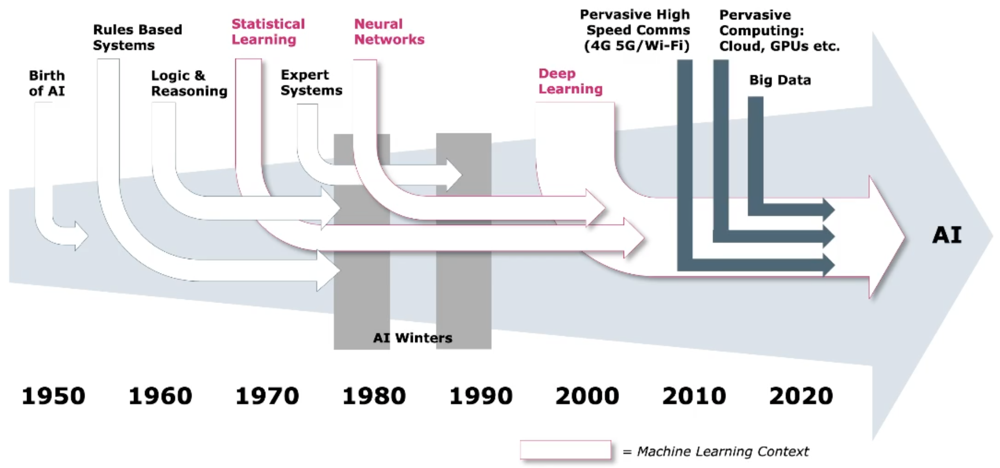
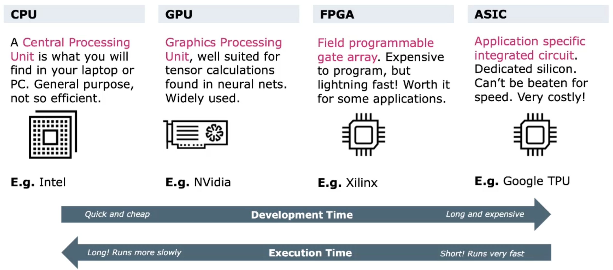

# History & Development
Einführung in die Geschichte und Entwicklung von Machine Learning

## ML in the Context of AI
Machine Learning ist ein Teil von AI, welche normalerweise Menschliche Intelligenz benötigt. Um dies zu erreichen wird ML betrieben. Es lernt ohne explizit progammiert zu werden.

## Development of AI
Mit dieser Disziplin wurde ungefähr 1950 erste Versuche gestartet. Es folgten *Rules Based Systems* und *Logic & Reasoning* zwischen den 1960 bis Anfang 1980.

{width=60%}

## Der Ursprung von AI
In 1945 erschien erster programmierbarer Computer *ENIAC*. Es entstand eine erste Welle mit viel Forschung und Entwicklung bis Anfang 70er. Die Meinung war, dass Computer alles lösen können. Man merkte aber, dass sie zwar komplexe Aufgaben effizient lösen konnten, jedoch nicht greifen oder etwas erkennen können. Funding wurde immer weniger.

> Es ist einfach einem Computer Intelligenz eines Erwachsenen Menschens beizubringen, jedoch sehr schwierig oder unmöglich ihm die Fähigkeiten eines Einjährigen Kindes, wie Wahrnehmung oder Mobilität, beizubringen.
>
> -- Moravec Paradox

Während der zweiten Welle *Expert Systems* wurden vorallem mit bestehenden Wissen gearbeitet und mit den verfügbaren Wissen etwas zu machen.
Auch diese Welle wurde durch den zweiten *AI Winter* ausgebremst.
> Die Hauptlektion aus 35 Jahre AI-Forschung ist, dass komplexe Probleme sind einfach und die Einfachen sehr schwierig.
>
> -- Steven Pinker

1988 kam die Idee auf von Daten und Erfahrungen zu lernen. Mit dem vermehrte Einsatz von Wahrscheinlichkeiten *Bayesian Networks* kam der Erfolg zurück.

## The Connectionists: ANN's, ML and NN
Artificial Neural Networks (ANN's), Machine Learning und Deep Learning (NN). Wie lernt man überhaupt?
Das Gehirn ist sehr flexibel und kann aus verschiedenen Inputs lernen und diese Sinne weiterentwickeln.

## The Human Brain
Das menschliche Gehirn hat verschiedene Areale die für unterschiedliche Funktionen verwantwortlich sind. Es ist massiv vernetzt und verändert sich ständig (durch lernen/Stimulation). Alle Regionen sind aus dem gleichen Neuralen Netz. Jedes Neuron ist mit 1000 bis 10000 anderen verbunden.

### Networks that Learn
1887 wurden die Neuronen als Fundamentals Nervensystem entdeckt. 1943 wurde das Neuronenmodel als logische Einheit modelliert. *If* meine Synopsen etwas wahrnehmen (Threshold überschreiten), *then* sende (abfeueren) ich ein Signal durch das Axon, *else* sende ich nichts. Wenn mehrere Neuronen das gleichzeitig feuern, verbinden sie sich - und so entsteht Lernen.
1958 Frank Rosenblatt übertrug die Idee in Computer Vision und erfand das *Perceptron*, ein einzelner Neuralen Netzwork Layer.

## Deep Learning vs. Machine Learning
Machine Learning benötigt menschliches Feature extraction um zu klassifizieren. Deep Learning nutzt grosse neuronale Netzwerke und lernt mit Daten, Algorithmen und Processing Power.

## Three Pillars of Machine Learning
Data, Algorithmen und Porcessing Power. Was natürlich nicht fehlen darf ist Highspeed Kommunikation, welches all die anderen Punkte begünstigt (Concrete).

## Various Options for Hardware Acceleration

## Performance Measure
*F1-Score Performance* bewertet AI Models auf Basis ihrer Erkennungsrate in Prozent.

## Remaining Challenges

* Datenprobleme sind die Grössten Fallstricke in ML-Projekten. 80% des Aufwandes geht auf Datenaufbereitung und lediglich 20% fürs Modelling
* Daten haben Tendenzen, möglichst ausgeglichene Daten verwenden
* ML/DL Training ist sehr Energieintensiv
