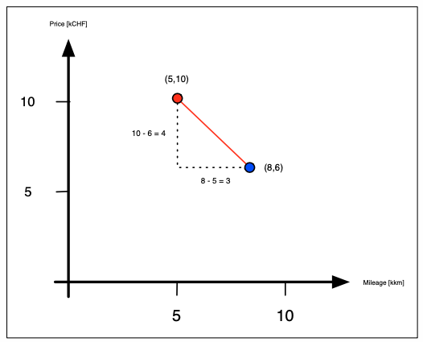
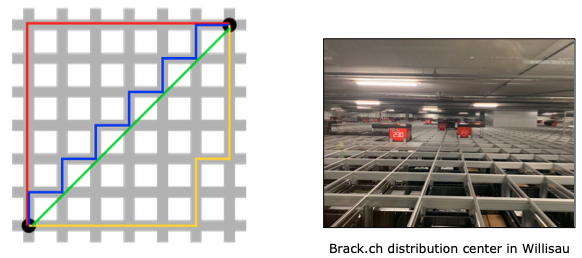
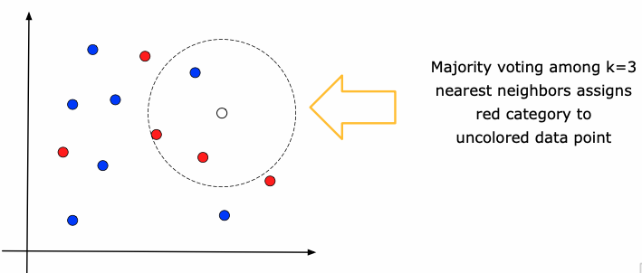
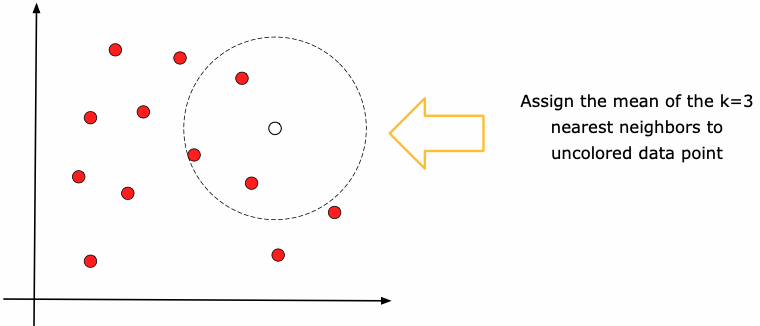

# Machine Learning Fundamentals

Grundlagen des ML

## Vector Space Model

Ein Vektor Space Model enthält nur numerische Daten (ausser dem Key). Zum Überführen von
kategorischen Daten gibt es mehrere Techniken für die Transformation. Von nun an gehen wir jeweils
davon aus, dass die Daten numerisch vorhanden sind. Der Key wird normalerweise nicht zu den Daten
gezählt.

## Data Records

Beinahe alle ML-Verfahren setzen ein *VSM* voraus. Wenn alle Daten als nummerische Werte vorliegen,
kann jede Zelle als Spalte interpretiert werden.

{width=60%}

Die Länge der roten Linie kann mit Hilfe von $\sqrt{a^2+b^2}$ berechnet und als Distanz
interpretiert wird.

## Numerical Encoding of Text

Kann man auch ganze Texte oder Bilder in ein Vector Space Model überführen? Bilder können mit Hilfe
von Filter transformiert werden. Bei Text funktioniert es mit Hilfe des **TF-IDF Scores** - *
term frequency-inverse document frequency*. Dieser verbindet Wörter zu numerischen *Vektoren*. Als
Basis dient ein Referenz-*Korpus*. Dazu nehme man alle Wikipediaartikel und stellt diese in Kolonnen
dar. Jedes Wort wird nun anhand seiner Häufigkeit im ersten Artikel gemessen. Danach dividiert man
durch das Reziproke vom Gesamtwert des Wortes über alle Artikel.

## Distance and Similarity

Das Inverse der Distanz ist die Similarität. Je weiter voneinander entfernt, desto
unterschiedlicher, respk. je näher umso ähnlicher (Similarität) sind die Werte. Auf diesem Konzept
basieren alle ML-Algorithmen ausserhalb von Neuronalen Netzen und evtl. Entscheidungsbäume.
Beispiele für Distanz und Similarität sind:

* Dating-Site empfiehlt anderes Profil mit den ähnlichsten Vorstellungen
* Auto-Verkaufsseite schlägt Preis für Auto anhand der 20 letzten Verkäufe dieses Modells vor
* Webshop empfiehlt Produkte anhand ähnlicher Warenkörbe anderer Benutzer

Wir brauchen also einen Weg die Distanz/Similarität aussagekräftig zu berechnen.

## Euclidiean Distance or $L^2$-Norm

Ist eine generalisierte Form der Pythagoras Formel welche für eine beliebig grosse Anzahl an
Dimensionen verwendet werden kann. Ist eine Zahl zwischen $[\,0,\infty[\,$ findet man den
ähnlichsten Punkt durch die *Minimierung der Distanz* zwischen zwei Punkten. Die Euklidische Distanz
wird auch $L^2$-Norm genannt.

$$euclid(X,Y)= \|X-Y\|_{2} = \sqrt{\sum_{i=1}^n(x_i-y_i)^2}=\sqrt{\sum_{i=1}^n x_i^2-2x_iy_i+y_i^2}$$

## Semantik of Similarity

Je nach Daten gibt die Distanz nicht exakt wider, was wir erwarten würden. Bei unterschiedlichen
Anwendungszwecke genügt die Similarität nicht den Ansprüchen. So würde die Distanz bei einem Text
der Copy-Pasted wurde weit auseinander liegen (obwohl gleicher Inhalt). Wir müssen also semantisch
sinnvoll die richtige Methode auswählen. Die Distanzfunktion muss auf die Domäne angepasst werden.

## Cosine Similarity Intuition

Die Kosinus Similarität misst den Winkel $\theta$ zwischen zwei Vektoren $X$ und $Y$. Zwei Punkte
auf einer Geraden haben den Winkel $0$, aber hätten einen grosse *Euklidische Similarität*.

Die Similarität kann bei vielen Algorithmen per Parameter übergeben werden.

## Cosine Similarity

Durch das Normieren $\frac{X}{\|X\|{_2}}$ der Vektoren werden die Punkte auf dem Einheitskreis
abgebildet. Das Skalarprodukt entspricht der Projektion eines Vektors Y auf den Vektor X. Der
Kosinus liegt zwischen $[\,-1,1]\,$. Für die Distanz verwenden wir aber einen positiven Wert,
weshalb wir den Betrag nehmen. Damit wird Kosinus Similarität berechnet. $0$ bedeutet kleinste
Distanz - maximale Similarität und 1 grösste Distanz - Dissimilarität.

$$cos(X,Y)= \frac{X,Y}{\|X\|_{2} * \|Y\|_{2}} = \frac{\sum_{i=1}^n(x_i y_i)}{\sqrt{\sum_{i=1}^n x_i^2} \sqrt{\sum_{i=1}^n y_i^2}}$$

$$\text{Kosinusdistanz}=1-\text{Kosinus Similarität}$$

## Euklid vs. Kosinus

Die beiden Varianten können ganz unterschiedliche Resultate liefern. Werden die Punkte auf den
Einheitskreis normiert, ergeben beide Verfahren dasselbe Resultat.

## Manhattan Distance

Auf einem Schachbrett oder auf der Strasse von Manhattan kann nicht die Euklidische Distanz zur
Bestimmung der Entfernung verwendet werden, da man keiner Geraden folgen kann. Die Manhattan Distanz
ist definiert durch $$manhattan(X,Y)=\sum{i=1}^n\|x_i-y_i\|$$ Der Wertebereich der Distanz liegt
zwischen $[\,0,\infty[\,$

{width=60%}

## Levenshtein or Edit Distance for Strings

Die Levenshtein Methode zählt die minimale Anzahl an nötigen Operationen an einem Wort um dieses in
ein anderes zu überführen. Jede Operation gibt Strafpunkte und werden addiert. Die Summe entspricht
der *Levenshtein Distance*. Je grösser umso weniger Similarität zwischen den beiden Worten. Die
Operationen werden wie folgt gewertet:

* +1, wenn Buchstabe gelöscht wird
* +1, wenn Buchstabe hinzugefügt wird
* +2, wenn Buchstabe ausgetauscht wird (löschen und hinzufügen) - manchmal wird nur +1 gewertet

Die effiziente Implementierung ist sehr herausfordernd! Nichts desto trotz, sehr wichtiger und oft
verwendeter Algorithmus, zum Beispiel als Wörterbuch. Betrachtet bei Fehler alle Wörter mit
kleinster Distanz (Abweichung) und schlägt diese als Korrektur vor.

## Jaccard Similarity for Sets

Betrachtet die Menge einzelnen Wörtere und dividiert sie durch die gesamte Anzahl an Wörter. Der
Wertebereich liegt zwischen $[0,1]$ und ist definiert durch $$jaccard(X,Y)
=\frac{|X{\cap}Y|}{|X{\cup}Y|}$$ Sie kann bei Recommender Systemen angewendet werden. Zum Beispiel
wenn zwei Warenkörbe gleiche Produkte enthalten oder wenn zwei Texte gleiches Jargon verwenden.

## Haversine Distance for GEO Data

Flugzeuge reisen nach dieser Distanz, da sie die Krümmung der Erde berücksichtigt. Sie misst in der
Atmosphäre die Distanz, ergo ist die Similarität klein, wenn die Distanz gross und vice-versa.

## From Points to Distributions

Manchmal müssen auch Verteilungen beurteilt werden und nicht nur die Punkt zu Punkt Distanz. Es gibt
auch die *distribution-to-distribution*, welche bei der Bildanalyse verwendet wird.

## Mahalanobis Distance between Point and Distribution

Misst die Entfernung des Punkts als wie viele Standardabweichungen der Punkt vom Mittelwert entfernt
liegt (Art Euklidische Distanz).

* Erst wird die Verteilung normalisiert indem korrelierende Variablen in unkorrelierende
  tranformiert werden
* dann wird skaliert, dass die Varianz gleich 1 wird
* zum Schluss wird die euklidsche Distanz zwischen Punkt X und dem Mittelwert berechnet

## Distance may be sensitive to Scale of Axes

Die Einheit von Features können Daten verfälschen (zB. km -> m). Sie dominieren dann das Ergebnis
einer anderen Einheit die viel kleiner ausfällt. Deshalb müssen vor dem betreiben von Machine
Learning Daten normalisiert werden. Idealerweise haben alle Feature den gleichen Wertebereich.

## Min-Max Normalization

Variante um Daten zu normalisieren und transformiert die Werte ins Intervall $[0,1]$. Der Grösste
Werte in der Spalte erhält den Wert 1, der kleinste der Wert 0. Die Werte dazwischen werden
skaliert. $$x\mapsto\frac{x-\text{min}_X}{\text{max}_X-\text{min}_X}$$ Dies erlaubt die
Interpretation in Prozent und man hat keine negativen Werte. Kann aber nicht für *supervised
learning* verwendet werden, weil globale min/max nicht bekannt sind.

## Z-Score Normalisierung

Die Daten werden so transformiert, dass der Mittelwert 0 ist und die Standardabweichung 1.
$$x\mapsto\frac{x-\mu_X}{\sigma_X}$$ Kann für supervised und unsupervised learning verwendet werden.
Der Nachteil ist die fehlende Prozentinterpretation. Kann zu negativen Werten führen (negative
Preise oder Anzahl). Zur Interpretation müsste zurücktransformiert werden.

## Normalization Parameters

Bei Min/Max Normalisation werden (min/max) benötigt, beim Z-Score (mean, std). Wichtig, Parameter
aus Trainingsdaten bestimmen (nicht Testdaten), Min/Max nicht für supervised learning verwenden (
ausser Daten enthalten globale Min/Max). Normalisierten Parameter speichern um später zu skalieren.

```python
import pandas as pd
from sklearn.preprocessing import MinMaxScaler 
from sklearn.preprocessing import StandardScaler

df = pd.read_csv('data/autoscout24/cars.csv') 
df = df[['Price', 'Seats', 'Mileage']]
print(df.head())

# Min-Max Normlization
scaler = MinMaxScaler()
df[df.columns] = scaler.fit_transform(df)
print(df.head())

# Undo Normalization
df[df.columns] = scaler.inverse_transform(df) print(df.head())

# Z-score Normalization
scaler = StandardScaler()
df[df.columns] = scaler.fit_transform(df)
print(df.head())

# Undo Normalization
df[df.columns] = scaler.inverse_transform(df) print(df.head())
```

## K-Nearest Neighbors Classification (k-NN)

Ist wahrscheinlich der einfachste ML-A. Ist ein Verfahren für Regression und Klassifizierung. Zeigt
auf, wie wichtig Distanz bzw. Similarität für ML ist. K-Nearest Neighbors muss ein 
definierter Parameter $k$ mitgegeben werden. $k=3$ bedeutet, dass K-Nearest die drei nächsten Punkte
zu einem neuen Punkt sucht und anhand deren Eigenschaften klassifiziert wird. k-NN
mit $k=1$ wird einfach das Label des nahesten Punktes übernommen. Bei $k>1$ wird ein
Mehrheitsvoting gegenüber den $k$-nahesten Punkte gemacht.

{width=80%}

## K-Nearest Neighbors Regression

Löst Regressionsproblem zum Beispiel Preisvorhersage aus einem Regressionsmodell der $k$-nahesten
Punkte. Funktionsweise mit Parameter $k$ analog k-NN-Klassifizierung.

{width=80%}

## Hyperparameter

Der Wert von $k$ wird Hyperparameter genannt und entspricht der Anzahl Nachbarn. Das Resultat kann
stark vom gewählten $k$ differieren. Es ist also wichtig, dieses möglichst optimal zu wählen (es gibt
keine Optimierungsmöglichkeit durch einen Computer). Als weiteren Paramter kann eine Konstante zur 
Distanz-/Similaritätmethode übergeben werden.

## Facts on K-Nearest Neighbors

* Sehr langsam, weil jedesmal Similarität zu allen Punkten berechnet wird. Danach die Distanz berechnet
  und nahesten ausgewählt. Dies wird bei jedem Datenpunkt gemacht.
* Für kleines Dataset gute Baseline, legt Massstäbe fest für andere Algos
* Mehrheitswahl bedeutet alle Nachbarn sind gleich stimmberechtigt, egal wie weit sie entfernt
  liegen.
* Alternativ kann per Parameter die Distanz berücksichtigt werden $\frac{1}{d}$ mit $d
  =\text{distance} > 0$
* benötigt am wenigsten Daten, reichen Daten nicht aus, gibt es keine Möglichkeit für ML
* $k$ ist sogenannter Hyperparameter
