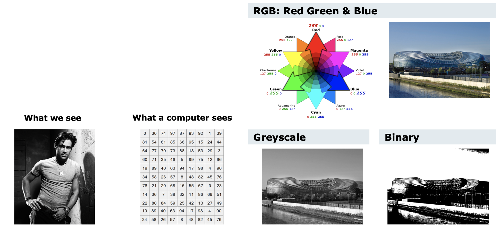
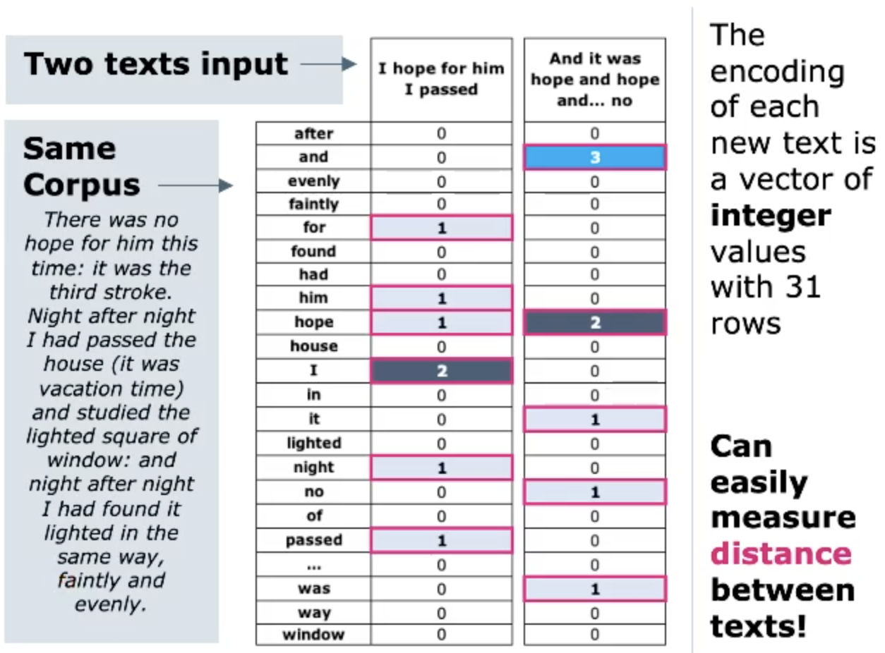

# Feature Engineering

Ist eine Manipulation an unseren Rohdaten um höhere Performance und bessere Ergebnisse im Kontext
von Machine Learnung zu erreichen. Kurz, wir möchten es für die Algorithmen einfacher machen.

{width=70%}

Kann die Performance der ML-Algos verbessern. Domänenexperten können mit Fachwissen helfen,
nützliche Features zu extrahieren. In modernen DL-Ansätzen werden Feature *gelernt* und nicht
engineered.

## Data

Als Menschen können wir sehr schnell aus einem Datenset eine Klassifizierung machen, indem wir ihre
Eigenschaften miteinander vergleichen. Diese Eigenschaften werden *attributes* oder *feature*
genannt. Eigenschaften können sein:

* Farbe
* Form
* usw.

### Tabular Data

Meist sind Daten in tabellarisch verfügbar. Jede Zeile entspricht einem Dateneintrag und wird als
ein *Datenpunkt (data point)* interpretiert. Die Zeilen enthalten *features* der verschiedenen
Datenpunkte. Sofern die Daten nummerisch sind, können wir sie als *multi-dimensionalen Vektoren* in
einem *feature space* interpretieren. Die Distanz zwischen zwei Punkten entsprechen einer
Similarität (je näher umso ähnlicher).

### Time Series Data

Zeitfolgen sind eine Spezialform von tabullarischen Daten welche in einer *chronologischen Sequenz*
vorliegen. Eines der Feature ist dabei ein Set aus Zeitstempel. Die Abfolge muss vollständig sein um
die Daten korrekt interpretieren zu können. Audiodaten oder Börsenentwicklungen sind gute Beispiele
für Zeitfolgen. Diese Sequenzen dürfen nicht gemixt werden, da sie sonst nicht mehr dem Original
entsprechen.

### Image Data

Auch Bilder sind tabellarische Daten. Ein Schwarweiss-Foto enthält Nummern, welche die *
Pixelintensität* repräsentieren im Range von $[0,255]$ (bei 8bit, $2^8$). SW-Bilder haben ein Layer
an Pixel, farbige (RGB) haben drei Ebenen. Ein Bild kann auch binär sein, 0 entspricht Schwarz, 1
entspricht weiss.

{width=90%}

### Text Data

Die menschliche Sprache ist eine hohe kognitive Kunst und macht es für Maschinen sehr schwierig von
Text zu lernen. Aber Text ist überall und häufig die Kerndaten in eienem ML-Projekt. *Rohe
Textdaten* ist oft nicht direkt für ML brauchbar und deshalb idealer Kandidat für *Feature
Engineering*.


### Feature Engineering vs. Featuree Learning

Moderne *Deep Learning* Algorithmen können Features direkt aus den Daten lernen. Aber häufig stehen
nicht die umfangreichen Daten zur Verfügung die nötig wären um DL zu betreiben, welch auch gelabelt
sein müssten. Ausserdem bietet die Genialität und Expertise des Menschen mehr als DL kann.

## Feature Engineering for Tabular and Time-Series Data

Tabellarische Daten werden auch *Panel Data* genannt. Daher hat auch das Python Package *Pandas*
seinen Namen (**_Pan_**el **_Da_**ta).

### Data Quality Assessment & Data Cleaning

Jedes Projekt startet mit einem DQA und Data Cleaning. *Daten-Normalisierung* ist auch entscheidend
um einen dynamischen Wertebereich zwischen den Features zu vereinheitlichen. Die wichtigsten Dinge
nochmals erwähnt:

* Originaldaten sicher aufbewahren
* Änderungen an den Daten dokumentieren
* Duplikate entfernen
* Irrelevante Daten entfernen
* Falsche bzw. unterschiedliche Bezeichnungen vereinheitlichen
* Outliers (Ausreisser) auf kausalität prüfen
* Fehlende Daten mit Mittelwert, Median füllen

### Data Imputation

Der Prozess um fehlende Daten mit Werten die wir «raten» zu ersetzen wird *Imputation* genannt. Es
ist ein Risiko, weil die Schlussfolgerung (Konklusion) verfälscht werden kann. Mit Vorsicht
ausführen und nur, falls wenige fehlen. Sonst Feature komplett entfernen.

Nullwerte sind häufig mit *NaN* oder *NA* vermerkt. Mit der Pandas-Methode `df.fillna()` können
nulls mit 0, dem *Median*, *Mean*, o.ä. ersetzt werden.

## Engineering New Features

Mit den Techniken von *Grouping* und *Binning*.

### Grouping

Mit Datengruppierung können wir *kategorische* Daten mit ähnlichen Typen zusammenfügen.

|  |Original Feature | New Feature
---|---| ---
**Bezeichnung**|Title of Person|Gender of Person
**Values**|Mr., Sir, Miss, Lady, Mrs., Fr., Prof., Mx. |Male, Female, Unspecified

### Binning

Mit Daten-Binning können *nummerische* Werte in Bereiche gliedern (in einem Bin).

> Beispiel von Zeiten am Boston Marathon

|  |Original Feature | New Feature
---|---| ---
**Bezeichnung**|Finishing Time|Finishing Group
**Values**|beliebige Zeit|2-3h, 3-4h, >4h

Zweck kann sein, die Leute zu finden, die nächstes Jahr ein anderen Startblock erhalten.

### De-skewed Data

Wenn wir Daten binnen, werden einige Bin's mehr Einträge haben als andere. Solche Daten werden
schief genannt (skewed). Um das zu beheben können wir auf den Originaldaten den Logarithmus anwenden
und die Schiefheit wird oft entfernt. Dies muss aber **vor** dem Binning gemacht werden. Hint: Den
Logarithmus kann man nur von positiven Zahlen ziehen. Ergo müssen negative Zahlen erst gemappt
werden.

{width=40%}

### Kernel Trick

Manchmal sind die Daten die ein Feature beschreiben schwierig zu analysieren. Dann kann man ein *
Kernel*-Feature hinzufügen. Im Beispiel auf \ref{kerneltrick} fügen wir das Feature $z=x^2+y^2$
hinzu. Dies wird *Kernel Trick* genannt. Die Kernel-Funktion tranformiert die Daten in einen höher
dimensionalen Featureraum. Die Daten können einfacher analysiert werden.

{width=90%}

### Expert Knowledge

Expertise ist eine der grösste Schlüssel um Daten zu verbessern. Als Beispiel der *Buffett
Indicator*, welcher die Entwicklung von Börsenwerte mit einer eigens entwickelten Formel aus
Indikatoren voraussagen kann. Dazu brauchte er Expertenwissen um das neue Feature, seinen Indikator,
zu generieren. Dies wäre nicht offensichtlich nur aus den Rohdaten.

### Transform Features

Daten in Zeitfolgen müssen in ihrer Originalreihenfolge bleiben. *Time-Frequency Transformationen*
sind lineare Transformationen, welche die Zeitfolge beibehalten. Solche *Spectogramme* zeigen wie
die Frequenz mit der Zeit ändert und können Dingee aufzeigen, die im Rohmaterial verborgen bleiben.

```python
import matplotlib.pyplot as plot
from scipy.io import wavfile

signalData = wavfile.read('y.wav')
plot.specgram(signalData)
plot.xlabel('Time')
plot.ylabel('Frequency')
plot.show()
```

{width=60%}

### Expert Features in Time-Series

Experten sind oft nötig, um richtige Schlüssel zu ziehen, oder auf Features (Formeln oder
Betrachtungsweisen) hinzuweisen die nützlich sein können. Damit kann zum Beispiel die *Votalität*
abschätzen zu können und somit Risiken besser abzuschätzen.

## Image Data & Computer Vision Applications

Digitale Bilddaten sind numerisch.

### Edges are an Important Feature

In einem Bild sind *Features* besonders wichtig. Wir können aus einer kleiner Skizze schon viel
entnehmen. *Edges* sind eines der wichtigsten Image-Features. Weitere sind:

* gerade Linien
* Ecken
* Objekte
* Segmente (gleiches Material, gleiche Farbe)
* usw.

Es gibt viele Algorithmen um Feature zu detektieren.

#### Edge Detection

Ein einfache Möglichkeit um Ecken zu finden ist der *Gradient* eines Bilders zu analysieren. Der
Gradient $\nabla(I)$ eine Bildes $I$ ist die erste Ableitung in eine Richtung. Eine weitere
Möglichkeit ist das übereinanderlegen des Bildes und verschieben um einen Pixel in eine Richtung.
Danach Pixelwerte vom Original subtrahieren. Je nach Richtung erhält man die Ableitung nach $x$ bzw.
$y$. Euklidischer Betrag, damit nicht nur horizontale und vertikale Kanten gefunden werden:
$$I_\text{edges}=\sqrt{\nabla_x^2(I)+\nabla_y^2(I)}$$ Daraus erhalten wir ein neues Bild, welches
die Kanten hervor hebt.

### Image Segmentation

Kanten sind oft die Grenzen von Bildsegmenten. Bei der *Image Segmentation* werden Bilder in
Segmente aufgeteilt. *K-means clustering* gruppiert Pixel in $k$ Segmente (unsupervised).

{width=20%}

*Gestalt Principles* sind menschliche Warhehmungen, wie ähnliche Elemente gruppiert werden und
Patterns erkannt werden. Auch können komplexe Bilder vereinfacht werden, wenn wir Objekte wahrnehmen
{width=40%}

### Image Denoising

Um ein Bild zu glätten, können wir jeden Pixel mit dem Mittelwert der Nachbarn (3x3) dem jetzigen
Pixel zuweisen. *Convolution* sind lineare Filter. Mit Image Filtering wird ein neues Bild erzeugt,
wessen Pixel eine lineare Kombination der Originalen Pixel sind. Dies mit mittel *convolution*
implementiert.

### Histogram Equalization

Histogrammausgleich kann helfen, ein Bild zu schärfen.


### Scale Invariant Feature Transform - SIFT

Ist ein Feature-Erkennungs Algorithmus um *lokale Features* in einem Bild zu finden. Dazu werden *
key-points* aus einem Set von Referenzbilder in eine Datenbank extrahiert. Die Key-Points sind
besondere Merkmale in einem Bild bzw. dessen abgebildeten Objekt. Diese werden dann im neuen Bild
wieder gesucht, indem die Features verglichen werden. Auch wenn das Bild skaliert wurde, Noise- und
Belichtungsresistenz. Der Bild inhalt wird transformiert in lokale Feature-Koordinaten welche
invariant gengen Translation, Rotation, Skalierung und weitere Bildparameter.

### Feature Learning in Computer Vision

Feature Learning mit Bilder verschiebt sich mehr und mehr in Richtung Deep Nerual Networks.

## Text Data & Language Applications

Natural Language Processing (NLP) ist die Schnittmenge aus Computer Science und Linguistik. Diese
beschäftig sich mit der Form der Sprache, Bedeutung und Kontext. Mit NLP versuchen wir *
Representations* zu erreichen, welche uns nützliche Sachen mit Text ermöglichen wie Übersetzung und
Konversation.

### NLP poses really difficult problems

Es gibt etwa 6000 Sprachen und enthält Mehrdeutigkeiten und Redundanzen. Ausserdem ist sie
Kontextrelevant und viele Wörter sind sehr rar.

{width=50%}

* Morphology = Stammworte

### Linguistic Feature Engineering

Text für ML vorbereiten um *Semantic Language Task* (Sprechen) erreichen zu können.

1. **Tokenization** Erzeugt *Tokens* aus dem Text, einzelne Worte und Punktuation
2. **Stop-Word Removal** Füllwörter oder weniger nützliche Tokens werden entfernt (Sie, du, auf, am,
   ..)
3. **Stemming&Lemmatization** Tokens werden in ihre Grundform überführt (Wörter $\rightarrow$ Wort)
4. **Part of Speech Tagging** Labels wie Verb, Nomen, .. werden den Tokens angefügt
5. **Syntax** Text Parsing, Grammatik, Zusammenhang zwischen Tokens

### Text Vectorization

Text wird mit statistischen Features untersucht und nummersich dargestellt. Dies hat einige
Vorteile.

* Vektorisiert kann der Text algorithmisch verarbeitet werden
* besitzt so ein Distanzmass (z.B. Euklidische Distanz)
* und kann so Similarität messen

#### One-Hot Encoding

Bei der *One-Hot Ecoding*-Methode wird aus dem Korpus (Refernzmenge) eine Liste von einmaligen
Worten erzeicht. Jedes Wort des neuen Textes wird dann hinzugefügt und überall dort, wo ein Wort
vorhanden ist, mit 1 markiert. Diese Repräsentation ist sehr spärlich, aber trotzdem
hoch-dimensional, sie wächst extrem schnell.

{width=40%}

#### Bag-of-Words

Ähnlich wie One-Hot Encoding, zusätzlich wird die Frequenz der Häufigkeit repräsentiert. Jeder Text
der analysiert werden soll wird als Vektor hinzugefügt. Die Vektorspalten entsprechen den Tokens die
im Text vorkommen und die Values entsprechen der Häufigkeit. Diese Methode ist effizienter aber
immer noch spärliche Repräsentation. Ausserdem geht die Ordungen der Worte verloren!
{width=40%}

#### Term Frequency-Inverse Document Frequency (TF-IDF)

Verbreitet genutzer Textvektorisierung Algorithmus. Setzt sich aus zwei Berechnungen zusammen. Die *
Term Frequency* gibt an wie oft ein Wort im Vergleich aller Worte im gleichen Dokument vorkommt $TF
= \frac{w}{d}$. Mit $k$ Dokumenten gibt es Worte die sehr häufig vorkommen zum Beispiel «und». Diese
sollten bestraft werden. Dazu wird der *Inverse Document Frequency* (IDF) verwendet. Die Document
Frequency ist das Verhältnis zwischen $k$ Dokumenten welche das Wort $w$ enthalten. Davon das
Inverse $IDF=\frac{1}{\frac{k}{w}}$. Um nun den TF-IDF zu erhalten müssen beide Werte multipliziert
werden. Um *Schiefe* auszugleichen sollte erst der $log(IDF)$ gezogen werden.

{width=60%}

### Modern ML Methods

Gehen einen Schritt weiter und lernen die wichtigen Features von Text aus grossen Datensets.
