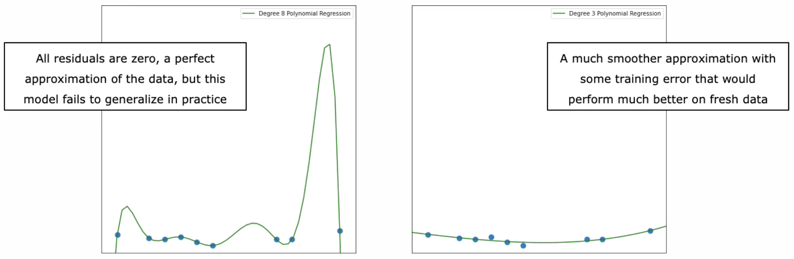
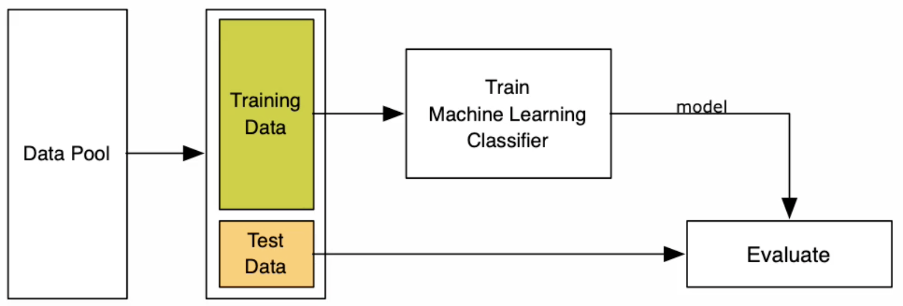
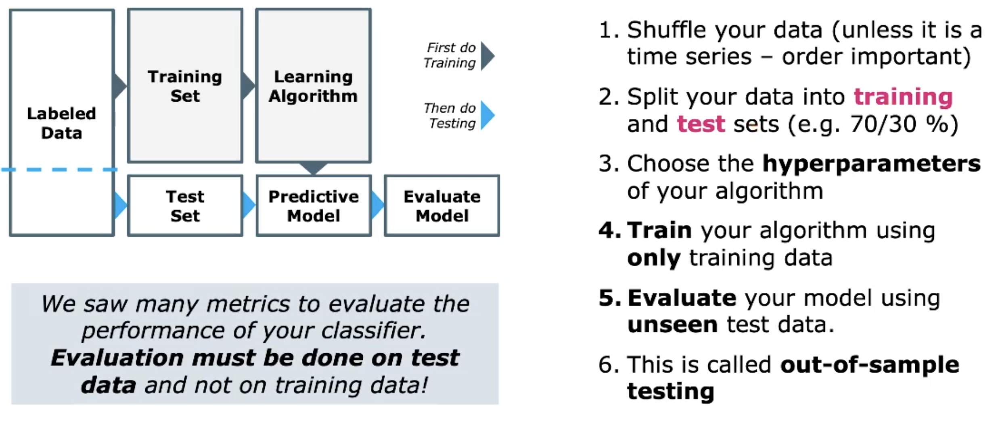
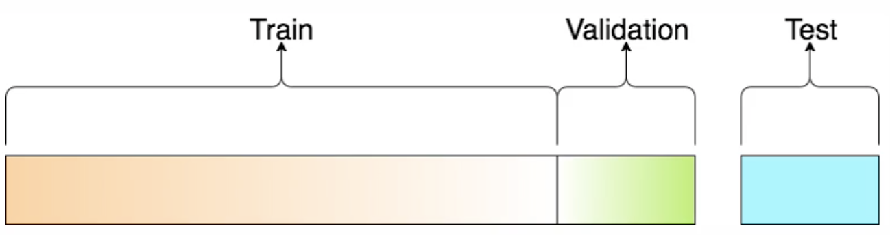
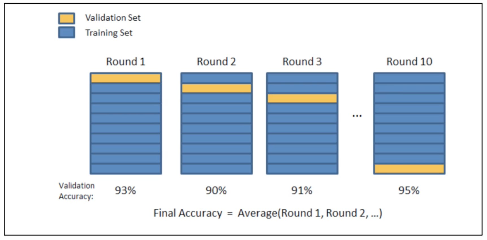
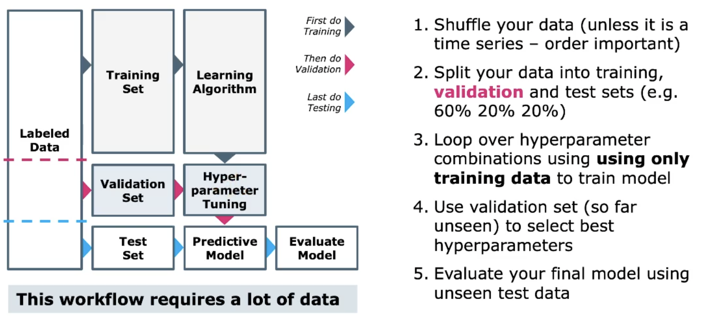

# Supervised Learning - Regression

Überwachtes Lernen mit Regressionsmodellen. Ziel ist es die Zielvariable (*Attribut*)
anhand *gelabeled* Daten vorauszusagen. Die Zielvariable ist stetig. Das Voraussagen einer Kategorie
wäre ein Klassifizierungsproblem.

## Variants of Regression Models

Berühmte Regressionsmodelle sind

* Linear Regression
* Polynomial Regression
* k-NN Regression
* Support Vector Regression
* Regression Trees and Random Forests
* Neural Networks
* XGBoost Regression
* ...

Unterscheiden sich durch ihre *Hypothese*. Bedeutet wie sich die Funktion an ihre Daten *fittet* (
anpasst). Je nach Regressionsmodell benötigt die Funktion mehr oder weniger Daten, um eine Funktion
anzupassen (
z.B. Neuronale Netze sind sehr Datenhungrig).

## Measuring Regression Quality

Welches Model approximiert die Daten am besten (Güte).

### Regression Errors for Linear Hypothesis

*Residuen* minimieren den Fehlerterm (Distanz zwischen Gerade und effektivem Datenpunkt).

### Regression Errors for any Hypothesis

Residuen werden bei allen Modellen verwendet. Das beste Model ist das, welches die kumulierten
Residuen minimiert. Es gibt versch. Methoden um Fehler (Residuen) zu minimieren.

### How to Measure Regression Errors

Wir nehmen die Funktion $f_i$ als Voraussage-Funktion an für $i=1,2,...,m$. Die Differenz (
Fehler/Residuen) ergibt sich zwischen Voraussage und effektiven Wert aus $y_i-f_i$. Die Summe der
Fehler $\frac{1}{m}\sum_{i=1}^m(y_i-f_i)$ wäre unsinnig, weil sich positive und negative Fehler
auslöschen würden. Geeigneter sind folgende Summen:

#### MAE - Mean Absolute Error

Betragswerte der einzelnen Residuen. $$\frac{1}{m}\sum_{i=1}^m|y_i-f_i|$$

#### MAPE - Mean Absolute Percentage Error

Besser als MAE, weil prozentualer Fehler. $$\frac{1}{m}\sum_{i=1}^m|\frac{y_i-f_i}{y_i}|$$

#### MSE - Mean Squared Error

Vorteil, grössere Abweichungen werden stärker bestraft als kleinere, weil quadriert wird. Wird oft
zur Optimierung verwendet, aber schwieriger zu interpretieren als MAE und MAPE. $$\frac{1}{m}\sum_
{i=1}^m(y_i-f_i)^2$$

### Comparison with Mean Approximation

Man kann auch den Mittelwert mit der Approximation vergleichen, um den Fehler zu kumulieren. Wie
viel besser/schlechter ist die Approximation mit dem Vergleich zum Mittelwert?

#### R-Squared ($R^2$) - Coefficient of Determination

$R^2$ misst, wie gut das Modell die Abweichungen der Varianz erklärt. Der Wert liegt zwischen $[0,1]
$. Der Wert kann als Prozentsatz interpretiert werden. $R^2=0.53$ bedeutet, dass $53%$ der
Datenvarianz durch das Modell erklärt wird. Wir *minimieren* MAE, MAPE und MSE aber *maximieren*
$R^2$.

$$R^2=\frac{MSE(mean)-MSE(model)}{MSE(mean)} = 1 - \frac{\sum_{i=1}^m(y_i-f_i)^2}{\sum_{i=1}^m(
y_i-\mu_Y)^2}$$

Es ist möglich, dass der $R^2$ negativ wird. Genau dann, wenn das Modell schlechter performt, als
der Mittelwert (horizontale Gerade) und der Bruch $>1$ wird.

## Machine Learning Quality Assessment

Grundsätzlich ist das Modell zu wählen, welches den grössten $R^2$-Wert ergibt.

### Generalization Error

Das minimieren von Trainingsfehler garantiert nicht, dass das Verfahren auch auf neuen (*
fresh/unseen*) Daten auch gut performt. Praktisch relevant ist deshalb die Performance auf neuen
Daten. Diese wird *generalization Error* genannt. Modelle die gut auf Trainingsdaten performen, aber
schlecht auf unseen Daten werden *overfitted* genannt (Trainingsdaten auswendig, kann Wissen aber
nicht auf neuen Daten anwenden).

#### Perfect Performance on Training Data

Unwidersprüchliche Daten können perfekt approximiert werden (Interpolationstheorem). Für $m$
verschiedene Datenpunkt ergibt ein Polynom mit Grad $m-1$.

{width=90%}

Model soll *Tendez* der Daten und nicht die Trainingsdaten auswendig lernen.

#### Simplistic Machine Learning Workflow

Dieser Workflow funktioniert nur, wenn wir viele Daten haben (wir splitten) und fixe Hyperparameter
verwendet werden. Beim Vergleich von Modellen darf dies nicht angewandt werden.

1. Daten mit Zufalls-Seed vermischen (ausser bei Timeseries)
1. Daten in Trainings- und Testdaten aufteilen (80/20)
1. Regressionsmodell auf Trainingsdaten trainieren
1. Evaluation auf dem Testset um Performance schätzen

{width=70%}

weiteres Beispiel

{width=60%}

### Hyperparamters

Hyperparameter bilden die manuelle Konfigration eines ML-Models und sind je nach Modell sehr
verschieden. Als Beispiel Anzahl $k$-Nachbarn bei k-NN oder Grad des Polynomials für Regressions
Modelle. Als Engineer müssen wir die besten Hyperparameter aussuchen, welche auf ungesehenen Daten
am besten performt. Ein simpler Train-Test split funktioniert da leider nicht.

Parameter hingegen sind optimierbare Gewichte im System, die automatisch optimiert werden können (
zb. mit [Gradient Descent][]).

#### How to get Fired as Data Scientist

Beim Vergleich von Hyperparameter darf die Aussage, wie genau das Modell performen wird nur dann
getätigt werden, wenn es *truly unseen* Daten sind (sobald einmal verwendet sind sie nicht mehr
unseen).

### Evaluation Workflow for Hyperparameter Optimization

Daten sollen in 60/20/20-Teile für Training/Validation/Test aufgeteilt werden. Die Testdaten
wegsperren und erst für finalen Performancetest **einmal** verwenden. Arbeiten nur mit Trainings-
und Validationsdaten

1. über alle Hyperparameter Kombinationen loopen
1. Modelle mit gewählten Hyperparameter mit *Trainingsdaten* trainieren
1. Performance für Model mit *Validationsdaten* messen
1. Bestes Modell (Performance) auswählen
1. Modell mit *Testdaten* evaluieren, dies ergibt Performanceschätzung für *truly unseen* Data.

Ist man unzufrieden, braucht man neue Daten. Man darf keine Änderung am Modell vornehmen, ohne neue
Daten zur Hand zu haben. Dieser Workflow benötigt viele Daten.

{width=60%}

### K-Fold Cross-Validation

Wenn wir zu wenig Daten haben um auf 60/20/20 zu teilen, kann das $K-Fold$-Prinzip aushelfen. Man
teilt die Trainings- und Testdaten in 80/20 auf. Die Testdaten wegsperren. Auf den 80% der Daten
wird die *K-Fold Cross Validation* gemäss Abbildung \ref{kfold} ausgeführt.

{width=60%}

Die 80% Daten werden in $k$-Teile unterteilt. Das Training wird jeweils auf $k-1$ Teile ausgeführt
und validiert. Nach jeder Runde wird ein anderes Validierungs- und Trainingsset verwendet. Die
Gesamtgenauigkeit ergibt sich aus dem Durchschnitt der Genauigkeit aller Runden. Wird mittlerweile
auch dann verwendet, wenn sehr sehr viele Daten vorhanden wären. Grund ist, dass wir aus diesem
Verfahren stabile Aussagen erhalten, oder wenn Training sehr, sehr rechenintensiv.

{width=60%}

Aufwendigste Methode ist *Leave-One-Out Cross-Validation*.
