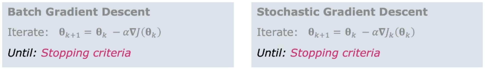
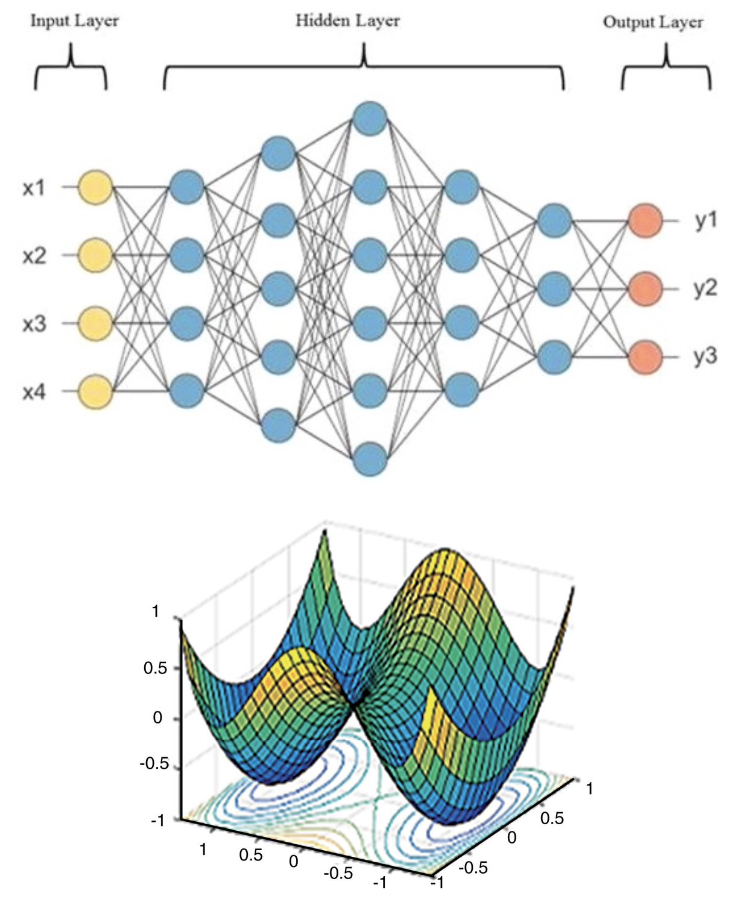

# Gradient Descent

Wie findet man die relevanten Punkte in einer Funktion? Mit einer Form von *supervised learning*. Es
wird von gelabelten Daten gerlernt. Dazu wird eine Kostenfunktion definiert und die Parameter so
optimiert, dass man zum lokalen Minimum strebt.

## Fining local minima

Wenn wir eine Kostenfunktion minimieren möchten, suchen wir nach dem lokalen bzw. globalen Minimum.
Um einen Parameter (z.B Gefahr) zu minimieren, muss ein anderer (z.B. Geschwindigkeit) angepasst
werden. Dies wird *Parameter Tuning* genannt. Der Parameter $\theta$ können wir *tunen*, weil er in
unserer *direkten* Kontrolle ist. $J(\theta)$ ist die Kostenfunktion und wird verändert, wenn wir
$\theta$ verändern. $J$ wird also indirekt kontrolliert.

### Multidimensional Functions

Auch im multidimensionalen Parameterraum gelten die Regeln der Mini-/Maxima. Wobei das Minimum einer
Kostenfunktion $J(\theta)$ ein Vektor ist $\theta = [\theta_0, \theta_1]^T$. Um diesen zu finden
nutzen wir die partielle Ableitungen.

### Contour Lines

Kontourlinien zeigen den Wert von $\theta$, für welche die Kostenfunktion $J(\theta)=c$ ist. Wobei
$c$ einer Konstante entspricht.

## (Batch) Gradient Descent

Der Gradient ist ein Vektor, welcher die partiellen Ableitungen von $J(\theta)$ enthält. Mehr dazu
in IMATH. Batch heisst es, weil es auf einem grossen Datenbestand angewendet wird.

> $\nabla J(\theta)$ wird in Englisch "grad jay theta" ausgesprochen.

[Der Gradient von $J(\theta)$](images/gradient.png){width=50%}

### The Idea Behind Gradient Descent

Starte irgendwo und bewege dich *entgegen* des Gradienten. In Pseudocode:

1. Caclulate the Gradient of starting point $\nabla J(\theta_0)$
1. move a small step $\alpha$ in the exact opposite direction $-\alpha\nabla J(\theta_0)$
1. go back to first step, iterate until arriving at the local minimum

Die Step-Grösse $\alpha$ bestimmt die Geschwindigkeit der *Konvergenz*. Die Daten müssen vorher **
normalisiert** werden. Skalenwerte der Plots beachten! Falls Skalen bereits identisch, kann $\alpha$ optimiert werden.

### The Math Behind

Der Algorithmus entspricht folgendem mit definiertem $\alpha$:
$$\theta_{k+1}=\theta_k-\alpha\nabla J(\theta_k)$$ Iterieren bis zum Stopkriterium

### Batch Gradient Descent

Wir haben eine Kostenfunktion $J(\theta)$, welche die Summe aller Fehlerterme (Residuen) enthält.
Bei jeder Iteration $k$ werden alle Datenpunkt $(X,Y)$ verwendet, um $\nabla J$ zu berechnen. Dies
wird *
Batch* Gradient Descent genannt. Es ist eine *iterative* Methode, welche auf dem Gradienten basiert.
Dabei werden vorhandene Daten genutzt, um den Gradienten abzuschätzen. Zum Beispiel bei linearer
Regression versuchen wir eine Gerade so anzupassen, dass Sie ideal zwischen die Datenpunkte passt.

{width=70%}

## Stochastic Gradient Descent

Weil im Batch Gradient Descent in jeder Iteration *alle* Datenpunkte verwendet werden, können wir
garantieren, dass wir auf ein Minimum konvergieren. Jedoch wird bei einer grossen Anzahl $N$ das
Training sehr langsam. Ausserdem kann sich das Training in einem lokalen, anstatt globalen Minimum
reinarbeiten.

Die Alternative ist *Stochastic Gradient Decent*. Diese nutzt pro Iteration nur **einen**
Datenpunkt (ein Sample vom Datenset) um den Gradienten abzuschätzen. Der Punkt wird dabei zufällig
ausgewählt.

{width=70%}

### Convergence of Gradient Descent

In der Abbildung \ref{convergencegradient} erkennt man klar die Unterschiede der Konvergenz der
beiden Verfahren.

{width=70%}

### Batch vs. Stochastic Gradient Descent

| **pros** | Batch | Stochastic
| --- | --- | ---
|   | * *Globale* Minimum wird für konvexe Kostenfunktionen gefunden | * sehr schnell
|   | * konvergiert zu einem lokalen Minimum für nicht konvexe Funktionen | * erlaubt online-learning

| **cons** | Batch | Stochastic
| --- | --- | ---
|   | * langsam für grosse Datensets | * hohe Varianzen zwischen Punkten
|   | * Kein Online-Learning (z.B. für neue Daten) | * Springt umher, auch wenn nahe am Minimum

{width=20%}

### The Effect of Learning Rate $\alpha$

Die Konvergenzrate wird mit der *Schrittgrösse* $\alpha$ definiert. Normalerweise zwischen $0.01 \leq
\alpha \leq 0.1$. Je grösser der Wert, umso grösser ist der Schritt in jeder Iteration. Die
Gefahr, dass Minimum zu überspringen steigt damit. Wenn sie aber kleiner sind, umso mehr Iterationen
sind nötig, bis das Minimum gefunden wird. Ideal wäre mit grossem $\alpha$ zu starten und kleiner zu
werden.

### Stopping Criteria

Die Stopkriterien sind sehr ähnlich. Die beste Option ist häufig Datenabhängig.

{width=70%}

Stoppen wenn

* ein Maximum an Iterationen erreicht wurde
* die Kostenfunktion einen gewissen Threshold unterschritten hat
* die Reduktion der Kostenfunktion zwischen Iterationen sehr klein ist
* der Gradient der Kostenfunktion klein ist
* die Schritte pro Iteration kleiner als einen gewissen Threshold sind

## Applications of Gradient Descent in Machine Learning

Gradient Descent wird überall in ML verwendet. Sei es beim Finden von optimalen Parameter, bei
linearer oder logische Regression, beim Finden der *Weights* im Training von neuronalen
Netzwerken, oder beim verfeinern von Billionen von Parametern in Deep Learning.

### Linear Regression by Gradient Descent

In 1D-linearer Regression wird versucht eine Gerade an die Datenpunkte anzupassen. Mit zwei
Parameter, versuchen wir eine Ebene (x,y,z in 3D) an die Punkte anzupassen. Sobald mehr als drei
Dimensionen im Spiel sind, fitten wir eine *Hyperebene* oder *hyperplane*. In all diesen Fällen ist
unsere Kostenfunktion ein Mass wie *arm* das Fitting ist. Normalerweise wird es mit der Summe der
Quadrate der Residuen berechnet. Der Gradient der Kostenfunktion ist dann eine lineare Funktion der
Parameter.

{width=50%}

### Logistic Regression by Gradient Descent

Hier wird versucht *sigmoide*-Daten so anzupassen, dass sie für *binäre* Klassifikation genutzt
werden kann. Die Parameter werden durch Gradient Descent optimiert.

{width=50%}

### Neural Net Training by Gradient Descent

Dabei werden die *Gewichte* (*weights*) so optimiert, dass Klassifizierungsfehler reduziert werden
können. Es werden *labelled data* genutzt, um die Fehler zu messen und eine Kostenfunktion zu
entwickeln. Die Kostenfunktion ist *non-convex*. Mit *back propagation* kann die Geschwindigkeit
optimiert werden.

{width=50%}

### Deep Learning by Gradient Descent

Es werden viele Daten benötigt. Es wird immer wieder die Gradientengleichung verwendet. Es wird
eine Kostenfunktion erstellt, welche die Gewichte optimiert (lokales Minimum). Auch hier kann
Back-Propagation helfen, allerdings tritt das Problem vom *Verschwinden des Gradiententermes* auf. Die
Konvergenz kann dadurch gleichbleiben. Um dies zu verhindern sind spezielle Tricks nötig.

{width=50%}
