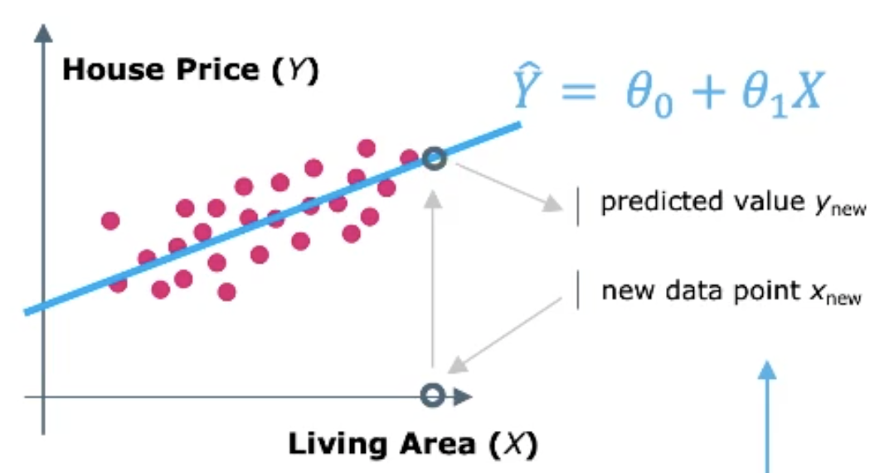
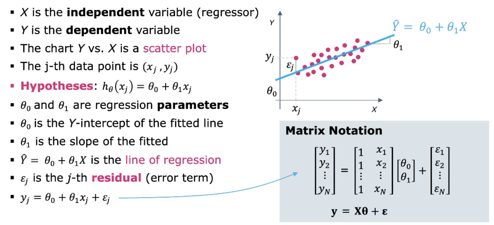
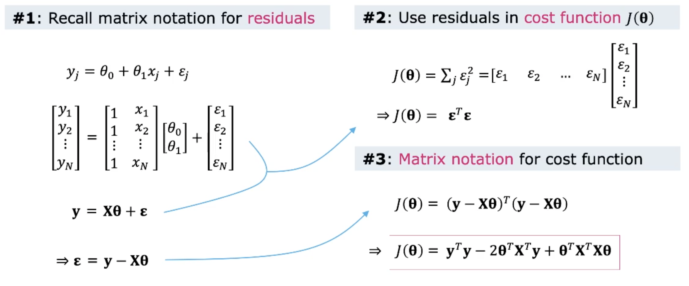
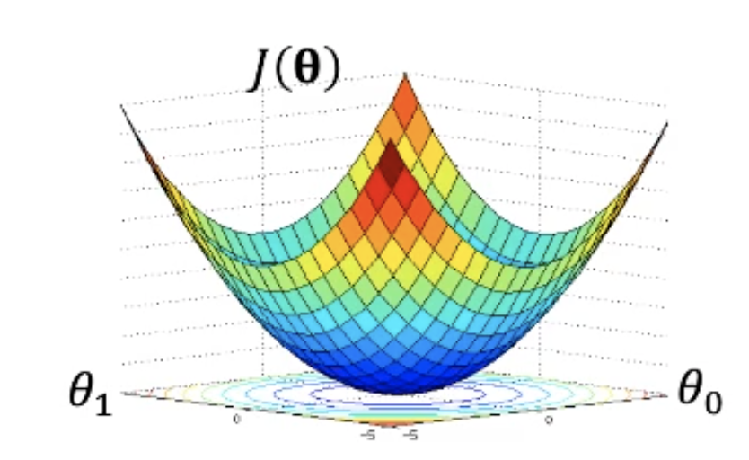
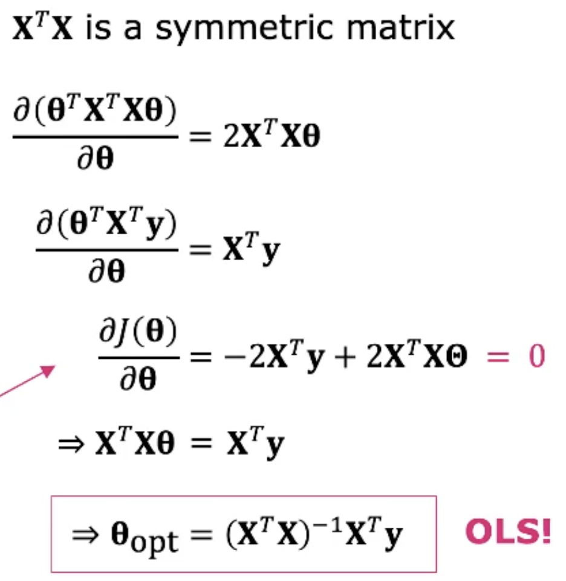
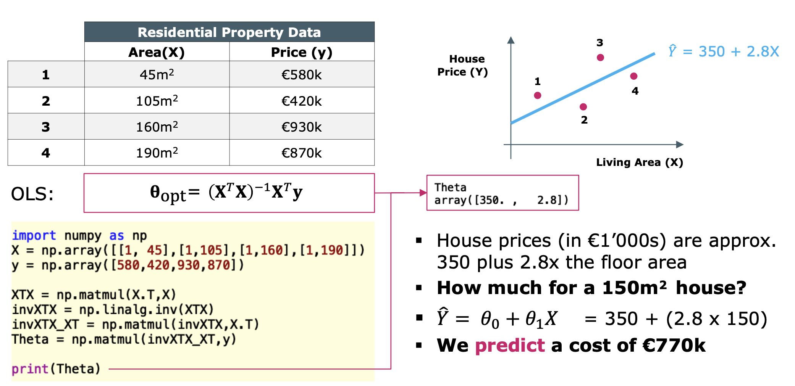
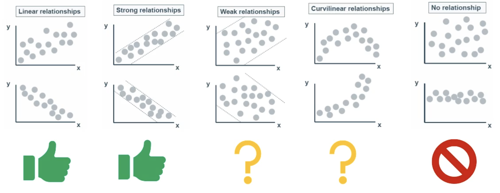
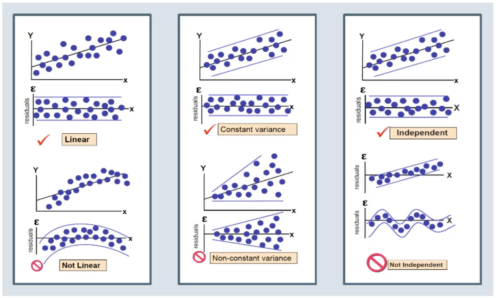
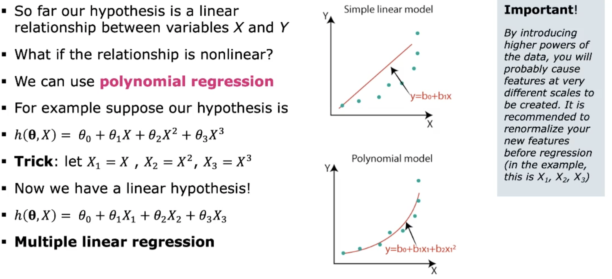

99# Linear Regression

Gibt es eine Beziehung zwischen zwei Variabeln und falls ist sie stetig oder nur in einer gewissen
Periode?

## Introduction

Regression wird genutzt um Relationen in Daten zu finden. Das Ziel ist es die Relation zwischen
Features zu finden, *wenn es existiert*. Wenn wir voraussetzen, dass die Relation approximativ
linear, können wir die **lineare Regression** wie folgt ausdrücken:
$$ \hat{Y}=\theta_0+\theta_1X$$

### Regression can be used for Prediction

Wenn wir eine Gerade finden können, können *neue* Datenpunkt abgeschätzt werden. Wir nutzen lineare
Regression um die Voraussage für neue Datenpunkte zu treffen.

{width=40%}

Aber wie finden wir die die Parameter $\theta_0$ und $\theta_1$? **Supervised Learning**

### Terminology

{width=50%}

### Selecting the Regression Parameters

In einem linearen Modell ist unsere Hypthese, dass die Relation zwischen den beiden Variablen eine
gerade Linie ist:
$$h_\theta(x)=\theta_0+\theta_1x$$ Um nun die beste Gerade zu finden, müssen wir $\theta_0$ und
$\theta_1$ so wählen, dass das Total der *Fitting Error* minimal ist.

## Ordinary Least Squares (OLS)

Wie können wir den Regressionsfehler messen?

* [MAE - Mean Absolute Error][]
* [MAPE - Mean Absolute Percentage Error][]
* [MSE - Mean Squared Error][]

### Defining a Cost Function

Der *MSE - Mean Squared Error* ist der Favorit als Regressionsmass. Es ist eine konvexe Funktion der
Parameter und stetig **differenzierbar** beider Parameter ($\theta_0, \theta_1$). Wir wählen also
$\theta_0, \theta_1$ um den MSE zu minimieren. Die Funktion nennen wir *Cost Function* $J(\theta_0,
\theta_1)$. $$J(\theta_0, \theta_1) = \frac{1}{N}\sum_{j=1}^N\epsilon_j^2=\frac{1}{N}\sum_{j=1}^N(
y_j-\hat{y}_j)^2=\frac{1}{N}\sum_{j=1}^N(y_j-\theta_0, \theta_1 x_j)^2$$

#### Writing the Cost Function in Matrix Form

{width=50%}

#### Minimizing the Cost Function

Die Kostenfunktion ist eine *konvexe* (Schüsselform) mit einem einzigen Globalen Minimum.

{width=40%}

Das Minimum finden wir mit *Calculus*.

### Ordinary Least Squares

Um das Minimum der Kostenfunktion zu finden muss der Gradient $0$ sein.

{width=50%}

#### Example in Python

{width=50%}

### Linear Regression by Gradient Descent

Eine effizientere Möglichkeit (besonders bei grossen Datensets) das Minimum zu finden ist die
Gradientengleichung. Die Lösung wird so iterativ gefunden. Mehr dazu in [Gradient Descent][].

## Regression Performance ($R^2$)

Lineare Regression können wir einsetzen, wenn die Datenpunkte linear Zusammenhängen, einen
Zusammenhang besteht. Dies müssen wir aber prüfen können.

{width=60%}

Die Variabilität von $Y$ der Gerade ist der [MSE - Mean Square Error][]. Die Variabilität von $Y$
vom Mittelwert $\hat{Y}$ ist die *Varianz*. Das Verhältnis dieser beiden Zahlen ist eine gute
Performance Metrik.

### $R^2$ - The Coefficient of Determination

$R^2$ ist ein Mass wie stark die Variabilität von $Y$ durch $X$ erklärt wird. Der Wert erklärt die
Variabilität der abhängigen Variable. $1-R^2$ ist die Variablität die unerklärt bleibt.
Siehe [R-Squared ($R^2$) - Coefficient of Determination][]

Der Wert von $R^2$ ist nicht 100% verlass. Die Daten sollte *immer* geplottet/visualisiert werden.
Die Verteilung kann $R^2$ beeinflussen!

### Visualize your Residuals

Die Residuen verbleiben, wenn wir die beste passende Gerade von den Daten abziehen. Für einen
guten *fit* die Residuen sollten wie *zero-mean*, stationär, *white noise* aussehen. $$\mathbf{y =
X} \Theta + \epsilon \Longrightarrow \epsilon = \mathbf{ y - X} \Theta$$

{width=50%}

### Correlation and $R^2$

Korrelation ist ein generelles Mass wie zwei Variabeln sich in Relation zur anderen verhalten. Die *
Pearson correlation* $\rho_{X,Y}$ ist ein spezieller Fall, welcher nur die lineare Relation zwischen
$X$ und $Y$ betrachtet. Es ist ein normalisiertes Mass der *Covarianz* und liegt zwischen $-1 \leq
\rho_{X,Y} \leq 1$.

Weil wir die *lineare Abhängigkeit* messen erwarten wir einen Zusammenhang so dass gilt:
$$rho_{X,Y}^2=R^2$$

Durch Korrelation gilt nicht automatisch ein kausaler Zusammenhang.

## Multiple Linear Regression

Wenn wir mehr als ein Feature in einem $N$-Dimensionalen Raum betrachten.

### Matrix with M-Regressors

{width=50%}

### Nonlinear Regression

{width=50%}

### Regularization

Wenn wir mehr extra Feature haben, um unsere Trainingsdaten fitten, kann es sein dass das Model
overfittet. Overfitting führt zu Generalisierungsfehler wenn neue Daten kommen. Wir müssen uns auf
die Feature fokusieren welche die grösste erklärende Macht haben. Dies ist Regularisierung.

#### Ridge and LASSO

Beide Methoden sind sehr ähnliche Methoden der Regularisierung (overfitting verhinder). Beide fügen
der [Ordinary Least Squares (OLS)][], also der Kostenfunktion, einen extra Term hinzu, um die
unwichtigen Feature weniger zu gewichten.

* Ridge: nutzt die Summe der Quadrate der Parameter, irrelevante Features werden sehr klein
* LASSE: nutzt die Summe der Beträge der Parameter, irrelevante Features werden $0$

#### Regularization Parameter $\lambda$

Grosse Parameter werden bestraft. Hat Effekt, dass nur die wichtigen Feature die Regression steuern.
Weniger relevante Features werden unterdrückt. Kontrolle über den *Regularisierungsparameter*
$\lambda$
