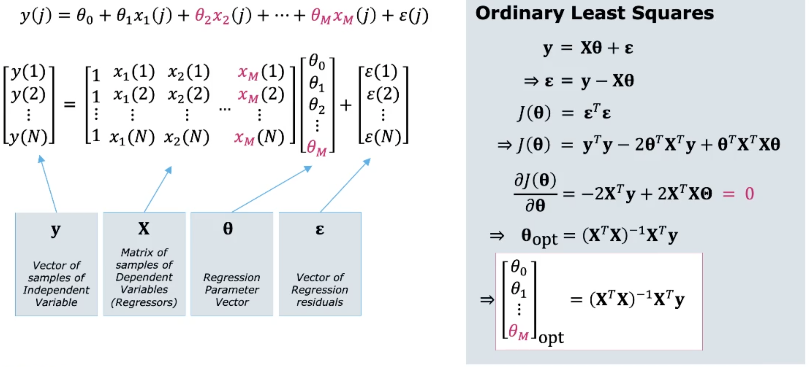

# Linear Regression

Gibt es eine Beziehung zwischen zwei Variabeln und falls, ist sie stetig, oder nur in einer gewissen
Periode?

## Introduction

Regression wird genutzt, um Relationen in Daten zu finden. Das Ziel ist es, die Relation zwischen
Features zu finden, *wenn eine existiert*. Wenn wir voraussetzen, dass die Relation approximativ
linear ist, können wir die **lineare Regression** wie folgt ausdrücken:
$$ \hat{Y}=\theta_0+\theta_1X$$

### Regression can be used for Prediction

Wenn wir eine Gerade finden, können *neue* Datenpunkt abgeschätzt werden. Wir nutzen lineare
Regression, um die Voraussage für neue Datenpunkte zu treffen.

{width=40%}

Aber wie finden wir die die Parameter $\theta_0$ und $\theta_1$? **Supervised Learning**

### Terminology

$\theta_0$ ist der Bias Term bzw. entspricht der Achsenverschiebung. $\theta_0$ hat kein Einfluss auf over-/underfitting.

{width=70%}

### Selecting the Regression Parameters

In einem linearen Modell ist unsere Hypthese, dass die Relation zwischen den beiden Variablen eine
gerade Linie ist:
$$h_\theta(x)=\theta_0+\theta_1x$$ Um nun die beste Gerade zu finden, müssen wir $\theta_0$ und
$\theta_1$ so wählen, dass das Total der *Fitting Errors* minimal ist.

## Ordinary Least Squares (OLS)

Wie können wir den Regressionsfehler messen?

* [MAE - Mean Absolute Error][]
* [MAPE - Mean Absolute Percentage Error][]
* [MSE - Mean Squared Error][]

### Defining a Cost Function

Der *MSE - Mean Squared Error* ist der Favorit als Regressionsmass. Es ist eine konvexe Funktion der
Parameter und stetig **differenzierbar** in beiden Parameter ($\theta_0, \theta_1$). Wir wählen also
$\theta_0, \theta_1$ um den MSE zu minimieren. Die Funktion nennen wir *Cost Function* $J(\theta_0,
\theta_1)$. $$J(\theta_0, \theta_1) = \frac{1}{N}\sum_{j=1}^N\epsilon_j^2=\frac{1}{N}\sum_{j=1}^N(
y_j-\hat{y}_j)^2=\frac{1}{N}\sum_{j=1}^N(y_j-\theta_0, \theta_1 x_j)^2$$

#### Writing the Cost Function in Matrix Form

{width=50%}

#### Minimizing the Cost Function

Die Kostenfunktion ist *konvexe* (Schüsselform) mit einem einzigen globalen Minimum.

{width=40%}

Das Minimum finden wir mit *Calculus*.

### Ordinary Least Squares

Um das Minimum der Kostenfunktion zu finden, muss der Gradient $0$ sein.

{width=50%}

#### Example in Python

{width=50%}

### Linear Regression by Gradient Descent

Eine effizientere Möglichkeit (besonders bei grossen Datensets) das Minimum zu finden, ist die
Gradientengleichung. Die Lösung wird so iterativ gefunden. Mehr dazu in [Gradient Descent][].

## Regression Performance ($R^2$)

Lineare Regression können wir einsetzen, wenn die Datenpunkte linear zusammenhängen. Dies müssen wir
aber prüfen können.

{width=60%}

Die Variabilität von $Y$ der Gerade ist der [MSE - Mean Squared Error][]. Die Variabilität von $Y$
vom Mittelwert $\hat{Y}$ ist die *Varianz*. Das Verhältnis dieser beiden Zahlen ist eine gute
Performance-Metrik.

### $R^2$ - The Coefficient of Determination

$R^2$ ist ein Mass wie stark die Variabilität von $Y$ durch $X$ erklärt wird. Der Wert erklärt die
Variabilität der abhängigen Variable. $1-R^2$ ist die Variablität die unerklärt bleibt.
Siehe [R-Squared ($R^2$) - Coefficient of Determination][]

Dem Wert von $R^2$ kann nicht zu 100% vertraut werden. Die Daten sollten *immer*
geplottet/visualisiert werden. Die Verteilung kann $R^2$ beeinflussen!

### Visualize your Residuals

Die Residuen verbleiben, wenn wir die beste passende Gerade von den Daten abziehen. Für einen
guten *fit* die Residuen sollte $\epsilon$ wie *zero-mean*, stationär, *white noise* aussehen.
$$\mathbf{y = X} \Theta + \epsilon \Longrightarrow \epsilon = \mathbf{ y - X} \Theta$$

{width=50%}

### Correlation and $R^2$

Korrelation ist ein generelles Mass wie sich zwei Variabeln in Relation zueinander verhalten. Die *
Pearson correlation* $\rho_{X,Y}$ ist ein spezieller Fall, welcher nur die lineare Relation zwischen
$X$ und $Y$ betrachtet. Es ist ein normalisiertes Mass der *Covarianz* und liegt zwischen $-1 \leq
\rho_{X,Y} \leq 1$.

Weil wir die *lineare Abhängigkeit* messen, erwarten wir einen Zusammenhang so dass gilt:
$$rho_{X,Y}^2=R^2$$

Durch Korrelation gilt nicht automatisch ein kausaler Zusammenhang.

## Multiple Linear Regression

Wenn wir mehr als ein Feature in einem $N$-Dimensionalen Raum betrachten.

### Matrix with M-Regressors

Ordinary Least Squares Regressor.

{width=70%}

### Nonlinear Regression

Nicht-lineare Regression.

{width=70%}

### Regularization

Wenn wir mehr Extra-Features haben, um unsere Trainingsdaten fitten, kann das Model overfitten.
Overfitting führt zu Generalisierungsfehler, wenn neue Daten kommen. Wir müssen uns auf die Feature
fokussieren, welche die grösste *erklärende Macht* haben. Dies ist Regularisierung.

#### Ridge and LASSO

Beide Methoden sind sehr ähnliche Methoden der Regularisierung («overfitting-verhinder»). Beide
fügen der [Ordinary Least Squares (OLS)][], also der Kostenfunktion, einen Extra-Term hinzu, um die
unwichtigen Features weniger zu gewichten.

* Ridge: nutzt die Summe der Quadrate der Parameter, irrelevante Features werden sehr klein
* LASSE: nutzt die Summe der Beträge der Parameter, irrelevante Features werden $0$

#### Regularization Parameter $\lambda$

Grosse (komplexe) Parameter werden bestraft (Penalty). Hat Effekt, dass nur die wichtigen Features die Regression
steuern. Weniger relevante Features werden unterdrückt. Kontrolle über den *
Regularisierungsparameter* $\lambda$. Wird $\lambda$ zu gross gewählt, kann das Modell underfitten.
