# Classification

Wie können Daten in versch. Klassen separiert werden.

## Introduction

Binary Classification ist die Klassifizierung in zwei Klassen (Features). Wenn wir einen neuen
Datenpunkt erhalten, ist die Frage in welche Klasse wir den neuen Punkt zuweisen können.

### Classification Requires a Decision Boundary

Klassifizierung ist eine Form von *Supervised Learning*. Dem Algorithmus werden gelabelte
Trainingsdaten übergeben. Die Daten müssen vorgängig von einem Experten klassifiziert werden. Um
eine Voraussage zu machen, benötigen wir einen Klassifizierungsalgorithmus, welcher das Label von *
unseen* Samples erkennen kann.

Das Klassifizierungsproblem reduziert sich auf das Finden einer passenden *Decision Boundary*,
basierend auf den gelabelten Trainingsdaten. Das Beispiel in Abbildung \ref{decisionboundary} zeigt
eine *lineare* Boundary, non-lineare sind aber auch möglich.

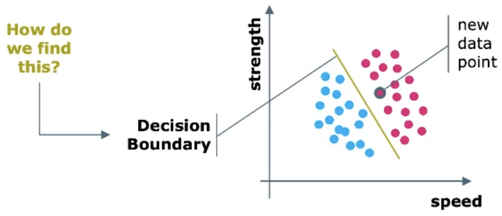{width=40%}

Es gibt mehrere Methoden für Klassifizierung:

* Logisitc Regression
* k-NN
* Decision Tree
* SVM mit RBF-Kernel
* SVM mit $n$-polynomialen Kernel
* Gaussian Naive Bayes

### Simple Classification: $k$-Nearest Neighbours

$k$-NN ist eine Mehrheitswahl der $k$-nahesten Punkte. Dazu wird ein Distanzmass benötigt
z.B. [Euclidiean Distance or $L^2$-Norm][]. $k$-NN ist am wenigsten Datenhungrig.

#### Changing Hyperparameteer $k$

Verschiedene $k$ ergeben verschiedene Klassifizierungsresultate. Mit der *Confusion Matrix* und
entsprechenden Metriken können wir die Performance messen. Die optimale $k$ finden wir mittels *
Hyperparameter tuning*. Wichtig, damit die Skalenwerte (oder Dimenstionen) der Variablen zu einander
passen, müssen die Daten **normalisiert** werden!! Ansonsten dominiert eine der beiden.

#### Pros and Cons of $k$-NN

**pros**

* Einfach zu implementieren z.B. mit ``sklearn`` Package für Python.
* ideal für kleine Datenset
* als *Baseline* nützlich um andere Klassifikatoren zu vergleichen

**cons**

* langsam weil die ganze Berechnung zu Klassifizierungszeit gemacht wird (keine Learningphase)

### Classification vs. Regression

Klassifizierung sagt *Kategorien* voraus. Die gelabelten Daten sind vom Typ *categorical*. Der
Klassifikator erlernt eine [Decision Boundary](#classification-requires-a-decision-boundary).

**Beispiel Klassifizierungsproblem:** Sagt Kaufverhalten voraus (ein Label), basierend auf
categorical labeled Trainingsdaten. Das Attribut welches vorausgesagt werden soll ist kategorisch.

Regression sagt *Werte/Zahlen* voraus. Die gelabelten Daten sind numerisch und lernt die
Beziehung/Zusammenhang in den Daten.

**Beispiel Regressionsproblem:** Sagt Preis (numerisch) eines Autos voraus, welcher anhand
gelabelten Trainigsdaten erlernt wurde. Das Attribut welches vorausgesagt werden soll ist stetig (
numerisch).

## Logistic Regression

Ist ein binäres, lineares *Klassifizierungs*-Problem.

### Binary Classification using 1 Feature

Bei der Klassifizierung separieren wir die Daten in *Kategorien*. Wenn ein kategorisches *Label* $Y$
nur zwei Werte (z.B besucht/nicht besucht) annehmen kann, sprechen wir von *Binary Classification*.
Wir labelen diese Werte mit 1 bzw. 0 (true/false). Beispiel; Wenn $X$ bei Wert 10 das Label
separiert (1/0), ist diese Linie die *Decision Boundary*.

### Binary Classification using 2 Feature

Mit mehr als einem Features, welches die Klassen unterscheidet, gehen wir für die Klassifizierung in
eine höhere Dimension. Bei zwei Features entspricht unsere Hypothese einer Geraden. Dafür benötigen
wir einen *linearen binären Klassifikator*. Dazu können wir *Logistic Regression* nutzen.

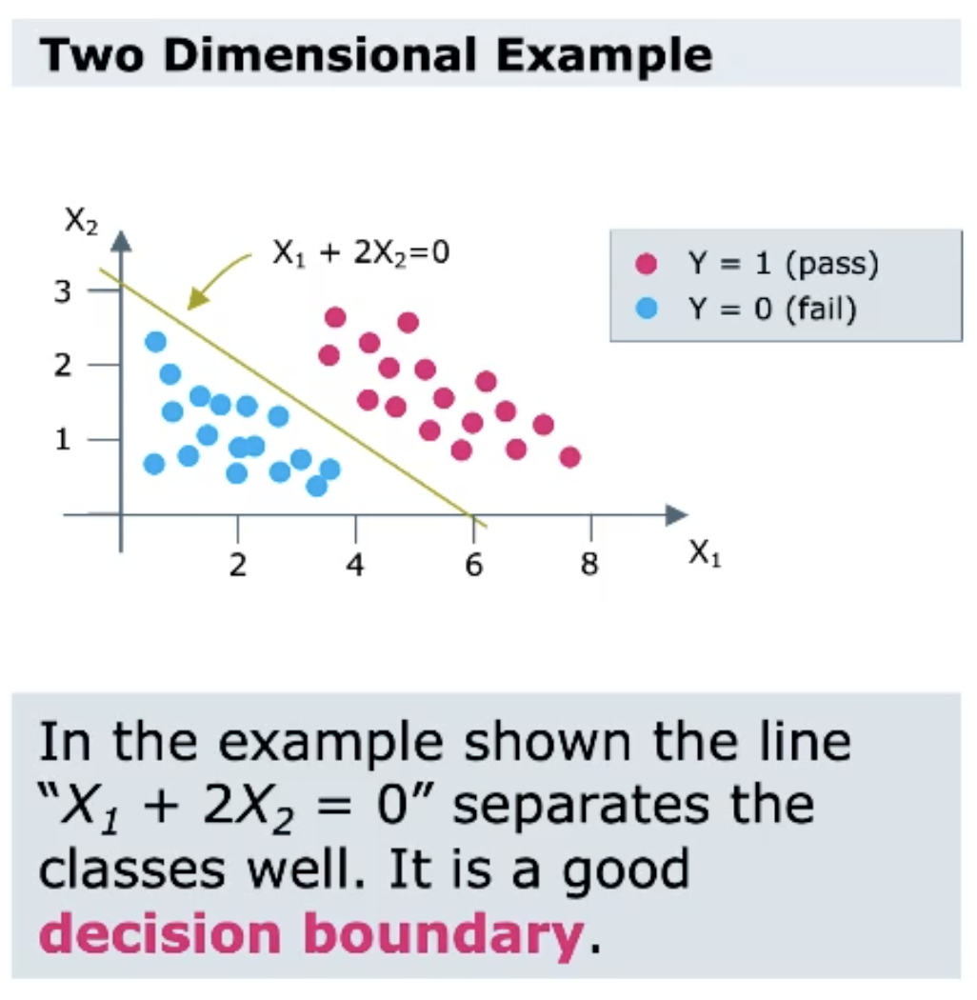{width=50%}

### Logistic Function

Eine *Logistic Function*, siehe in Abbildung \ref{logfunctionregression} links, ist eine
symmetrische Sigmoid (S-) geformte Funktion $g(z)= \frac{1}{1+e^{-z}}$ mit vielen angenehmen
Eigenschaften wie $0 < g(z) < 1$, oder dass sie stetig differenzierbar ist: $g'(z)=g(z)(1-g(z))\geq
0$

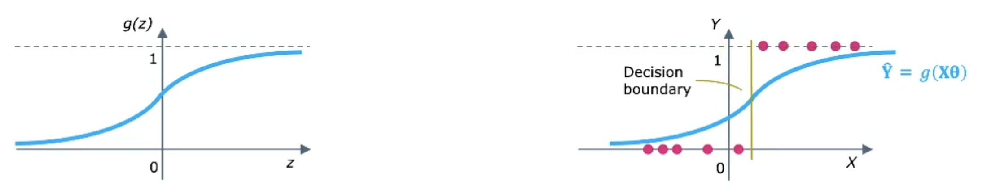
{width=60%}

### Logistic Regression

In der logistic Regression fitten wir **sigmoid** $\mathbf{\hat{Y}}=g(\mathbf{X}\Theta)$[^1]. Die
Decision Boundary, siehe in Abbildung \ref{logfunctionregression} rechts, ist als
$\mathbf{X}\Theta=0$ definiert. Wir erhalten eine W'keit ob eine Klasse zu 1 oder 0 gehört.

[^1]: Remember; in linearer Regression fitten wir eine Gerade $\mathbf{\hat{Y}=X}\Theta$. $\Theta$
ist immer noch eine lineare Kombi aus den Parameter.

### Logistic as a Probility Measure

Weil die Werte zwischen 0 und 1 liegen, ist es eine ideales Wahrscheinlichkeitsmass. Ist $z$ gross
und positiv ist die Wahrscheinlichkeit *hoch*, dass die Daten zu der 1er-Klass gehören. Ist $z$
negativ, ist die Wahrscheinlichkeit *klein*, zu der 1er-Klasse anzugehören. Ist $z=0$ sind wir genau
auf der Decision Boundary. Die W'keit ist 50%, dass die Daten zur 1er-Klass gehören.

### Logistic: Probability of Belonging to a Class

Wir berechnen die W'keit aus einer gewichteten linearen Kombi der Features $\mathbf{X}\Theta$.
Generell, haben wir für $n$-Datenpunkte und $m$ Features:

$$P(Y=1|\mathbf{X})=\hat{\mathbf{Y}}=g(\mathbf{X}\Theta)\text{, wobei }g(z)=\frac{1}{1+e^{-z}}$$

mit $\mathbf{X}\Theta = 3.57$ gibt das:
$$P(Y=1) = \frac{1}{1+e^{-3.57}}$$

Die sigmoid-Funktion sollte genau zwischen den beiden Punkten sein.

### Cost Function for Logistic Regression

Wenn $Y=1$, möchten wir, dass $g(\mathbf{X}\Theta)$ so nahe wie möglich an 1 ist. Dies ist die
W'keit, dass $Y=1$. Zur Herleitung der Kostenfunktion suchen wir nach einer Funktion, die tief ist,
falls $g(\mathbf{X}\Theta)$ nahe bei 1 und hoch, wenn $g(\mathbf{X}\Theta)$ nahe bei 0 (dann ist es
eine mis-classification).

In ähnlicher Weise machen wir das für $Y=0$. Wir definieren eine Kostenfunktion, die tief ist, falls
$g(\mathbf{X}\Theta)$ nahe 0 und hoch, wenn $g(\mathbf{X}\Theta)$ nahe 1 (mis-classification).

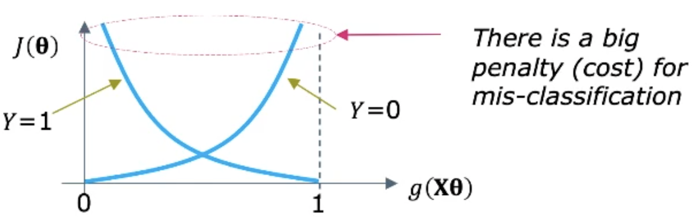
{width=30%}

Die *cross-entropy*-Funktion hat genau diese Eigenschaften gemäss Abbildung \ref{crossentropy}.

### Cross Entropy

Für $Y=1$ gilt

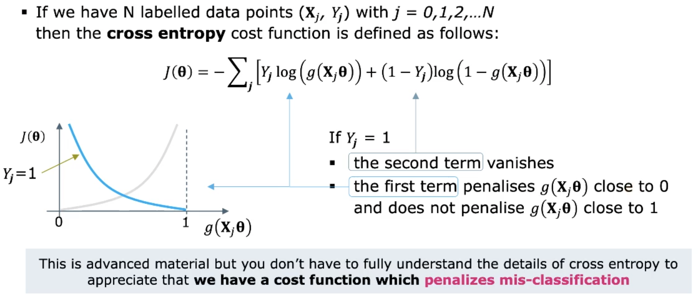{width=60%}

Für $Y=0$ gilt

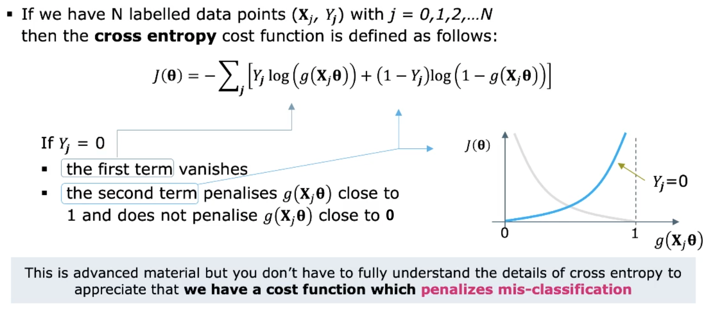{width=60%}

### Logistic Regression by Gradient Descent

In Logistic Regression können wir die optimalen Parameter nicht mit der OLS finden. Deshalb nutzen
mit [Gradient Descent][] dazu.

### Non-Linear Decision Boundaries

Mit Feature Engineering können auch Decision Boundaries gefunden werden, wenn durch lineare keine
möglich ist. Im Beispiel in Abbildung \ref{nonlinboundaries} fügen wir zwei Features $V_1=X_1^2$ und
$V_2=X_2^2$ (abgeleitet von $V_1$ und $V_2$) hinzu. Damit finden wir die Decision Boundary $g(
\mathbf{X}\Theta) = 50%$

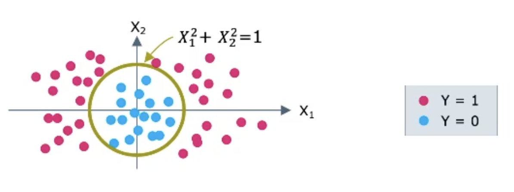{width=40%}

### One Versus the Rest

Falls wir mehrere Klassifizierungen machen müssen, machen wir eine «One vs. All» Klassifizierung.
Danach iterieren wir in die nächste Gruppe und klassifizieren weiter.

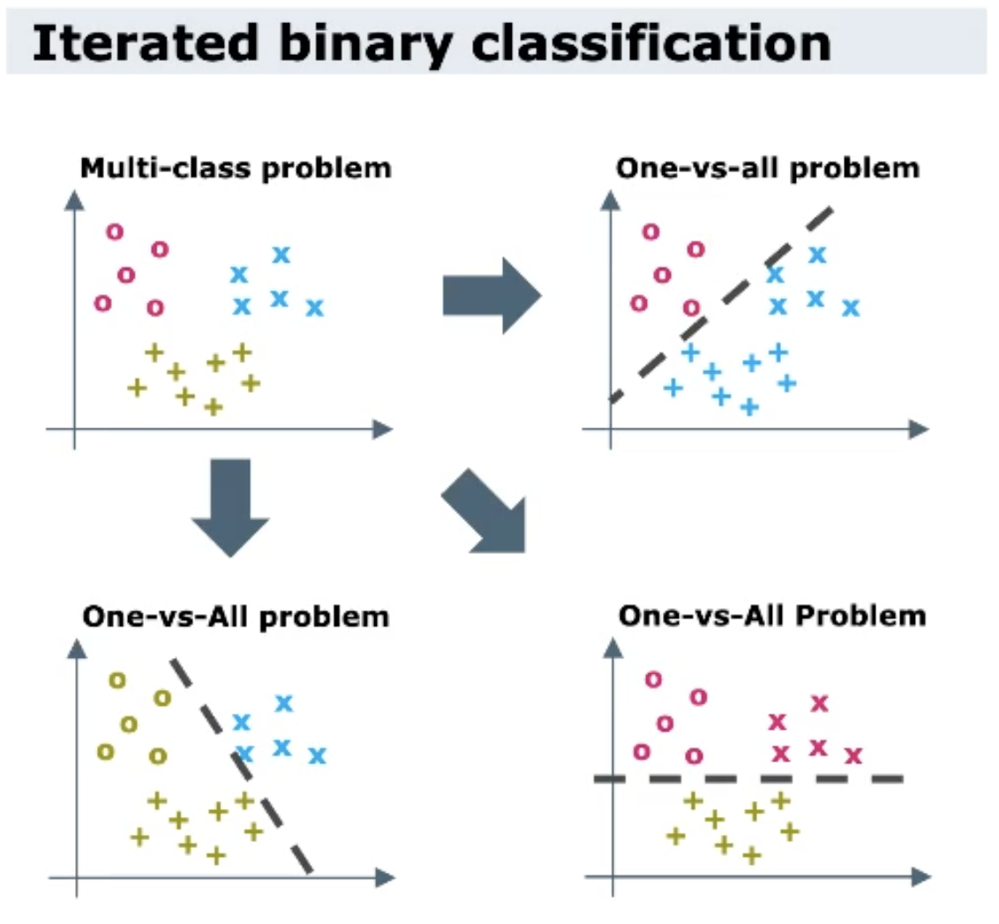{width=50%}

## Performance Analysis

Wir messen die Statistik der Fehler, um die Performance zu evaluieren.

* **True** *positive/negatives* bedeutet, dass der Klassifier richtig bewertet hat.
* **False** *positive/negatives* bedeutet, dass der Klassifier falsch bewertet hat.

### Confusion Matrix

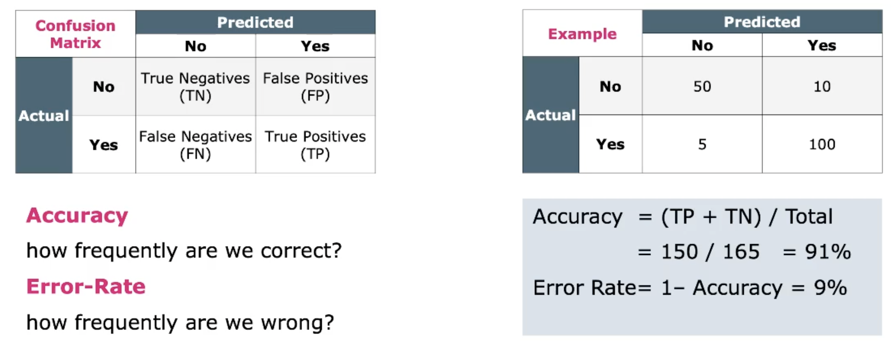{width=60%}

#### Imbalanced Data

Wenn die Daten sehr unausgeglichen sind (5000 No/ 20 Yes), erreicht man zwar eine hohe Accuracy,
welche aber keine Aussage hat. Immer die Daten prüfen!

#### Sensitivity - Performance on YES Instances

Die Sensivität misst wie oft das Modell **YES** voraussagt, im Verhältnis zum wahren **YES**. Es
wird auch *
True-Positive Rate* oder *Recall* genannt.

$$\text{Sensitivity}=\frac{TP}{TP+FN}$$

#### Specificity - Performance on NO Instances

Die Genauigkeit misst wie oft das Modell **NO** voraussagt, im Verhältnis zum wahren **NO**.

$$\text{Specificity}=\frac{TP}{TN+FP}$$

#### Precision - If True Negatives not Available

Manchmal sind keine True Negatives vorhanden, dann nutzen wir Precision. Das Modell sagt **YES**
voraus, wie oft ist das korrekt.

$$\text{Precision}=\frac{TP}{TP+FP}$$

#### F1 Score

Ist der harmonische Mittelwert zwischen Precision und Recall (Sensitivity) in Prozent. By Design
nimmt F1 keine True Negatives zum bewerten.

$$F1=\frac{2*\text{precision}*\text{recall}}{\text{precision}+\text{recall}}$$

F1 wird stark vom schlechteren Score hingezogen, also dann nutzen, wenn ein Klassifizierungsproblem
mit schiefen Daten vorliegt!

#### Summary of Classification Metrics

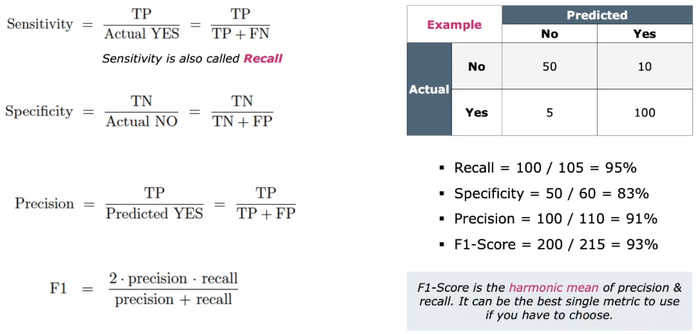{width=60%}

## Performance Optimization

Mit welchen Mittel können wir die Performance optimieren.

### Underfitting & Overfitting in Classification

Ist ein Modell underfitted, können die Klassen im Training und Test ungenügend separiert werden.
Dies bedeutet, es hat einen hohen *Bias*. Ist ein Modell overfitted, ist es überoptimiert auf den
Trainingsdaten. Zwar gute Performance auf Trainingsdaten, aber schlechte beim Testdaten. Dies
bedeuetet, es hat eine hohe *Varianz*.

#### Bias and Variance

Mit **Bias** ist gemeint, dass man systematisch einen bestimmten Wert vom Ziel entfernt ist. Das
Modell *ist konsitent*, aber *nicht akurat* (im Durchschnitt). Die **Varianz** meint die systematische *
Verstreuung* der Daten. Das Modell *ist akurat* (im Durchschnitt), ist aber *inkonsistent* und
generalisiert nicht.

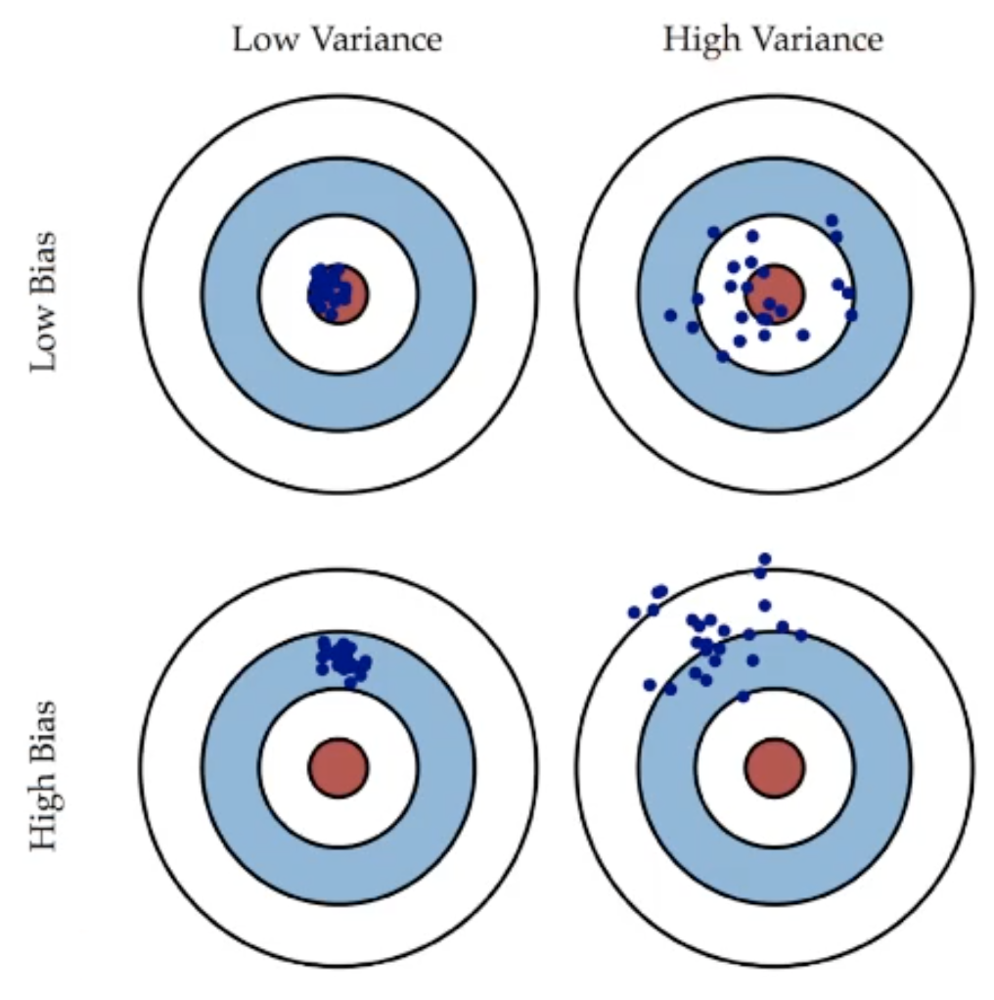{width=40%}

### How to Diehl with it

**Dealing with bias**

versuche

* grösseres Set von Features verwenden
* verschiedene Sets von Features
* Feature Engineering
* komplexere Algorithmen verwenden
* mehr Daten muss nicht die Lösung sein

**Dealing with variance**

versuche

* Anzahl Features reduzieren
* mehr Trainingsdaten erhalten
* [Data Cleaning][] (Outliers eliminieren)
* Training früh stoppen um overfitting zu vermeiden
* Advanced:
    * Reduktion von Features automatisieren (Feature Selection)
    * Regularisierung
    * Ensemble methods
