# Support Vector Machine

Skalierbar, komplexe Entscheidungsgrenzen (Decision Boundaries) mit Kernels, insenitive auf
Outliers. Es geht um Distanzen - welche zu den nahesten Punkten maximiert werden soll. Ist aber
linear!

## Motivation

Klassifizierungsprobleme können je nach Random Seed eine unterschiedliche Geradee als Deecision
Boundary ergeben.

### Uncertainty in Data

Unsicherheit in Daten. Z.B. ein Messgerät ist nicht immer gleich genau. Sie haben eine gewissee
Unschärfe. Wenn nun eine Entscheidungsgrenze sehr nahe an Punkten anliegt, könnte es sein dass die
Unschärfe dazu führt, dass ein Punkte die Grenze überschreiten würde.

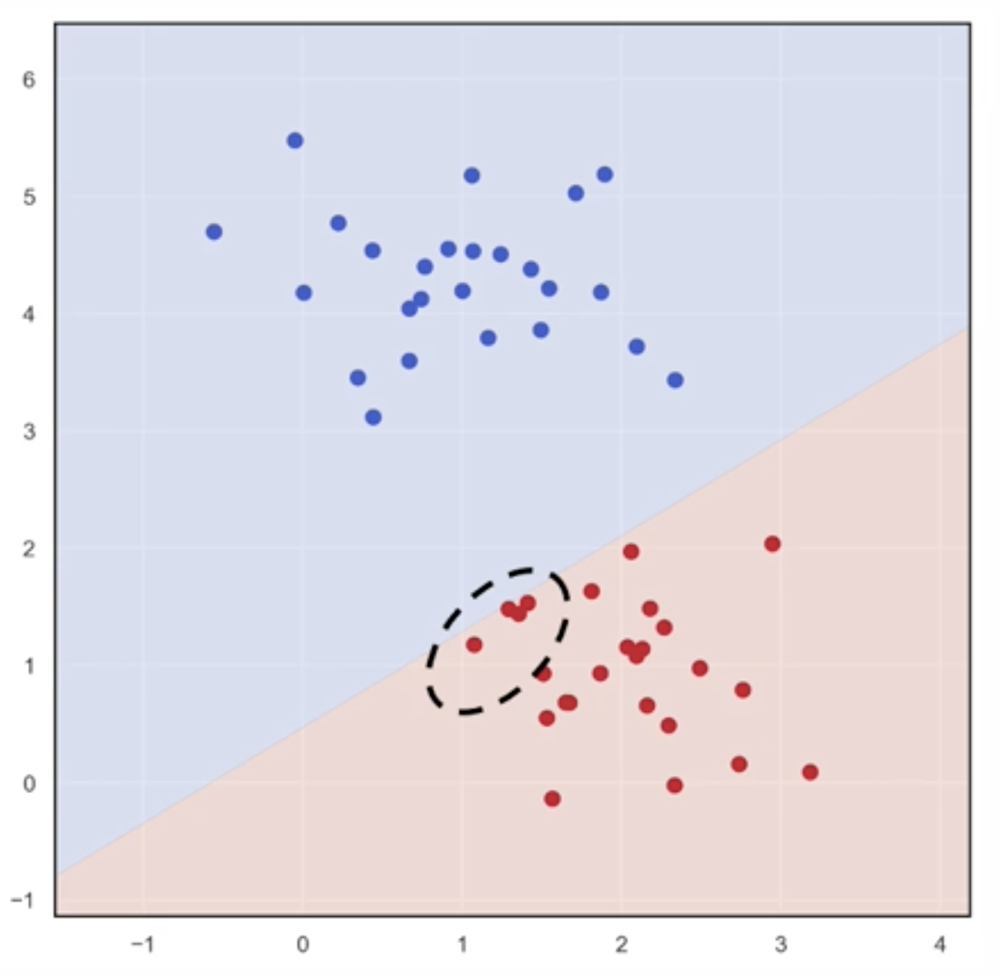{width=30%}

### Large Margin Classifier

Die Support Vector State Machine ist anders. Die Optimierung der Gerade wird so gemacht, dass die
Gerade so liegt, dass sie möglichst grossen Abstand zu beiden Seiten hat. Der Abstand zeigt an wie
sicher der Punkt nicht auf die andere Seite springt.

Lineare Regressionsverfahren setzen die Gerade in Abhängigkeit der Geraden beliebig.

### Support Vectors

Support Vektoren sind die Punkte im Diagramm, welche am nahesten zur Gerade liegen. Die *Margin* ist
eine symbolische Gerade die parallel zur Decision Boundary verläuft und durch die Support Vektoren
geht.

Weil die Descision Boundary von den Support Vektoren abhängt, ist die SVM insensitiv gegenüber
Outliers. Nur wenn Support Vektoren ändern, ändert die Decision Boundary.

## The Scalar Product

Das Skalar oder Dot-Produkt ist eine Nummer. Dazu werden die Vektoren elementweise miteinander
multipliziert und summiert.

$$\vec{p}\cdot\vec{q}=x_{1}x_{2}+y_{1}y_{2}+z_{1}z_{2}$$

### Scalar Product and Vector Length

Die $L^2$-Norm (siehe [Euclidiean Distance or $L^2$-Norm][]) ist die Wurzel der Quadrate der
Komponenten, aufsummieren und Wurzel ziehen.

$$||\mathbf{x}||=\sqrt{x^2_1+...+x_n^2}$$

Ein Einheitsvektor ist es dann, wenn die Länge 1 ist. Zum normieren wird, ist Vektor durch die Länge
zu dividieren.

### Vector Triangles

Vektoren haben eine Länge und Richtung. Aber keine Position. Deshalb ergibt sich aus $\vec{x}$,
$\vec{y}$ und $\vec{x} -\vec{y}$ ein Dreieck (wenn $0 < \theta < 90°$).

#### The Cosine Formula

Sofern $\vec{x}$ und $\vec{y}$ nicht trivial (nicht null) sind, gilt

$$\vec{x} \cdot \vec{y} = ||\vec{x}|| * ||\vec{y}|| * cos(\theta)$$

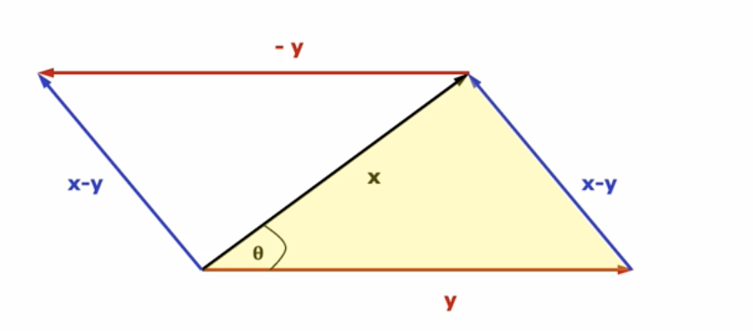{width=30%}

#### Scalar Product as Projection

Wenn $\vec{y}$ ein Einheitsvektor ist, entspricht das Skalarprodukt $\vec{x} \cdot \vec{y}$ der *
Projektion* von $\vec{x}$ auf $\vec{y}$

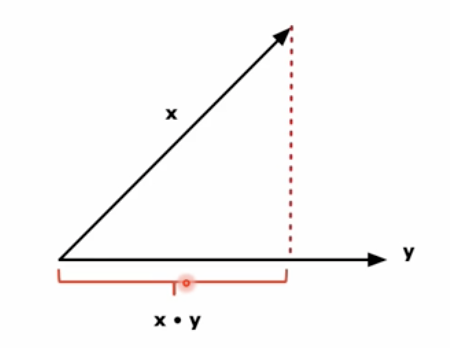{width=30%}

#### Perpendicularity Test

Das Skalarprodukt von senkrechten Vektoren ist null. Aufgabe; finde Vektor $y$ damit er senkrecht
auf $x$ steht. Dann Funktion $x_1*y_1 + x_2*y_2 + x_3*y_3 = 0$ aufstellen und lösen.

## Hyperplanes

Eine Hyperebene ist definiert durch einen Auffahrtspunkt $P$ und einem Richtungsvektor $w$. Wir
fordern von $w$, dass er ein Einheitsvektor entspricht und rechtwinklig zur Ebene steht.

### Hessian Normal Form

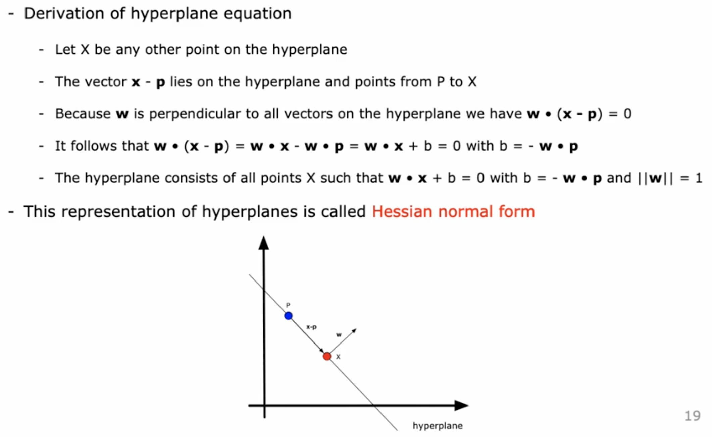{width=30%}

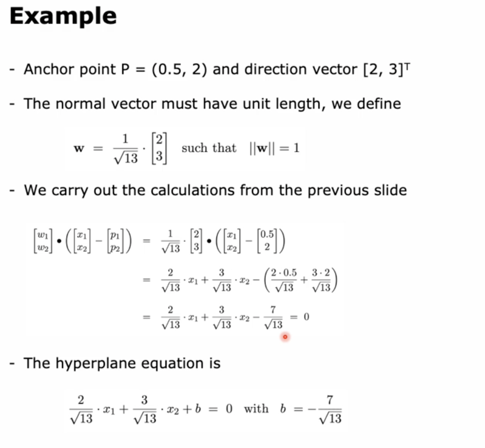{width=30%}

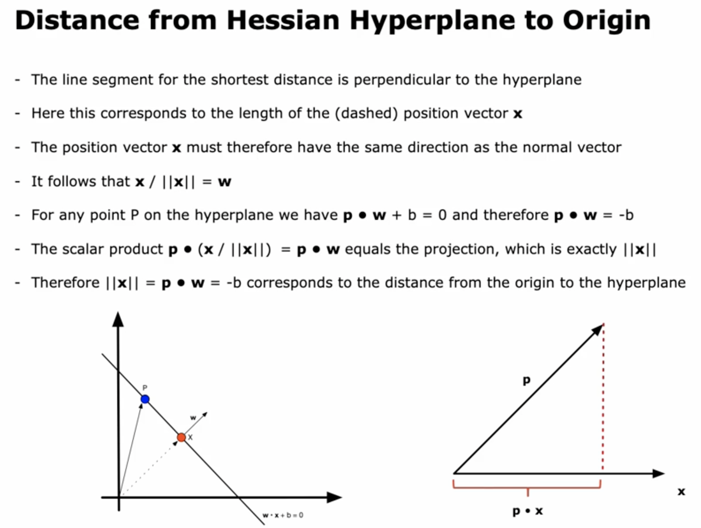{width=30%}

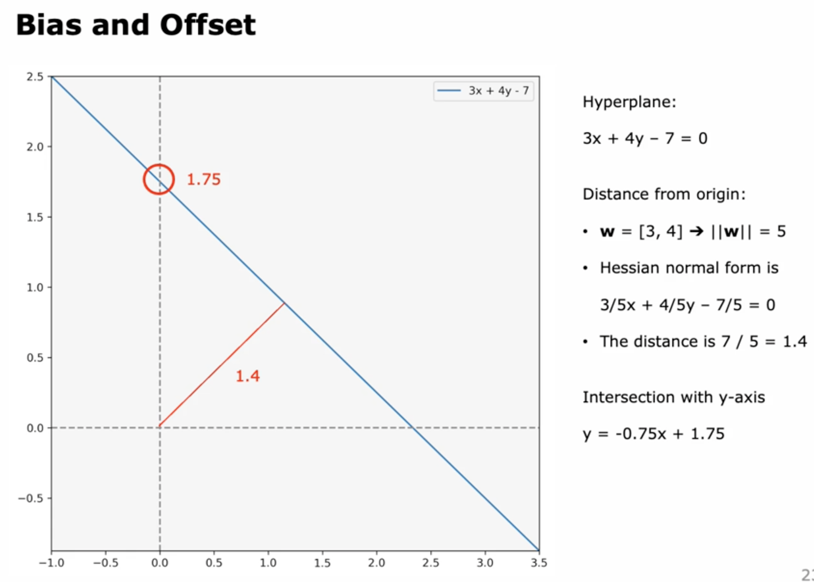{width=30%}

### Shifting the Coordinate System

Vektoren müssen nicht verschoben werden, weil die keine Position haben

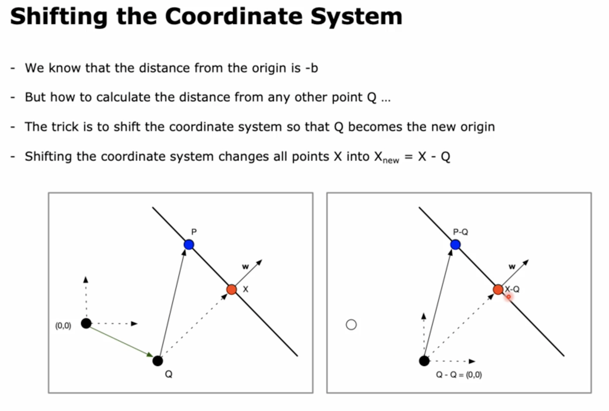{width=30%}

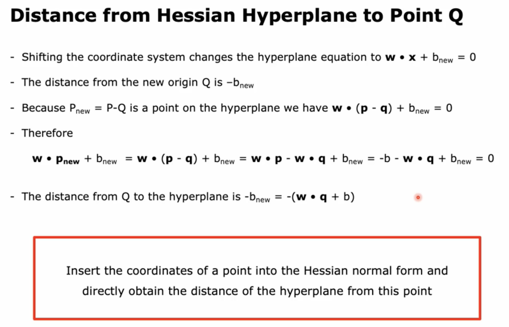{width=30%}

### How to interpret signed Distances

Eine Hyperebene teilt einen Raum in einen postiven und negativen Halbraum (+/-HP - Halfplane). By
Convention zeigt der Vektor $\vec{w}$ immer in die Richtung von -HP! Die Punkte in +HP haben eine
positivee Distanz und die Punkte in -HP eine negative Distanz zur Hyperebene.

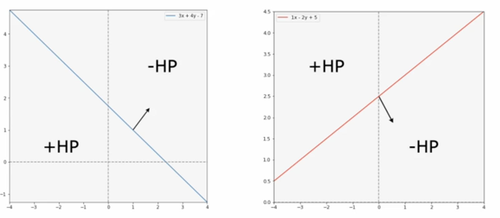{width=30%}

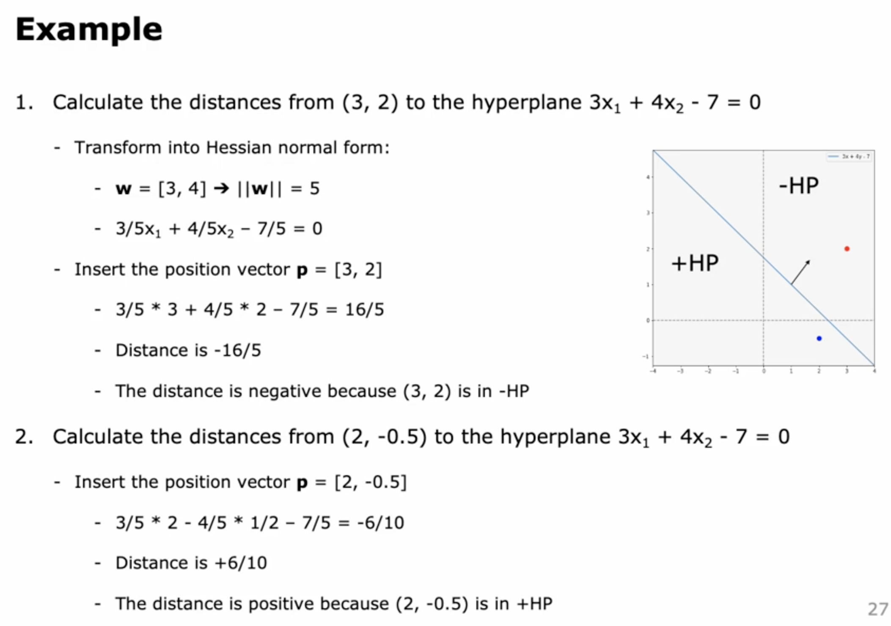{width=30%}

## Large Margin Classifier

In der binären Klassifizierung wählen wir für die Labels die Werte 0 und 1. Bei Suppoert Vector
Machines codieren die *labels* mit -1 und +1. Dies ist nur eine Namengebung, abere dadurch ergibt
sich eine elegantee Formulierung.

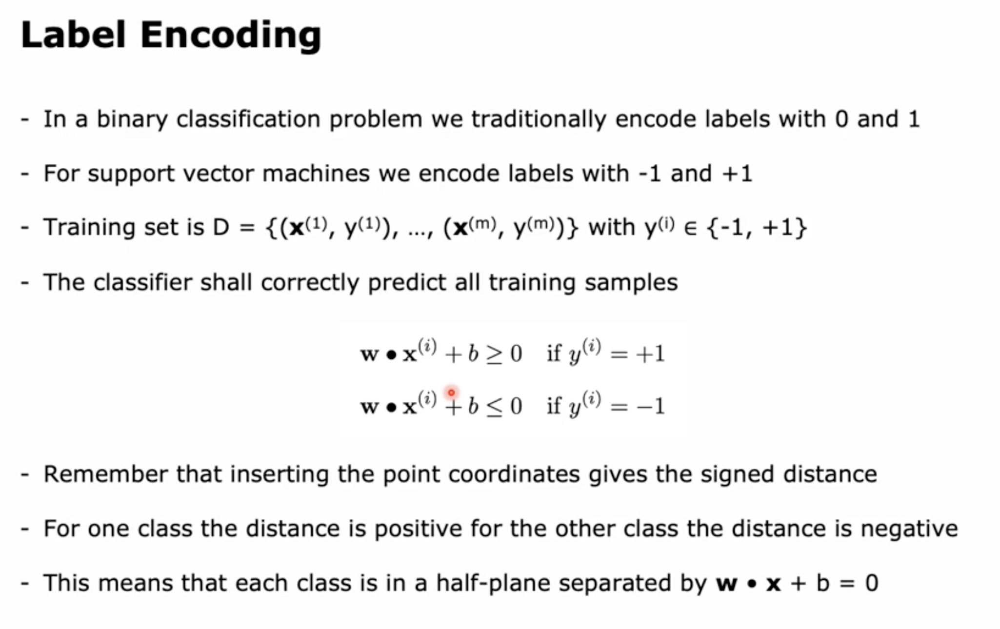{width=30%}

Die Hyperebene teilt lediglich die beiden Punktefamilien. Weil wir aber eine Distanz wollen, führen
wir ein $M=1$ ein und kontrollieren lediglich die Skalierung.

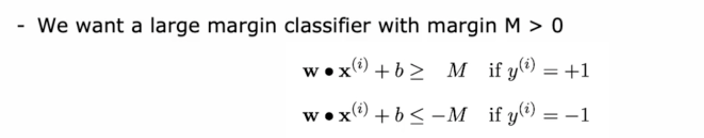{width=30%}

### Controlling the Margin

Die rote Linie auf der Abbildung \ref{redline} wird mit einer Konstate multiplizieret. Damit
vergrössert oder verkleinert sich der Margin. Mit dieser Skalierung von $\vec{w}$ kann die Margin
kontrolliert werden. Die Bedingung bleibt immer gleich, nämlich $+-1$, jedoch verändern wir so die
«Einheit» des Abstandes (mm, cm, m, km)

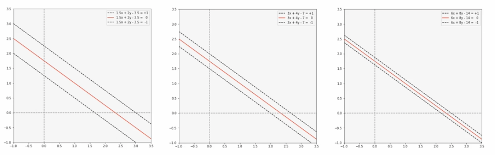{width=30%}

### Elegant Problem Formulation

Weil wir im obigen Fall eine Fallunterscheidung haben (if/else), ergäbe sich eine umständliche
Formulierung für die Optimierung. Weil wir die Labels +1 und -1 verwendene, können wir die Labels in
die Formel reinmultiplizieren und erreichen damit eine allgemein gültige Bedigungung (Constraint).

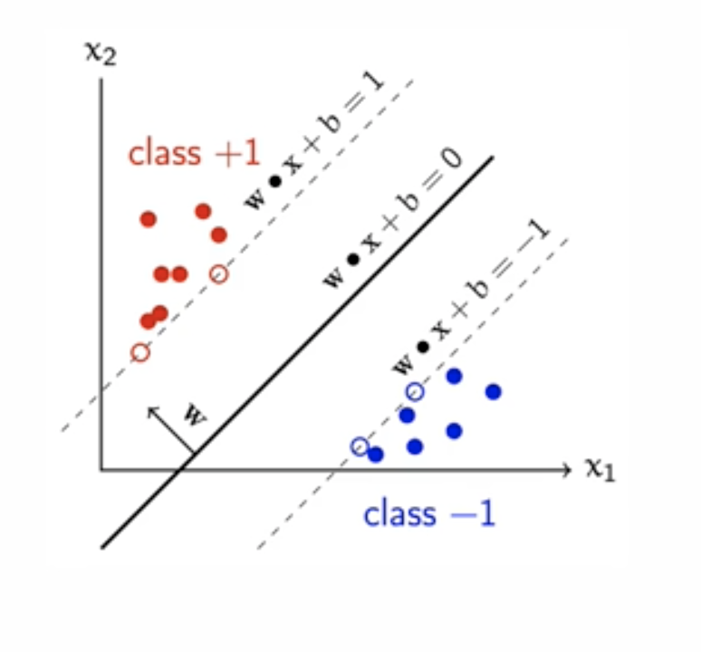{width=30%}

### How Big is the Margin

Die Distanz können wir ja aus $-b$ aus der hessischen Normanform ablesen. Wenn wir die Gleichung
aber skalieren entspricht sie nicht mehr der Hessischen Normalenform. Um dies zu umgehen können den
Term normieren. Da wir zwei Distanzen in beide Richtungen haben ergibt sich die gesamte Margin aus
$$-(b-1)/||\vec{w}||+(b+1)/||\vec{w}||=\frac{2}{||\vec{w}||}$$

### Primal Optimization Problem

Forderungen

1. Datenpunkte müssen auf richter Seite klassifiziert sein
1. Margin muss maximiert sein

//todo. add some text here

Entspricht einem *Hard Margin Classifier* mit welchem ein Binäres Klassifizierungsproblem gelöst
werden kann.

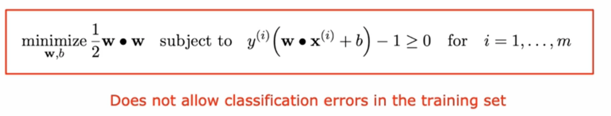{width=30%}

## Soft Margin Classifier

Das Problem der Hard Margin Classifier ist, dass jeder Punkt klar einer KLasse zugeordnet werden
kann. Das Model wird overfitted. Der Soft Margin Classifier erlaubt eine weichere Linie, wo auch
«Übertretungen» erlaubt sind.

### Outlier Sensitivity

Hard Margin Classifiers sind sehr sensitiv gegen Outliers. In der Abbildung \ref{sensitivityoutlier}
sehen wir dass der Graue neue Punkt eher zur Mehrheit der roten Punkte passen würde. Aber wegen der
harten Grenze zu blau zugeordnet wird. Das Model ist also overfittet und generalisiert zu wenig auf
unseen Data.

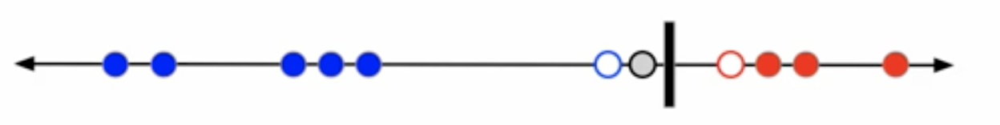{width=30%}

### Soft Margin Classifier

Ein *Soft Margin Classifier* erlaubt die Missklassifizierung von Trainingsdaten. Es ist ein
Trade-off zwischen besserer Generalisierung auf *unseen* Data, entgegeen der Klassifizierungsdaten
zu Trainingsdaten. Es muss die Überlegung gemacht werden noch mehr Punkte zu ignorieren. Dazu
Cross-Validation nutzen!

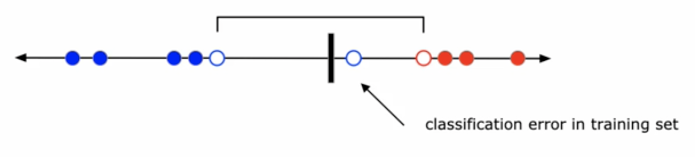{width=30%}

### Slack Variables

Jeder Datenpunkt erhält eine Schlufvariable $\varepsilon$, welche ein Mass ist, wie viel der Punkt
von der Margin abweichen darf. Der Hyper-Parameter $C$ in \ref{slackvariable} kann ich steuern wie
ob ein eher engerer Margin schlimmer ist oder mehr Verletzungen in den Trainingsdaten erlaubt sind.
Evalutation von $C$ via Cross-Validation.

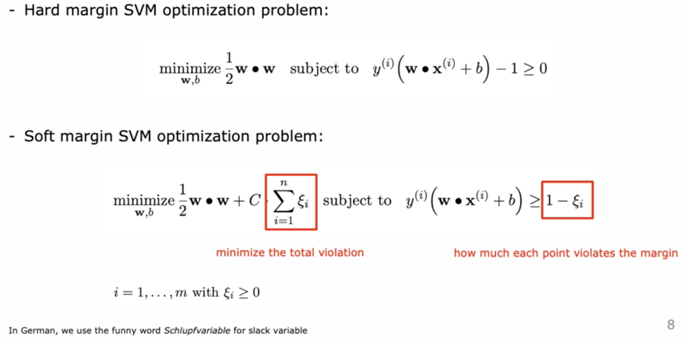{width=30%}

### Regularization Parameter

Mit Hilfe vom $C$, siehe ref{slackvariable} können wir overfitting entgegenwirken.

* je kleiner $C$, desto weicher, eher dürfen Punkte den Margin überschreiten $\rightarrow$ führt zu
  grosser Margin
* je grösser $C$, desto harter ist die Verletung $\rightarrow$ führt zu kleiner Margin
* mit $C=\infty$ werden keine Verletzungen akzeptiert und der Soft wird wieder zu Hard Margin
  Classifier

Es ist immer noch ein quadratisches Optimierungsproblem mit eindeutigen Minimum. Es ist ein
Trade-Off zwischen Trainingsfehler und Margin, kontrollierbar via Hyper-Parameter $C$. Bester
Trade-Off via Cross-Validation für $C$ finden.

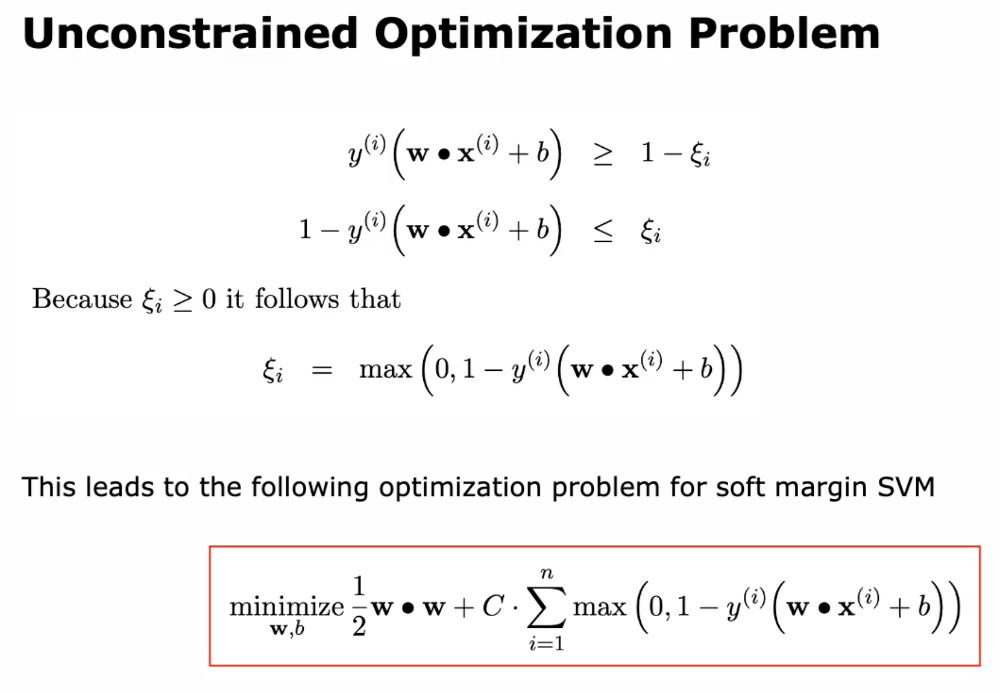{width=30%}

## Kernel

Einer der coolsten Tricks in ML und erlauben komplexere Entscheidungsgrenzen. Transformieren Daten
in Höheren Dimensionalen Raum.

### Not Linearly Separable

Wenn Daten nicht klar in zwei Gruppen unterteilt werden kann (Klassen sind kreisförmig) können Daten
in höheren dimensionalen Raum projeziert werden. Durch quadrieren können Daten proijeziert werden.
Das ist die Idee des Kernels.

### What is a Kernel

Berechnet Similaritätswert für zwei Datenpunkte, die in einen höher dimensionalen Raum porijeziert
wurden. Die definieren *implizit* ein Mapping in den hochdimensionalen Raum. Die Projektion wird nur
hypthetisch gemacht. Bzw. eben einfach den Wert zurückgegeben ohne die Projektion effektiv
auszuführen. Häufig verwendet:

* Lineare Kernels
* Polynomial Kernels
* RBF Kernels
* Sigmoid Kernels

#### Lineare Kernel

Spezialform des Polynomial Kernels, nämlich gewöhnliches Skalarprodukt

#### Polynomial Kernel

Dieser Kernel bereechnet aus zwei Datenpunkten (Vektoren) aus dem Tiefdimensionalen Raum das
Skalarprodukt, addiert Konstante $r$ und rechnet das Ganze hoch $d$ $$(\vec{x} \cdot \vec{y} + r)
^d$$

* $r$ = Koeffizient
* $d$ = Grad des Polynoms

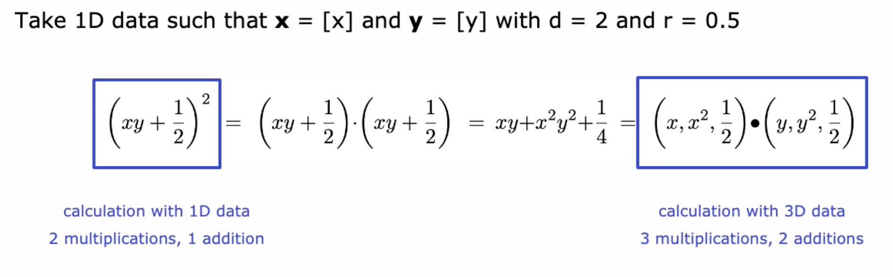{width=30%}

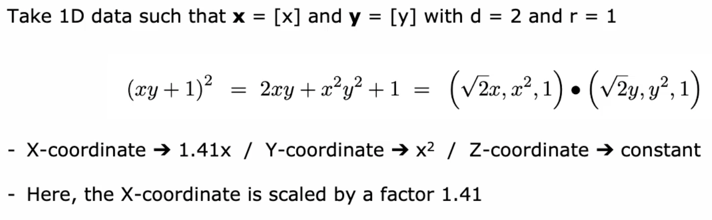{width=30%}

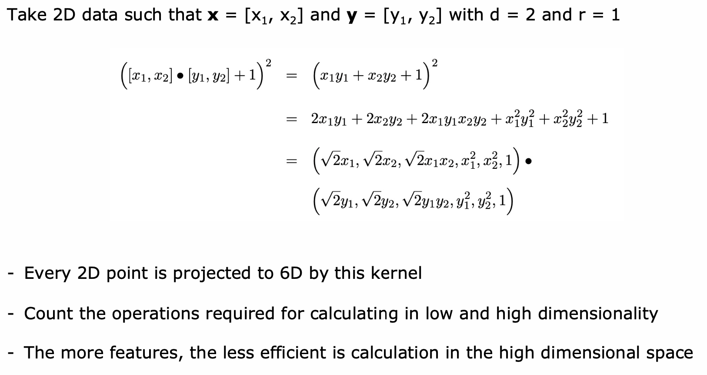{width=30%}

Output des Kernel ist das Skalarprodukt der beiden Koordinaten

#### RBF Kernel

Radial Basis Function (RBF) or Gaussian Kernel. Entspricht der Projektion in eine unendlichen
dimensionalen Raum. Verhält sich ähnlich wie ein gewichteter Nearest Neighbor Model. Je näher die
Distanz zu einem Trainingspunkt, desto mehr Einfluss auf die Klassifizierung. $$exp(-\gamma * ||
\vec{x}-\vec{y}||^2)$$

Das Gamma entspricht einem exponetiellen Decay (Verfall) der
skalierten [Euclidiean Distance or $L^2$-Norm][] zwischen $\vec{x} \text{und} \vec{y}$

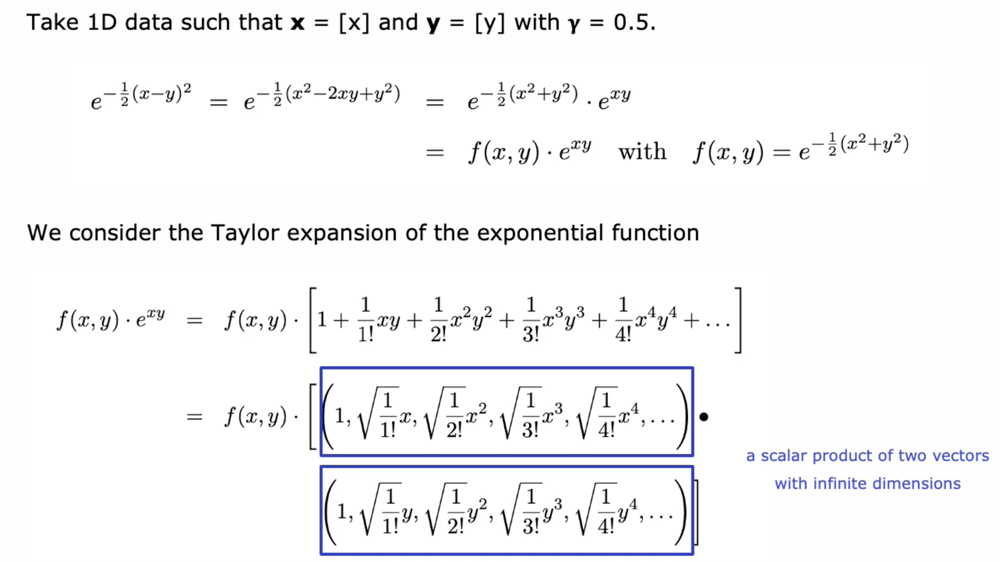{width=30%}

$f$ in ref{rbfkernel} enspricht der Ableitung. Die Taylorentwicklung ist eine unedliche lange
Approximation von $e^{xy}$

## SVM with Kernel

Obwohl wir es nur für die Hard margin Fall anschauen, funktioniert es sehr ähnlich im soft margin
Optimierungsproblem.

Problem ist, den Kernel in Optimierungsformel einzubetten. Eine solche Representation wird mit der *
Lagrange Methode*.

### Lagrange Methode

Siehe auch IMATH-stuff.

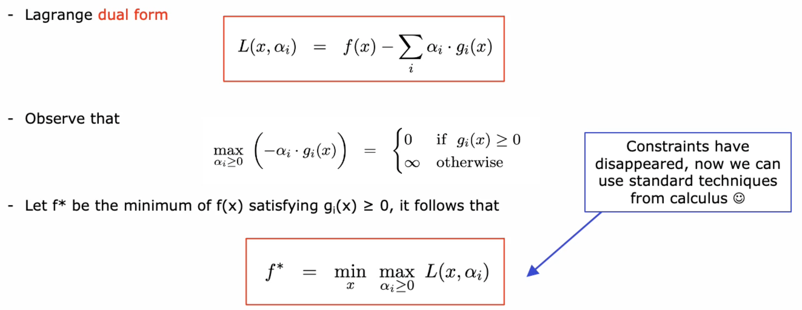{width=30%}

### Lagrange Transformation

Wir berechnen die partiellen Ableitungen mit $w$, $b$ und $a_i$. Eine Einschränkung ist, dass alle
partiellen Ableitung gleich null sind.

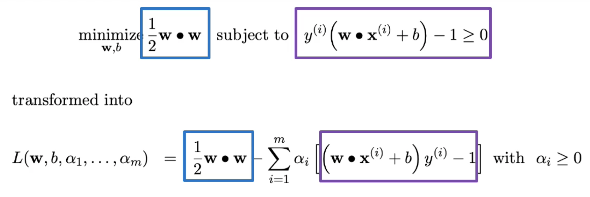{width=30%}

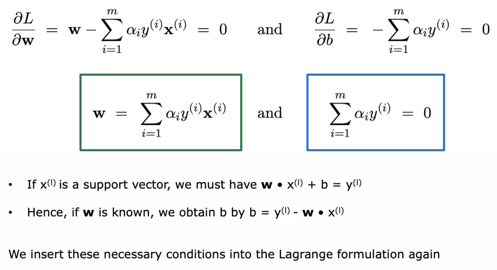{width=30%}

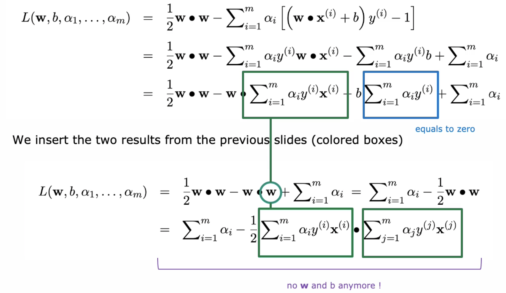{width=30%}

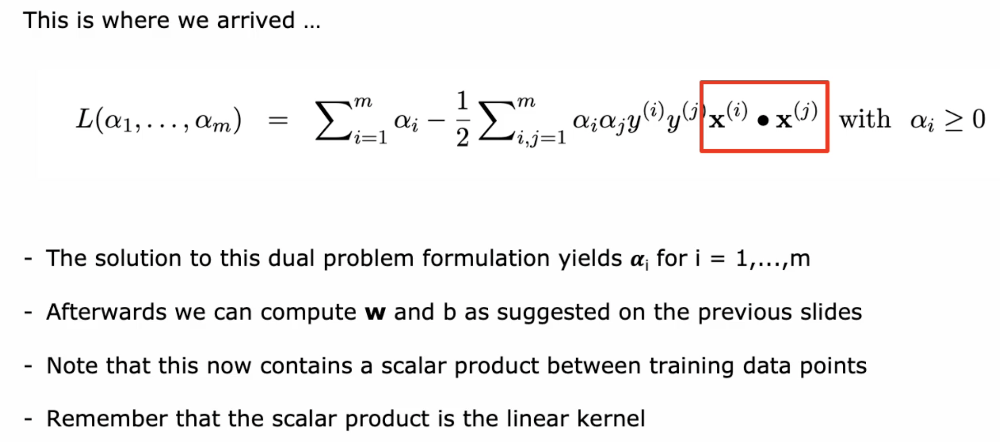{width=30%}

### Kernel Hard-Margin SVM

Als Skalarprodukt in \ref{kernelsvm} kann nun ein beliebiger Kernel eingefügt werden. Der Kernel via
Hyper-Parameter Optimierung eruieren. Anstatt das Primal Problem zu minimieren, *maximieren* wird
die Lagrange Dual Funktion. Zur Klassifizierungszeit verwenden wir

$K$ entspricht einem Kernel. Das Resultat ist eine Zahl (Similarität im höheren Raum).

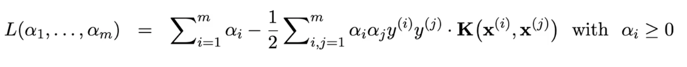{width=30%}

Zur Klassifizierungszeit wird der Karsupel nicht mehr benötigt.

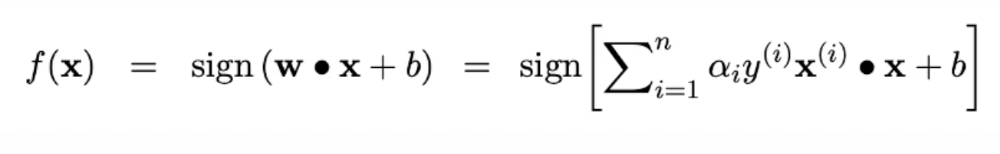{width=30%}

### API Check

siehe `sklearn.svm.SVC`

* Cistheregularizationparameter
* kernelchoice(linear,poly,rbf,...)
* degreeisthedegreedofpolynomialkernel
* gammaistheRBFkernelcoefficient
* coef0isthecoefficientrofpolynomialkernel

[https://scikit-learn.org/stable/modules/generated/sklearn.svm.SVC.html][]
