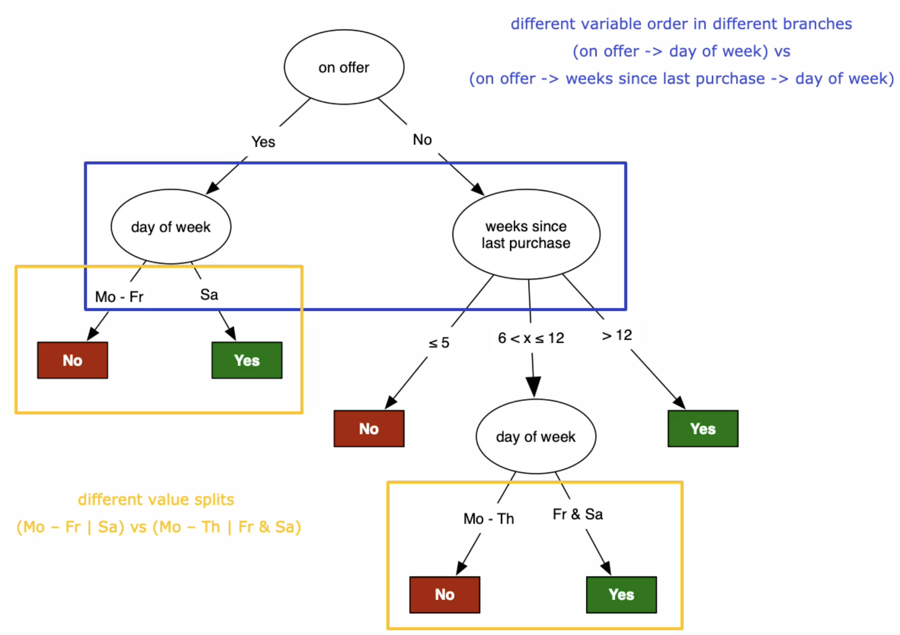
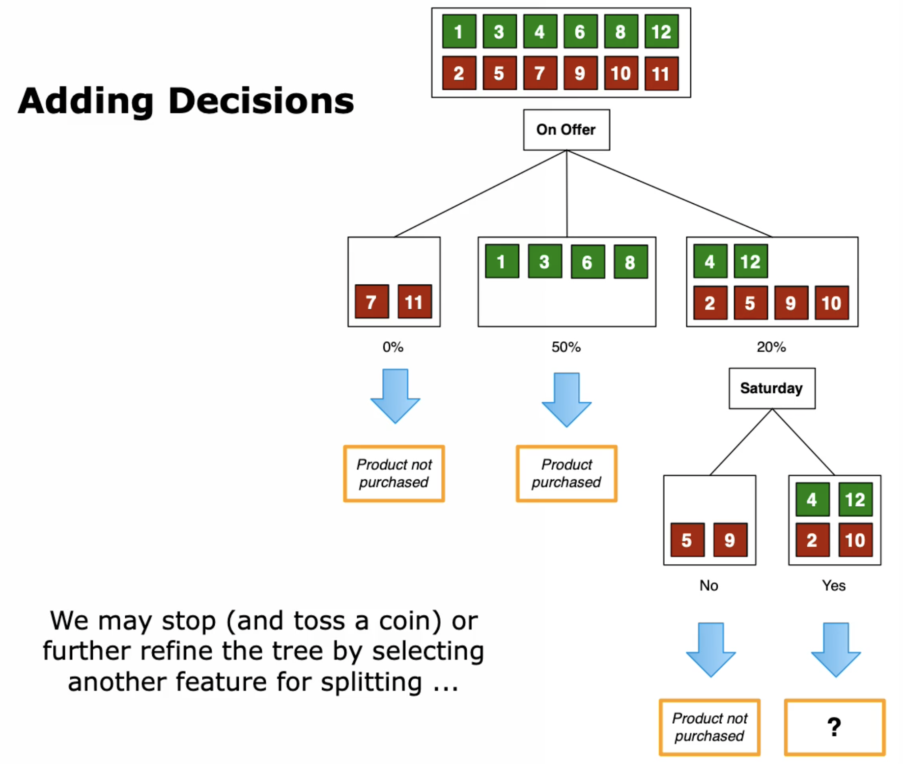
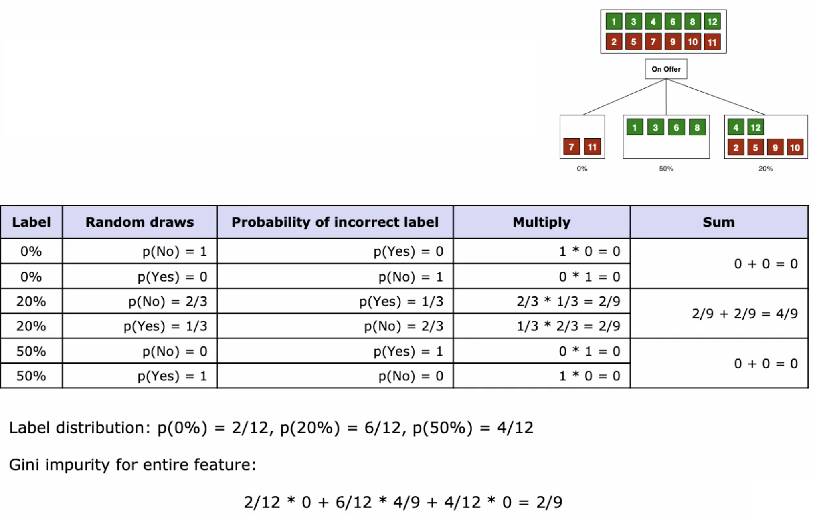
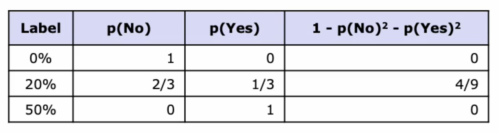

# Tree Models

Supervised Learning mit Decision-, Regression Trees and Random Forests.

## Decision Trees

Entscheidungsbäume sind Bäume, die zum Beispiel Kaufanalyse machen und eine Voraussage treffen, ob
ein gewisses Produkt am nächsten Samstag gekauft wird oder nicht. Entspricht einem
Klassifikationsproblem.

Features können sein, Dauer seit dem letzten Kauf des Produktes, gab es Rabatt oder Wochentag des
Kaufs. Der Algorithmus wählt die Features selber. Gleiche Variablen und Wertesplits siehe
ref{decisiontree} können unterschiedliche Ausprägungen haben.

{width=50%}

### Which Features and in which order?

Ja-Instanzen sind Ereignisse, wo ein Produkt *gekauft* wurde. Nein-Instanzen sind Ereignisse wo das
Produkt *nicht* gekauft wurde. Der Algorithmus muss filtern, welche Features für ein Ja entscheidend
sind, auch weil einige *nicht informativ* sind.

Als Beispiel nicht informativ wäre die *Jahreszeit*. Ein informatives könnte *Angebot* sein.

### Adding Decisions

Nein-Instanzen können laufend weiter unterteilt werden, falls es Sinn macht.

{width=40%}

### ID3 - Tree Construction Rules

Einen der ersten Algorithmen, um ein Entscheidungsbaum zu konstruieren.

1. Wenn nur *Positive* **oder** *Negative* Instanzen übrig sind, stop splitting und Entscheid dem
   Leaf zuweisen
1. Wenn einige *Positive* **und** *Negative* Instanzen übrig sind, ein weiteres Feature wählen und
   weiteres Child hinzufügen
1. *Spezialfall*: Wenn *keine* Instanzen übrig sind, zum Beispiel, wenn diese Kombi im Trainingsset
   nicht vorkommt, dann auf Parent schauen und da Mehrheitswahl treffen
1. *Spezialfall*: Wenn noch Instanzen vorhanden sind, aber *keine* Features mehr, sind die Daten
   verschmutzt. Das [Data Quality Assessment][] wurde ungenügend durchgeführt. Auch in diesem Fall
   wird Mehrheitswahl gemacht

#### History

* ID3 (Iterative Dichotomiser 3); Information Gain wurde erstes Mal für Featurewahl verwendet
* C4.5; nutzt auch Information Gain, integriert numerische Features (z.B. Preis) und partitioniert
  diese, beschneidet die Tiefe der Bäume und Kostenzuweisung zu Features
* CART (Classification and Regression Trees); Nachfolger von C4.5, kann auch für Regression
  verwendet werden, nutzt Gini Impurity, nutzt Varianzreduzierung für Featurewahl, konstruiert
  Binary-Trees für jeden möglichen Split

### Splitting Criterion

Es gibt also zwei Herangehensweise um das beste Splitting-Feature zu finden:

1. Anhand des Informationsgehaltes, wähle den, welchen den höchsten Informationsgewinn in Bezug auf
   die Zielvariable bietet
1. Gini Index oder Impurity (Unreinheit), Instanzen mit Ja und Nein Stimmen sind unrein. Der Index
   misst also die Reinheit eines Knotens

## Gini Impurity

Die Gini Impurity wird für jedes Feature (On Offer in \ref{giniimpurity}) gemessen. Für jedes Label
wird zufällig ein Wert gezogen und die Wahrscheinlichkeit berechnet, welchen Zug man macht. Die
Wahrscheinlichkeit einer richtigen Wahl wird mit der W'keit einer falschen Wahl multipliziert. Die
W'keit der beiden Labels wird summiert. Die Gini Impurity ergibt sich schlussendlich aus der Summe
der Labelverteilung multipliziert mit der Summe der W'keit der Labels.

{width=60%}

### Gini Impurity gets efficient

$p_i$ entspricht einem Random draw.

$$1-\sum_{i=1}^J p_i^2$$

{width=40%}

Die Komplexität der Gini Impurity lässt sich aus der Tabelle auslesen. Pro Feature-Wert gibt es eine
Zeile und pro Zielvariablenwert, eine Spalte.

### Gini Impurity of continuous Variables

Wenn numerische Werte vorkommen, kann nicht für jede mögliche Zahl eine Impurity berechnet werden (
unendliches Vorhaben). Vorgehen um das zu managen:

1. Tabelle nach diesen Werten sortieren.
1. Die Übergänge zwischen zwei Werten werden gewählt und daraus der Durchschnitt berechnet.
1. Der Druchschnitt der Übergänge wird nun als Splitkriterium verwendet
1. Diese Durchschnitte werden als Featurevalues verwendet, um die Gini Impurity zu berechnen

### Splitting Feature Selection and Stop Criterion

* je kleiner die Gini Impurity, desto besser
* wenn Purity nicht verbessert werden kann, wird aufhört
* der Split wird anhand des bestens Features gemacht

## Regression Trees

Beim CART Regression Tree hat man Regressionswerte in den Leafs. Um ein Mass zu erhalten wird die
Varianz dieser Daten gemessen. Je kleiner umso besser, je breiter umso unsicherer ist die Wahl.

Die Varianz ersetzt den Gini Impurity, der Rest ist gleich wie bei [Decision Trees][]

## Discussion

Nachfolgend Vor- und Nachteile der Bäume.

### Advantages of Decision and Regression Trees

Vorteile von Bäume sind und sie können...

* einfach verstanden und interpretiert werden (mehr Vertrauen als in Neuronalen Netzen (weil
  Blackbox))
* numerische und kategorische Daten behandeln und Klassifizierung und Regression
* mit beinahe ohne Datenaufbereitung umgehen (keine Normalisierung und Dummy Variablen (kein Vector
  Space Model))
* performen auch auf grossen Datensets

Nachteile der Bäume sind ...

* nicht so akkurat oder genau
* tendieren auf Überspezialisierung und werden so zu tief (overfitting). Es muss Pruning (abscheiden
  von Knoten) vorgesehen werden
* sehr sensitiv auf Datenqualität - eine Änderung auf Datenpunkt kann Resultat massiv beeinflussen

### Scikit Learn API

`sklearn.tree.DecisionTreeClassifier` mit den wichtigen Parameter `criterion='gini'`
sowie `max_depth=None`

`sklearn.tree.DecisionTreeRegressor` mit den wichtigen Parameter `criterion='mse'`
sowie `max_depth=None`

* mse steht für [MSE - Mean Squared Error][]
* max_depth kontrolliert Pruning und schützt so vor Overfitting

## Random Forests

Wurde bei Kinect (XBox) verwendet. Wieso aber Random Forests? Baummodelle tendieren auf Overfitting
und sind sehr sensibel auf Datenqualität (Verschmutzung, Anomalien, etc.).

Ein Wald beinhaltet ganz viele Bäume. Und das wird hier auch so gemacht. Ein Random Forest ist eine
Collection von [Decision Trees][]. Diese werden aus dem gleichen Trainingsset trainiert. Allerdings
werden zufällig Daten und die Attribute ausgewählt. Man erhält viele unterschiedliche Bäume mit
unterschiedlichen Subdatenmengen.

Die Voraussage wird so getätigt, dass ein neuer Datenpunkt allen Bäumen zur Klassifizierung gegeben
wird und die Wahl am Schluss wird auf Basis einer Mehrheitswahl aller Subbäumen getroffen.

### Building a Random Forest

Training

1. Wähle zufälliges Set D* aus Trainingsdaten D
1. Wähle zufälliges Set A* aus Attributen A
1. Erstelle Decision oder Regression Tree aus D* und A*
1. Schritte wiederholen für gewünschte Anzahl Bäumen

Decision Phase

1. Separate Entscheid für jeden Baum erhalten
1. Resultate kombinieren und finales Ergebnis ausspucken (Durchschnitt aus Regression oder Mehrheit
   bei Klassifikation)

Durch das einfügen des Zufalls wird die Performance besser. Das Risiko von Overfitting, sowie auch
unsaubere Daten - welche nur noch in einigen Bäume vorhanden sind, wird verteilt.

### Scikit Learn API

`sklearn.tree.RandomForestClassifier` mit den wichtigen Parameter `n_estimators=100`
, `criterion='gini'` sowie `max_depth=None`

`sklearn.tree.RandomForestRegressor` mit den wichtigen Parameter `n_estimators=100`
, `criterion='mse'`
sowie `max_depth=None`

* n_estimators steht für die Anzahl Bäume
* mse steht für [MSE - Mean Squared Error][]
* max_depth kontrolliert pruning und schützt so vor overfitting
