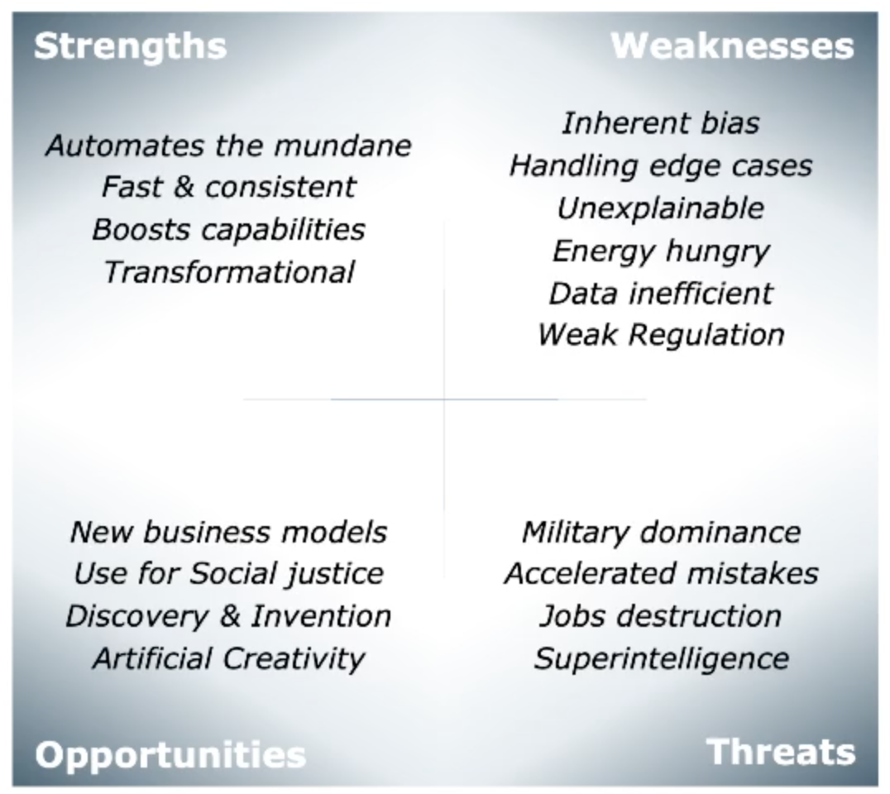

# Model Diagnostics

Ziel ist das Model weiter zu optimieren, sobald das Model ausgewählt wurde.

## Model Training

In Supervised Learning trainieren wir normalerweise unser Model mit [Gradient Descent][]. Durch den
Trainingsstep prüfen wir die Cost Function wie sie sich entwickelt.

Folgende Techniken können genutzt werden, um das Training des Systems zu verbessern.

### Training Curves

Die TRainingskurve zeigt die entwicklung der Kostenfunktion über die Zeit. Idealerweise *
konvergiert* die Funktion to einem kleinen Wert in nützlicher Zeit. Wir prüfen die *Dynamik* der
Kurve um die Trainingsperformance zu verstehen (z.B. linear Regression Trainigs Curves).

#### Training Epochs

Eine *Epoche* beschreibt ein Zyklus, indem wir *alle* Daten verarbeiten.

* Batch: Eine Epoche ist eine Iteration
* Stochastic: Eine Epoche sind $N$ Iterationen

{width=40%}

### Mini-Batch Gradient Descent

Mini-Batches sind kleinere Datenstücke aus dem Datenset. Wir wählen ein B (normalerweise 32) und
teilen die Daten durch B. Das gibt die Anzahl Iterationen von B. Mini-Batches geben einen
Performanceboost in Batch und Stochastic Training. Die Kurve konvergiert massiv schneller.

{width=40%}

#### Epochs vs. Batches

Eine Epoche ist normalerweise einen Loop über das *gesamte* Datenset. Ein Batch oder Minibatch sind
gleichgrosse Subsets aus dem Datenset wo der Gradient berechnet und die Gewichte aktualisiert
werden.

| Optimization Method| Samples in each Gradient Calc | Weight updates per epoch |
| ---- | ---- | ---- |
| Batch Gradient Descent | das gesamte Datenset | 1 |
| Mini-Batch Gradient Descent | fortlaufende Subset aus dem Datenset | $\frac{n}{\text{size of minibatch}}$ |
| Stochastic Gradient Descent | jedes Sample aus Datenset | $n$ |

### Step-Size Tuning

In [Gradient Descent][] können wir mit Hilfe von $\alpha$ die Trainings beeinflussen. Je kleiner
$\alpha$ umso länger dauert das Training, aber man ist auch genauer im Minimum. Falls zu gross,
verpasst man es.

{width=40%}

## Model Validation: Learning Curve Diagnostics

Validation wird gemacht, sobald das Training gemacht fertig ist. Es wird mit *unseen* Daten gemacht.
Dazu haben wir vor dem Training ein Validationset zurückgelegt. Aber was kann man noch versuchen,
wenn die Validation schlechte Resultat liefert?

Es gibt viele Möglichkeiten das Training zu wiederholen. Man sollte nicht wahllos andere Parameter
oder Models oder was auch immer verwenden sondern systematisch vorgehen. Normalerweise ist das Model
underfittet (hohen Bias) oder overfittet (hohe Varianz). Mit welcher Methode können wir herausfinden
was die Ursache ist?

* High Bias: das Model ist zu wenig komplex, schlechte Performance
* High Variance: perfort gut auf Trainingsdaten, abere generalisiert nicht auf Validation-Daten.
  Eine kleine Anpassung in den Trainingsdaten hat grossen Einfluss auf das Modell.

### Learning Curves

Learning Curves prüfen den Effekt von mehr Daten die genutzt werden könnten. Sie können genutzt
werden, um under- & overfitting zu diagnostizieren.

#### Learning Curves: Training Set

Im Training, reduzieren mehr Daten die Performance, weil es schwieriger wird die Daten zu fitten.

#### Learning Curves: Validation Set

In der Validierung, erhöhen mehr Daten die Performance. Mehr Daten erfassen die Verteilung der Daten
besser.

### Diagnosing Under-Fitting (High Bias)

Das Model ist zu simple und performt schlecht. Mehr Daten helfen hier nicht. Komplexeres Model
auswählen oder mehr Features generieren.

{width=40%}

### Diagnosing Over-Fitting (High Variance)

Kommt oft vor und schwierig zu beheben. Mehr Daten und saubere Daten können helfen. Evtl. ein
kleiners Set der Features versuchen oder [Regularization][] anwenden.

{width=40%}

## Model Tuning: Regularization and Other Tricks

Wir hoffen, dass unseres Model gut generalisiert - auch auf hoch-Dimensionalen Daten. Je höher die
Dimension der Training-Features, umso grösser ist aber die W'keit, dass wir overfitten.

Dies wird *The Curse of Dimensionality* genannt.

#### Regularization

Mit Hilfe der Regularisierung können wir grosse Parameter bestrafen, um eine bessere Generalisierung
erreichen. Dieser Effekt beeiflusst die Kostenfunktion so, dass die wichtigen Features das Training
vorwärts treiben (nicht du unwichtigen).

#### Cross-Validation for Regularization Tuning

weil $\lambda$ ein Hyperparameter ist, können wir Cross-Validation machen.

{width=40%}

Weitere Tricks können sein:

* Tuning step-Size oder Batch-size
* Tuning der Hyperparameter
* Validation Daten zur Diagnose nutzen

## Ethical Considerations

Nur weil wir es könnten, heisst nicht dass man es machen soll.

### Ethical Questions

Bevor man einen Auftrag ausführt sollte man sich folgende Fragen stellen:

* Wozu wird die Applikation eingesetzt?
* Sind die Daten parteiisch
* welche Partei hat die Daten zur Verfügung gestellt und wurden sie vergütet
* Wissen die Personen, um welche Daten es sich handelt, dass ihre Daten verwendet werden?
* Hat man das Recht/Zustimmung?

Je mehr Personen von diesem Algorithmus betroffen sind umso wichtiger werden diese Fragen.

### Machine Learning SWOT

Viele AI/ML Risiken haben Etnische Komponenten.

{width=40%}

### Bias in the Data

Grösstes Problem, die Realität in der ganzen Welt wird oft nicht in den Daten widerspiegelt (
Hauptfarbe, Traditionen (Hochzeitskleider)).

### Ethics Guide for Business

* Konstrollinstanzen sind essentiell
* Immer "Dual-Use" Szenarios betrachten (gute Idee missbrauchen)
* Audit log implementieren um Sichtbar zu werden
* Erklärbarkeit garantieren
* Rückmeldungen von Personen mit etnischen Background einholen

### ML Workflow

1. Data Quality Assessment (DQA) is always worth the time
2. Ethics is not an after-thought! Address ethical issues from the beginning
3. Split your data into Train- Validate- Test- sets: Lock away your test set!
4. Normalize your data, Visualise your data, Understand your data
5. Define the performance metrics you want to use for your application
6. Implement a quick- and dirty baseline classifier or regressor
7. Examine your training curves and fine-tune your training
8. Use your validation set for model diagnostics with learning curves
9. Learn and improve e.g. hyperparameter tuning, cross validation
10. Only use your test data once at the end!

