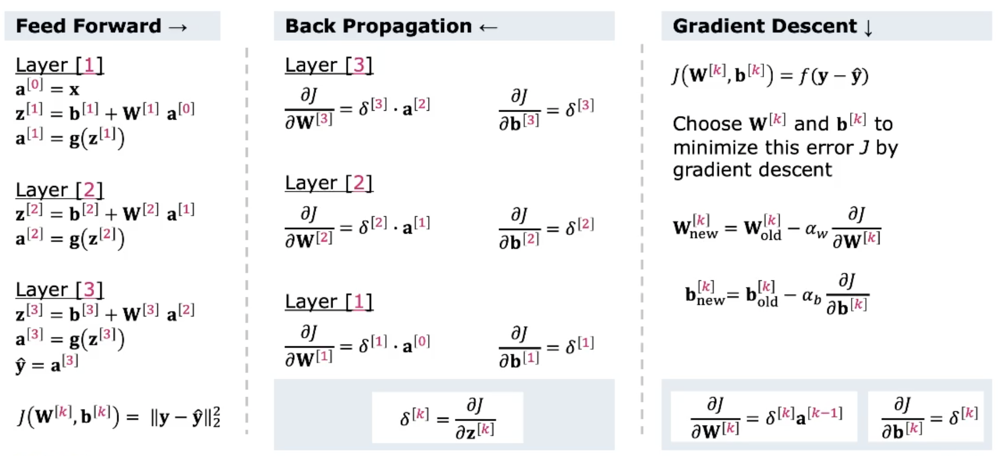

# Neural Networks

Eine der wichtigsten Methoden um ML zu betreiben.

## The Perceptron - An Artificial Neuron

Ein Neuron ist eine Zelle, die elektrisch aktiviert werden kann und mit anderen über *Synapsen*
kommunizieren kann. Ein Neuron besteht aus dem *Zellkörper* (Soma), *Dendriten* (Rezeptoren) und
einem einzigen *Axon* (haben Synapsen). Die Dendriten und das Axon zweigen vom Körper ab.

{width=40%}

Neuronen erhalten über die Dendriten ein Inputsignal und senden ein Output-Signal an das Axon. Über
Axon-Terminals kann das Signal via Synapsen an andere weiter geleitet werden. Der Signalprozess ist
teilweise *elektrisch*, teilweise *chemisch*. Wenn die Spannung in einem kleinen Interval stark
ändert, generiert das Neuron einen *All-or-Northing* elektro-chemischen Impuls, welcher *Action
Potential* genannt wird. Dieses Potential travesiert entlang der Axone und *aktiviert* mehr
synapsische Verbindungen. Neuronen-Wechsel ist sehr schnell $<1ms$. Face Recognition benötigt
ungefähr 100 Schritte und das Gehirn kann dies unter 100ms erledigen.

### How do we learn?

Wir lernen indem Synapsen gleichzeitig Impulse senden. Die Verbindung zwischen den Synapsen wird
dadurch stärker. Wenn das passiert, lernt man.

> Synapses that fire together, wire together

Das Gehirn hat verschiedene Areal, wo unterschiedliche Fähigkeiten gelernt werden.

### The Perceptron

Frank Rosenblatt implementierte als erster die Idee ein Model von Neuronen in den Computer zu
übertragen - es wurde Perceptron genannt.

#### The Perceptron as a Logic Unit

* *Inputs* $X_j$ von vorherigen Axone werden an den Synapsen multipliziert mit den Gewichten $w_j$
* Der *Bias* $b$ macht extra tuning des Aktivierungslayers möglich
* Die *Aktivierung* eines einfachen Perceptrons ist ein Boolean ``True`` wenn gewisser Threshold
  erreicht
* Der Bias und die Gewichte werden auf gelabelten Daten mit dem gradient descent (wie bei 
    logistic regression) gelernt.

{width=40%}

Die Funktion $g(z)$ wird *Activation Function* genannt. Sie produziert ein *Action Potential* oder *
Activation* $a$. Als Aktivierungsfunktion können z.B. Sigmoid Funktion, Soft-Max Funktion oder 
Hard Threshold (Step Funktion) verwendet werden.

Mit der Sigmoid-Funktion erhalten wir eine [Logistic Regression][] als Aktivierungsfunktion. Damit
kann der Perceptron als linearen Klassifier verwendet werden.

#### Logic using a Single Layer Perceptron

Siehe Wahrheitstabelle in Abbildung \ref{percep}.

{width=40%}

#### Linear vs. Non-Linear Models

Ein Single linear Network kann kein XOR implementieren, weil *Non-linear*. Ein einzelner Layer 
kann keine Nicht-Linearen Modelle erzeugen, dafür sind zusätzliche Schichten notwendig.

{width=40%}

## Feed Forward Neural Networks

Wenn Daten in einem Netzwerk von links nach rechts fliessen, ist es ein *feed-forward network*.

### Add a second Neuron

Schreibweise in Vektor bzw. Matrixform.

{width=40%}

### Add a third Neuron

3 Inputs und drei Outputs!!

{width=40%}

### Single Layer Neural Network

Generalisiert zu einer $M x N$ und löst bereits jedes linear separierbares Klassifikationsproblem.
Falls $g(z)$ eine logistische Funktion ist, kann jeder Output $a_j$ als *One-vs-All Klassifizierung*
betrachtet werden. Bedeutet, dass $a_1$ aus Klasse 1 oder nicht, $a_2$ aus Klasse 2 oder nicht, ...

{width=40%}

### Introducing a Hidden Layer

Einem Netzwerk können mehr Neuronen hinzugefügt werden. Bei einem Input-, Hidden- und Output-Layer
spricht man von einem *two-layer*-Network. Der Input-Layer wird nicht berücksichtigt, weil darin
keine Gewichte berechnet werden. Die Ausgabe eines Neurons formt den Input des nächsten Neurons -
simuliert das menschliche Gehirn.

#### Hidden Layers Create new Features

{width=50%}

#### Universal Approximators

* Es können jede Art von Non-Linear Klassifizierung mit Multilayered Networks gemacht werden
* Hidden Layer lernen neue Features, welche evtl. nicht identifiziert wurden
* Training ist eher langsam, Implementierung aber schnell und einfach
* Multi-Layer Artificial Neural Networks sind universale Approximationen
* Zu viele hidden Layers führt zu overfitting
* Das Gegenmittel gegen overfitting ist [Regularization][]
* sehr Fehlerresistent und Robust

### Deep Learning

Hidden Layers sind die Core-Idea in Deep Learning. Sie lernen ihre Features mit Hilfe der Hidden
Layers selber. Dazu braucht man kein Expertenwissen um Features zu extrahieren, aber viele viele
Daten.

## Neural Network Training by Gradient Descent and Back-Propagation

Das Zaubermittel im Training.

### Feed Forward Error Calculation

In Supervised Learning schmeissen wir die gelabelten Daten in das Netzwerk und schauen am Ende was
rauskommt. Falls das nicht dem Ziel entspricht, werden die Parameter $W$ und $b$ so angepasst, dass
das Resultat stimmt. Wir wählen die Gewichte W und die biases b so, dass die Kostenfunktion $J(W^{[k]}, b^{[k]})=f(y-\hat{y})$ 
minimal wird.

### Choosing a Cost Function

Wir brauchen eine Kostenfunktion, welche die Performance des Models misst. Die ist abhängig vom
aktuellen Problem:

* Regression
    - Mean Squared Error
    - Mean Absolute Error
    - Mean Absolute % Error
* Binary Classification
    - Cross Entropy
    - Hinge Loss
    - Squared Hinge Loss
* Multi Classification
    - Multilabel Cross Entropy
    - Kullback Leibler Divergence

### Recap - Feed Forward Neural Net

{width=50%}

{width=50%}

### Back Propagation

Back Propagation mit Hilfe der Kettenregel $\delta^{[3]}$.

{width=50%}

{width=50%}

{width=50%}

### Training a Feed Forward Neural Network

{width=50%}

## Activation Functions and the Soft-Max Classifier

Um nutzbaren Output zu erhalten, benötigen wir eine nicht lineare Aktivierungsfunktion. Mögliche 
Varianten sind: Step Function (hard threshold), logistic function, ReLu, Soft-max, ...

### Choosing an Activation Function

Normalerweise möchten wir als Output eine W'keit ($0 < \alpha < 1$). Weil wir [Gradient Descent][]
für das Training verwenden, sollte die Aktivierungsfunktion *stetig* und *differenzierbar* sein.
Wenn die Funktion zu flach ist, verschwinden die Gradienten. Dies verlangsamt das Training markant
und sollte vermieden werden. Wenn die Funktion *monotonic*, ist die Fehlerebene in einem
single-layer model *konvex*. Eine geeignete ist die Sigmoid, weitere werden nachfolgend behandelt.

#### The Rectified Linear Unit (ReLU)

Ist stückweise linear und wird oft bei Hidden Layers verwendet. Sofern Wert grösser 0, wird Wert
sofort zurückgegeben, sonst 0. Vermindert, dass Gradienten verschwinden. Standard Activation
Function für viele Typen von Neural Networks. Modelle mit ReLU sind einfach zu trainieren und
erzielen oft bessere Resultate.

{width=40%}

Allerdings führen sie zum *dying units* Problem, weil der Gradient für negative Werte immer null ist
und nicht mehr aktiviert wird.

#### The Leaky ReLU

Wird, oder Varianten davon, von den meisten DL Models genutzt, weil verschwinden der Gradienten
nicht auftritt. Führt *non-zero activation* für negative Werte ein. Verhindert Auslöschung des
Gradienten und dying unit Problem. Gute Performance, aber Resultate sind nicht immer konsistent.

{width=40%}

Sind aber generell eine gute Wahl für Hidden Layer Activations.

#### Soft-Max for Multi-Label Classification

Wird für Output bei multi-labels verwendet. Damit kann W'keit über alle Inputwerte bestimmt werden,
egal wie die Aussehen (postiv, negativ, grösser 1, usw.). Softmax modifiziert ein Vektor von $n$
reellen Werten, sodass die Summe 1 (100%) gibt.

$$softmax_j(z) = \frac{exp(z_j)}{\sum_{k=1}^{K}exp(z_k)}$$

Die Softmax-Funktion ist eine Generalisierung der Logistic Function für mehrere Dimensionen und wird
auch in *multinomial* Logistic Regression verwendet. Wird normalerweise bei der letzten
Aktivierungsfunktion eines NN verwendet. Die Inputs werden *logits* genannt. Die Funktion *
normalisiert* die Outputs eines Netzwerks in eine Wahrscheinlichkeitsverteilung.

{width=40%}

{width=40%}
