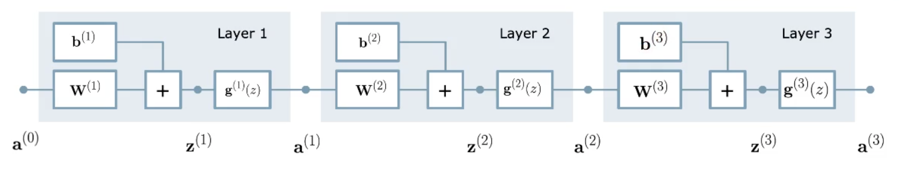
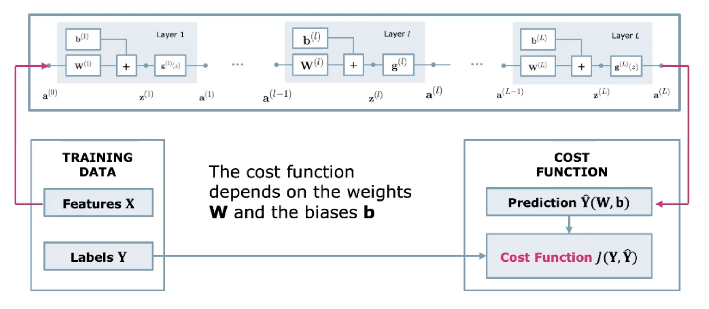
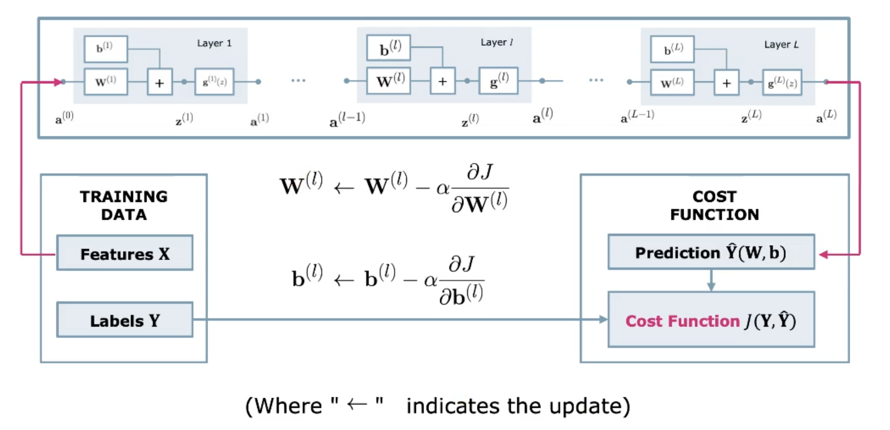
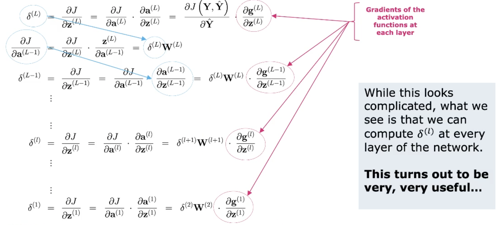
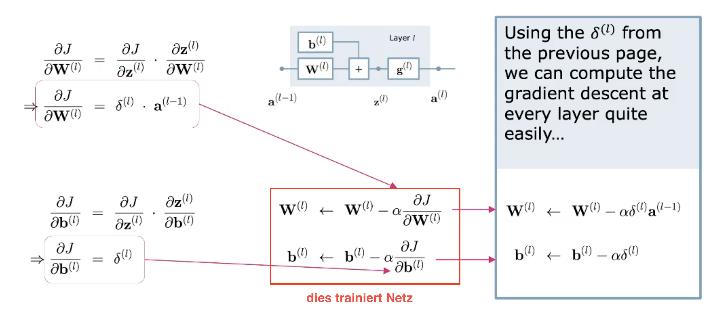
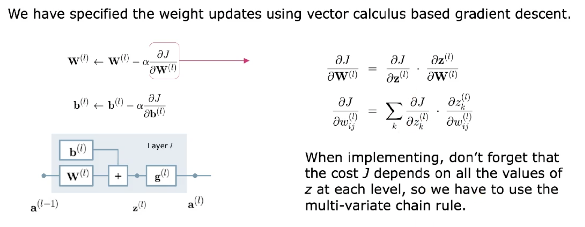

# Back Propagation

Wird genutzt um Neural Networks zu trainieren und beschleunigt die Berechnung des Gradient
Descent-Algorithmus.

## Motivation

Back Propagation ist sehr wichtig in ML. Viele Modelle (NN, CNN, RNN) nutzen BP für das Training -
überall wo es mehrere Layers gibt. Sie beschleunigen die Berechnung der Gradientengleichung.

BP ist aber schwierig. Ein einzelner Layer ist eher einfach, das grosse Ganze macht es Komplex.

BP ist built-in in den open-source ML-Frameworks.

## The Chain Rule

Methode um die Ableitung einer zusammengesetzten Funktion zu finden. Der Output der einen Funtion
ist der Input der Nächsten.

### The Logistic Function

**Recall**: Die Logistische Funktion ist eine *Sigmoid*, welche wir auf Daten einer logistic
Regression fitten, um binary Classification zu betreiben.

$$g(z)=\frac{1}{1+e^{-z}}$$

Die Ableitung der Sigmoid ist sehr einfach zu berechnen, weshalb sie auch oft verwendet wird:

$$\frac{dg(z)}{dz}=g(z)(1-g(z))$$

### The Multivariate Chain Rule

Bei einer Mehrvariablen Funktion $f(x,y)$ kann die partielle Chain-Rule angewendet werden.

$$\frac{df}{dt}=\frac{\partial f}{\partial x}\frac{dx}{dt}+\frac{\partial f}{\partial
y}\frac{dy}{dt}$$

## Gradient Descent again

Die Abbildung \ref{nngd} zeigt ein drei Layer Neural Network mit einem Hidden-Layer. Dieser wird mit
gelabelten Daten und mit Hilfe von Gradient Descent trainiert.

{width=70%}

{width=70%}

{width=70%}

## Back Propagation

{width=70%}

{width=70%}

### Familiar Cost & Activation Functions

Damit wir mit Back Propagation starten können, benötigen wir die Kostenfunktion $J$ und die
Aktivierungsfunktion $g$. Daraus erhalten wir ihre Gradienten, womit wir die Kostenfunktion
optimieren. Dazu benötigen wir Funktionen die differenzierbar sind z.B. MSE oder Logistic
Function (sigmoid).

### The Multi-Variate Chain Rule

Weil die Kostenfunktion $J$ auf allen Werten von $z$ in jedem Level basiert, muss die partielle
Kettenregel verwendet werden.

{width=70%}
