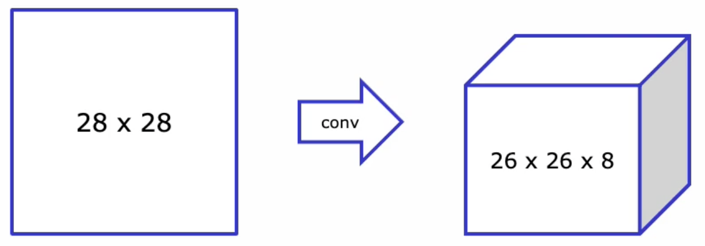
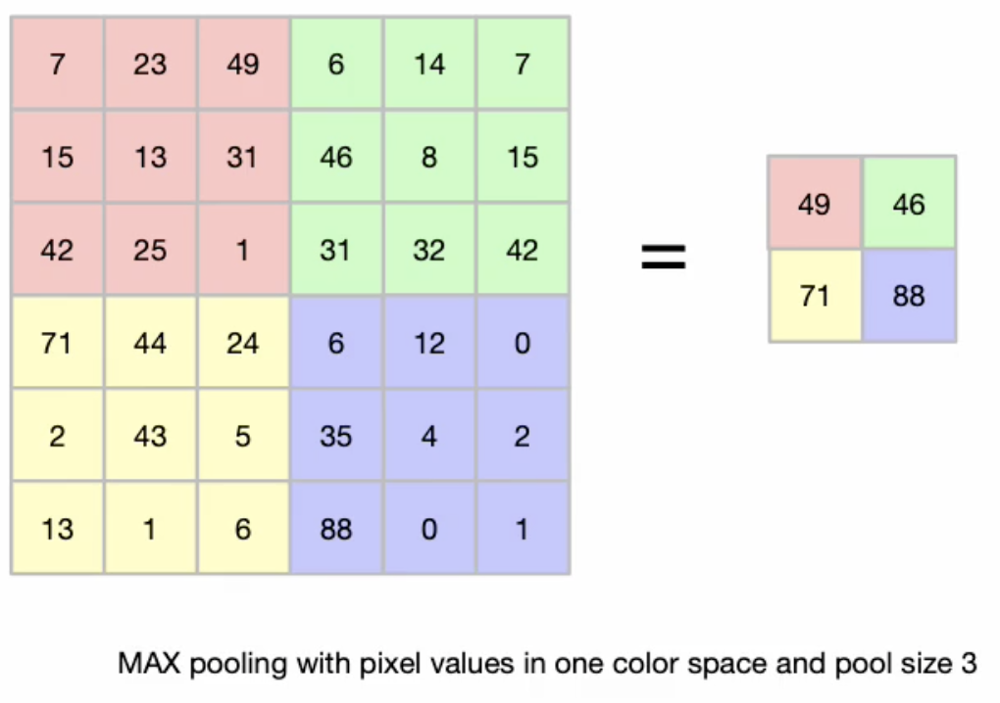
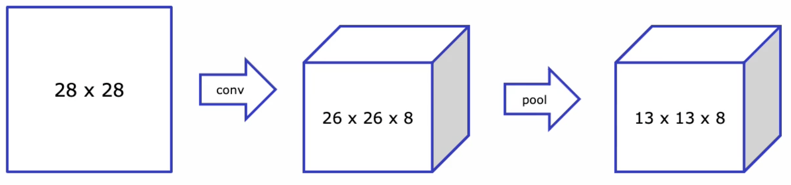
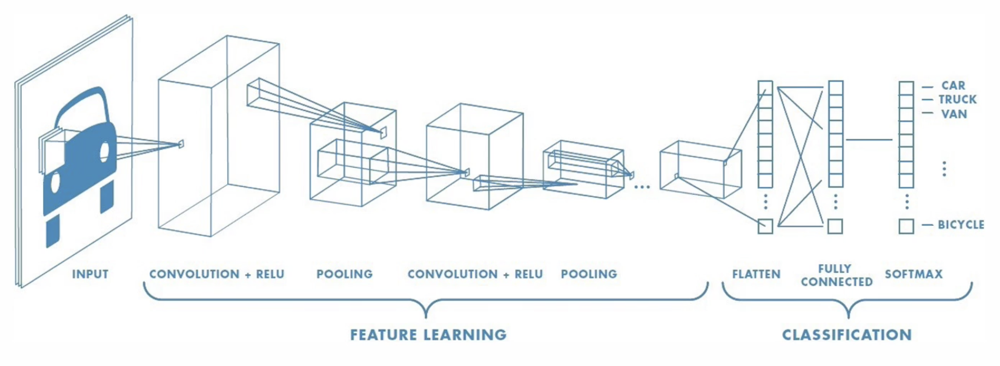
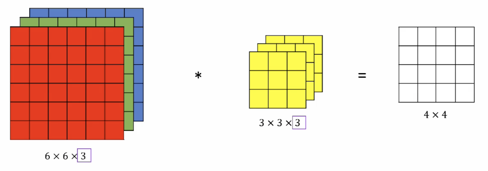
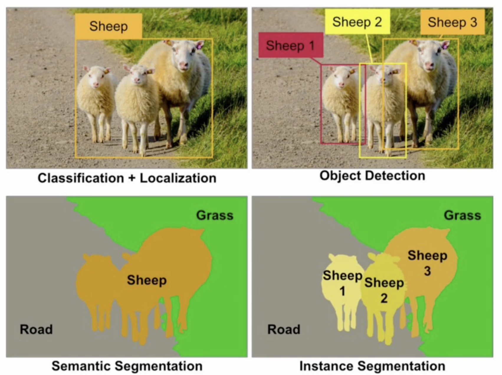

# Convolutional Neural Networks

Wie neuronale Netze Bildinformationen verarbeiten.

## ImageNet Challenge

Öffentliche Bildsammlung mit annotierten Bilder. 22k Kategorien. Zur Klassifizierung wird Error-Rate
verwendet. Top-5 bedeutet, Fehlerrate bei einem Bild min. eines von 5 Labels entdecken (
Bild mit Auto und Ampel).

## What an Image really is

Bild in drei Kanälen (Matrizen) RGB, mit Zahlen welche die Farbintensität repräsentieren.

## The Naive Approach

Pixelwerte direkt ins Netz eines neuronales Netz eingeben? Unmöglich, weil bereits ein kleines Bild
sehr viele Werte hätte (240x240x3). Dazu wären die gleiche Anzahl Neuronen nötig. Ein typischer
Hidden Layer hat 1024 Neuronen. Man bräuchte mehrere 100 Mio. Gewichte um ein sehr kleines Bild zu
verarbeiten.

### Tackled the Problem in the Old Times

Durch Feature Engineering konnte Anzahl Features reduziert werden. Durch Kantenextraktion wurden die
Features gewählt. Die Performance ist aber nur so gut, wie die von Menschen gewählten Filter sind.

### Invariance to Position, Scaling, Rotation

Bilder können skaliert, gedreht, usw. werden. Ein Klassifier muss also dasselbe Resultat erzielen,
ob das Bild dem Original entspricht oder skaliert wurde.

#### The MNIST Dataset

Berühmtes Set für die Erkennung der Handschrift.

## Convolutions & Pooling

Werden für Klassifizierung verwendet.

### Filter Matrices

Pixelwerte sind im Zusammenhang mit ihren Nachbarn am informativsten. Mit einem Filter werden diese
zusammen verarbeitet. Mathematisch benötigt dies viele Operationen, weil die Pixel- und Matrixwerte
elementweise multipliziert und addiert werden. Manchmal wird zusätzlich eine Aktivierungsfunktion
genutzt.

#### Images and Filters have different Size

Der Filter wird nun von links nach rechts über das Bild geschoben. Der Versatz der Verschiebung
wird *stride* genannt (wenn grösser, wird Bild kleiner). Grundsätzlich wird Bild immer kleiner. Um
das zu vermeiden, muss *gepaddet*  werden.

#### Effect of Convolutions

Mit Filter kann man Ecken detektieren (z.B. Sobel Filter). Die Filter blenden gewisse Eigenschaften
ein, bzw. aus.

### Convolutional Layers

Ein Conv-Layer wendet viele Filter parallel an. Durch das Anwenden des Filters, schrumpft das Bild
ein wenig. Es werden acht Filter angewendet, die alle 3x3 gross sind. Dadurch erhalten wir $3*3*8=
28$ Gewichte, und das Netz muss die Gewichte lernen. Obwohl viele Inputs und Output-Werte hat es nur
wenige Gewichte in diesem System.

{width=50%}

#### Convolutions as Neural Nets

Filtergrösse von 3, weil jeder Layer drei Inputs hat. Conv1D(1,3) bedeutet, dass es ein 1D
convolutional Layer mit 1 Filter und Filtergrösse 3 ist. Stride ist auch eins, würde separat als
«Parameter» angegeben.

Die Filter reduzieren die Anzahl Parameter für die nächste Schicht, weil die Gewichte jeweils gleich
sind.

### Pooling

Nachbarpixel sind jeweils sehr ähnlich und auch das convolution von Nachbarpixel würde ähnliche
Pixelwerte ergeben (hohe Redundanz). Wenn wir Objekte entdecken wollen, müssen wir diese aus der
Distanz betrachten - ein Auto können wir nicht anhand wenige Pixel erkennen.

*Pooling* nimmt nun aus z.B. 3x3 Fläche den max, min, oder avg der Pixelnachbar und wendet diese an.
Die Grösse wird über den Pool-Size Parameter bestimmt.

{width=50%}

Pooling bewirkt einem Zoom out Effekt.

#### Pooling Layers

Pooling dividiert Höhe und Breite durch die Pool Size. Im Bild \ref{poolinglayers} wird die Pool
Size 2 angewendet.

{width=50%}

## Model Architectures

{width=70%}

### Convolutions on RGB Images

Mit einem 3D-Filter werden die Farbräume zusammen gemerged und worin sich die Korrelation zu den
Farben anstatt Farbwerte enthält in 2D. Der 3D Filter enthält 27 Werte (3x3x3). Der Filter wird über
Bild gelegt und jeder überdeckte Punkt (27 Stk.) wird mit dem Filter multipliziert und danach
aufaddiert. Dies ist der neue Wert. Der Filter wird über das ganze Bild verschoben und jeweils neu
berechnet.

Das Resultat ist ein 2D mit Werten der Korrelationen.

{width=50%}

### Computer Vision Disciplines

Nicht nur was, sondern auch *wo* ist das Objekt!
Reihenfolge nach Schwierigkeit links oben, rechts oben, links unten, recht unten.

Bei Segmentierung wird jeder Pixelpunkt zugeordnet.

{width=50%}
