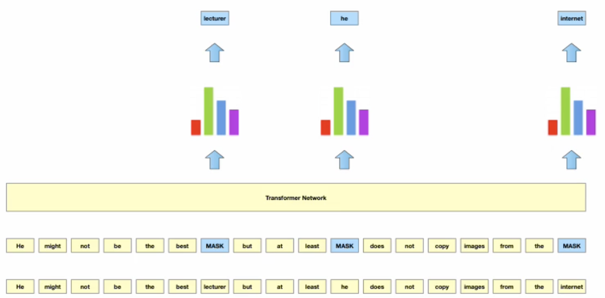
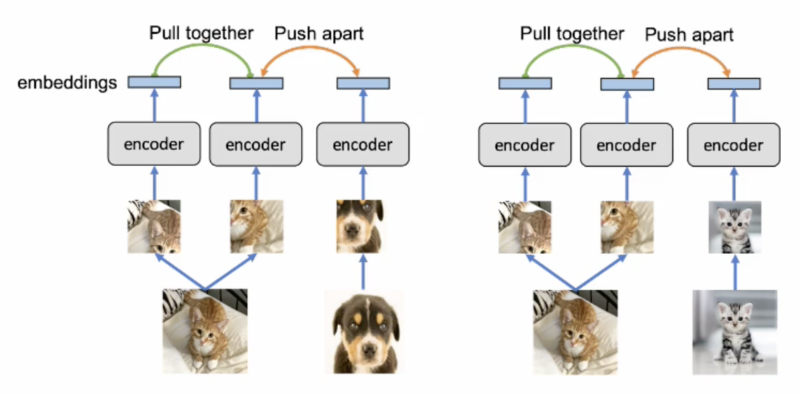

# Transfer Learning

Filter in Deep CNN lernen in frühen Layers abstrakte Features wie zum Beispiel Kantenfilter, Color
Blobs etc. Je weiter der Layer rechts liegt, umso mehr steigt die Komplexität dieser Features. Der
finale Layer erlernt Prototypen-Objekte. Ein neuronales Netz sind also Feature Extractors. Dieser
Part im Netz wird *Backbone* genannt (alle Hidden ohne Output). Daran kleben wir Klassifikatoren,
Lokalisierung oder was auch immer. Diese sind Task agnostisch (göttlich/generisch) und können für
alle Arten von CNN in den ersten Layers verwendet werden.

Task dedizierter werden die Strukturen je weiter rechts im Netz.

## Transfer Learning

Das ist die Idee von Transfer Learning. Um gute Modelle zu trainieren braucht man ein tiefes Netz.
Mit der Anzahl Schichten steigt die Menge an Optimierungsparameter und damit der Rechenaufwand. Um
ein Model zu trainieren, braucht man also annotierte Daten.

Weil die ersten Phasen relativ generisch sind, können diese in einem *Pre-Training* verwendet
werden. Die Domänenspezifischen Bilder werden danach in einem kleineren Umfang trainiert. Der
Datensatz bildet genau das ab, was schlussendlich erreicht werden soll. Trainiert wird nur der
finale Layer, evtl. ein paar wenige mehr.

## Transfer Learning Approaches

Es gibt zwei Vorgehensweisen. Quelle für Datensets sind Liste
auf [Wikipedia](https://en.wikipedia.org/wiki/List_of_datasets_for_machine-learning_research),
oder [datasetsearch](https://datasetsearch.research.google.com/) von Google.

### Libraries of pre-trained Models

Vortrainierte Datenmodel von unterschiedlichen Architekturen [TensorFlow](https://tfhub.dev/)
erhältlich. Für den Zweck des Transfer Learnings verwenden.

### Model Repurposing

Strategie 1 um einen Auftrag ausführen zu können:

1. Pre-Trained model für Objekt Detection auswählen
    - Zum Beispiel YOLO (geeignet für Video) trainiert auf COCO-Datenset
2. Den letzten Layer für die Objekt-Lokalisierung abtrennen
3. Neuen Objekt-Lokalisierungs-Layer mit zwei Kategorien hinzufügen
4. Nur den letzten Layer mit dem domänenspezifischen Datenset trainieren

#### Pros and Cons

* sehr effizient, weil nur ein Layer trainiert wird
* am wenigsten datenhungrige Technik
* Übernahme des gesamten Backbones aus dem vortrainierten Model
* Das bedeutet, dass diese Layers *frozen* sind

Der Nachteil ist, dass die Backpropagation von den frozen Layers gestoppt wird. Weil diese nicht mit
trainiert werden. Man nimmt also an, dass der Backbone gut auf den Zweck passt.

Falls man mit der Performance nicht zufrieden ist, kann mann Strategie 2 [Fine-Tuning][] anwenden.

### Fine-Tuning

Es wird nicht nur der letzte Layer trainiert, sondern einige der letzten Layers, weil diese die
komplexe Strukturen lernen. Diese werden unfreezed und neu trainiert.

Die Gewichte sind dabei nicht zufällig, sondern stammen aus dem Pre-Training. Die Optimierung muss
nicht von ganz vorne neu beginnen, sondern man hat schon einen akzeptablen Stand (Transfer Learning
Effekt). Das Training wird aber Ressourcen- und Datenhungriger.

Jeweils Performance messen.

Das Fine-Tuning kann im Extremfall auf alle Backbone-Layers ausgeweitet werden.

### Transfer Learning in Industry

Löst Probleme von ungeheuren Kosten und benötigten weniger Daten als bei einem Training von Scratch.

## Issues with Supervised Learning

Das Problem ist nicht die Datenmenge, die Daten sind vorhanden. Das Problem ist das annotieren. Dies
gilt für

1. labelled image datasets
1. labelled video datasets
1. labelled text datasets
1. labelling quality - auch Ärzte können unterschiedlicher Meinung sein

## Unsupervised Pre-Training

Aktuell grosses Forschungsthemen.

* Pre-Training benötigen imense Datensets
* Daten wären vorhanden, aber das labeling skaliert nicht

### Masked Language Modelling

Man nehme eine riesige Menge an unlabeled Sätzen in natürlicher Sprache und zufällig werden Wörter
maskiert. Ein pre-trained Model wird verwendet, um dieses mit den Sätzen und den Masken weiter
trainiert wird. Der Clou daran ist, dass man weiss was maskiert wurde und kann damit das Training (
Optimierung) gestalten.

{width=70%}

### Contrastive Learning

Für Bilder oder Videos. Man nehme grossen Satz an unlabeled Bilder aus z.B. Social Media. Man
berechnet nicht einen konkreten Wert, sondern vergleicht die beiden Bilder.

{width=50%}

Man samplet aus einem Bild zwei *Tiles* A und B. Alle B' werden in einen Batch gelegt. Wir fordern
für das Neuronale Netz eine hohe Similarität zwischen A und B des gleichen Bildes und eine tiefe
Similarität beim anderen.

Bei Videos wird es ähnlich gemacht. Das Video wird einfach in zwei gleich lange Teile gesampelt (
z.B. je 3s).

Die Bilder können noch transformiert werden (Farbe, Spiegelung, usw.).
