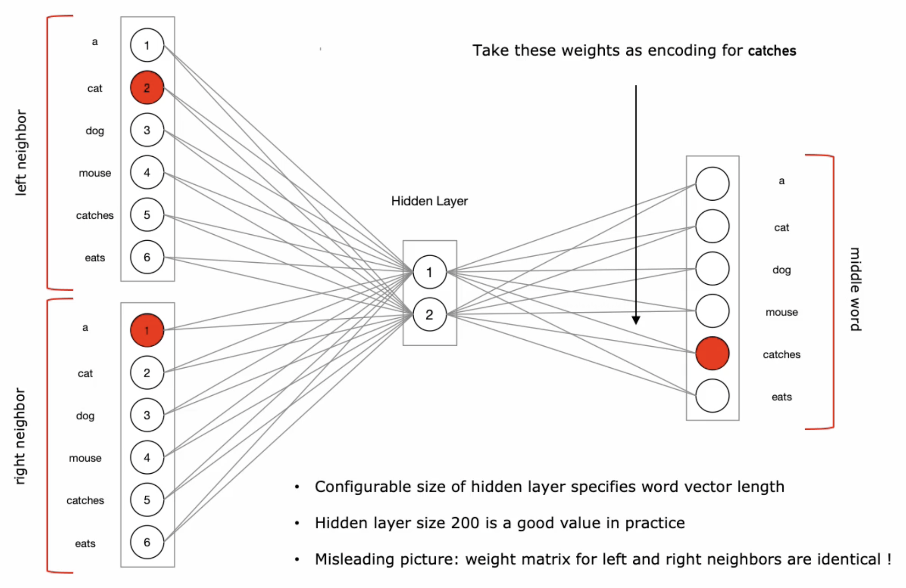
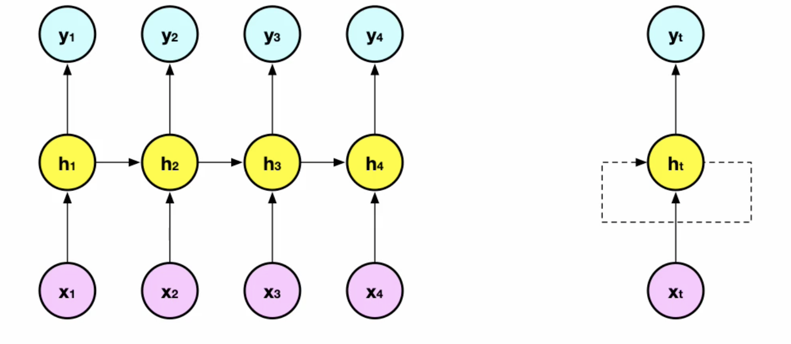
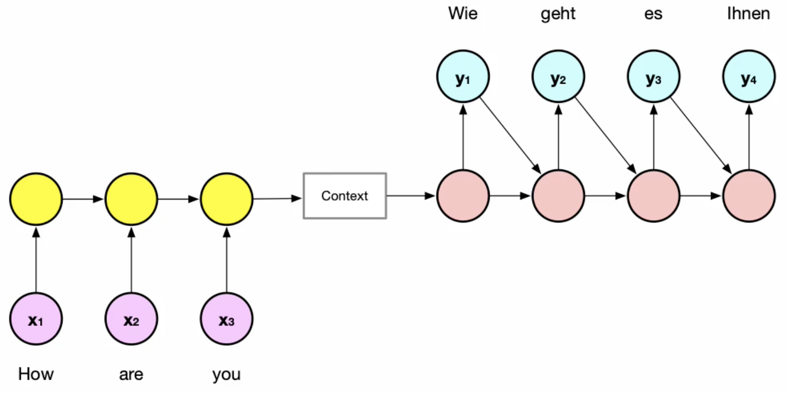
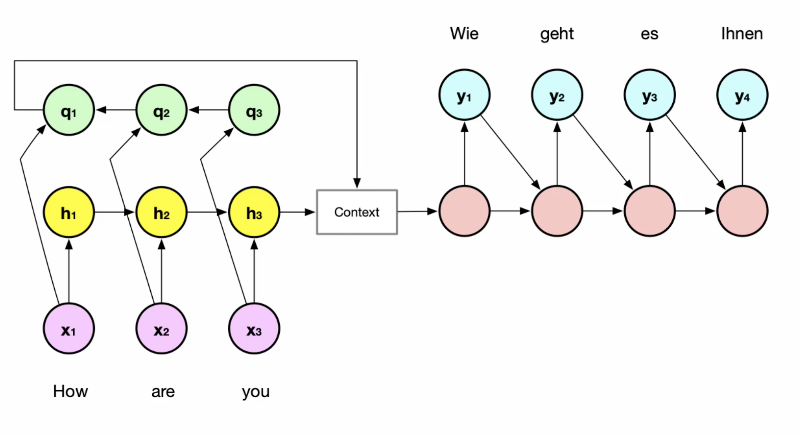
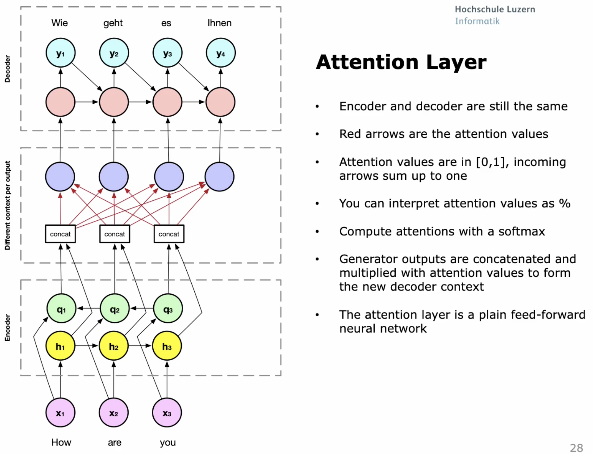
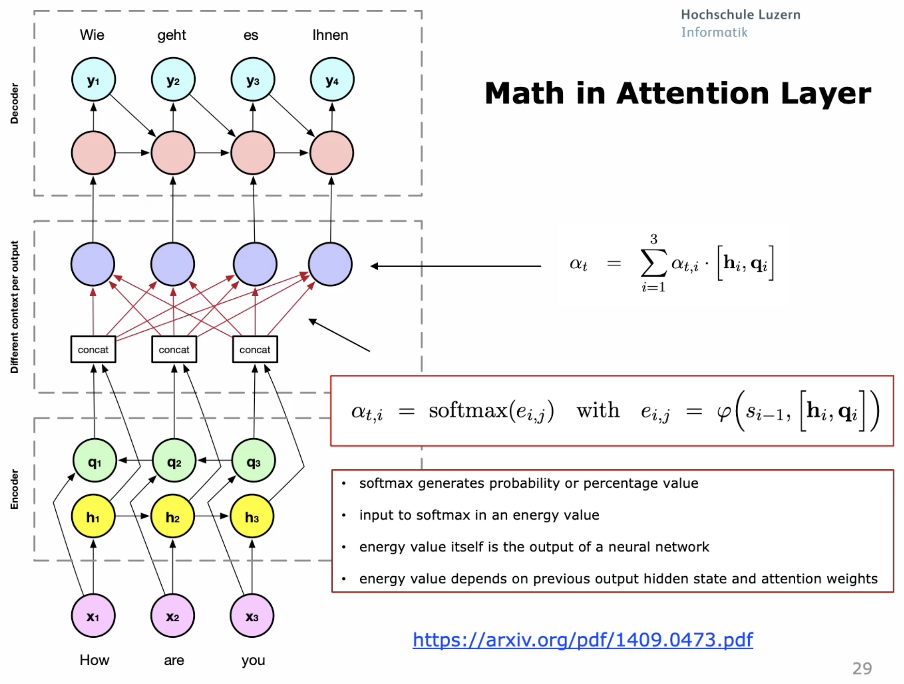

# Recurrent Neural Networks

Mit rekurenten wiederkehrende Netzen für Zeitreihen. Zum Beispiel Sprache.

## Unsupervised NLP

Semantik, Word Embeddings und Anwendung.

### Form Syntax to Semantics

Die Syntax vergleicht die Rechtsschreibung von Wörter. Dabei wird die Similarität mit der
Levenstein-Distanz ([Levenshtein or Edit Distance for Strings][]) gemessen. Die Levenstein Distanz vergibt Punkte wie viele Schritte nötig sind, um
ein Wort in ein anderes zu transformieren.

Semantik klärt die Bedeutung eines Wortes, zum Beispiel Fahrrad/Velo. Bedeutet das Gleiche.

### Word Relatedness

Worte haben eine Beziehung, wenn sie im gleichen *Dokument* vorkommen. Messung ob zwei Wörter einen
Bezug haben. Als Beispiel Hund und Leine. Tauchen diese Begriffe im gleichen Dokument auf,
werden die gezählt. Die Beziehung von Synonyme im gleichen Dokument ist sehr rar.

Als anderen Ansatz werden Worte als verwandt gewertet, wenn sie das gleiche *Thema* bearbeiten. Hier
wird die Wichtigkeit jedes Wortes in Bezug auf jeden Artikel (Wikipedia)
gewertet ([Term Frequency-Inverse Document Frequency (TF-IDF)][]). Verwandtschaft von Synonymen ist
besser.

### Word Similarity

Die TF-IDF ist sehr langsam weil wir in einem x-Millionen Dimensionsraum operieren. Mit der Idee der
Word Similarity wird der *Kontext* der Wörter verwendet. Dabei werden die Worte vor und nach diesem
Wort betrachtet und so eingestuft. Der zweier Kontext schaut sich also die beiden Worte vor und nach
dem Wort an.

Der Kontext wird zum Training in einem Neuronalen Netzwerk verwendet um fehlende Worte
vorauszusagen.

### Continuous Bag of Words applied to 3-Grams

Genannt CBoW. Wie in CNN wird Weight-Sharing verwendet, Gewichte von left und right neighbour sind
gleich.

{width=60%}

### Mathematics with Text - Word embeddings

Semantische Kalkulationen mit Wortersetzungen. Weil es sich um Vektoren handelt, kann man
damit rechnen. Dies kann folgendes ergeben:
Erhalten wird man nicht genau dieses Wort, aber mit einer Umgebungssuche und Similaritätsberechnung
ergibt folgendes

* King - Man + Women = Queen
* Paris - France + Poland = Warschau
* Computer Programmer - Man + Woman = Homemaker (nicht über alles erhaben)

Um das Modell zu trainieren braucht es extrem viele Daten, sodass diese nicht von Menschen auf
Qualität geprüft werden kann. Deshalb erben wir Fehler.

CBoW hat nur ein Hidden-Layer, das Training ist nicht sehr Rechenintensiv.

## Supervised NLP

Zeitreihenanalyse auf Textdaten angewandt.

1. Sequence-to-Vector Models

Sentiment Analysis; Input ist eine Sequenz ist fixed-size Vektor -> z.B. positive oder negative
Annotation

2. Vector-to-Sequence Models

Image Captioning, Input fixed-size Vector, Output eine Sequence (Satz)

3. Sequence-to-Sequence Models

Text Summarization, Translations; Input und Output sind Sequenzen

Vanilla NN und CNNs erwarten als In- und Output immer konstante Grössen.

### Recurrent Neural Networks

RNN lassen sich auf jede Art von timeseries-Daten anwenden. Die Hidden-States ($h_n$) fliessen in
die Berechnung der nachfolgenden Hidden-State ein. Die Outputs von $y_4$ sind also abhängig von den
Vorgänger.

{width=50%}

### Deep Insidee a Sequencee-to-Sequence RNN

RNN verwendet die gleichen Gewichtsmatrizen und Biases für jeden Step.

#### Vanishing Gradient Problems of RNNs

Durch die Rückkoppelung kann der Gradient immer kleiner werden und verschwinden. Es kann aber auch
vorkommen, dass der Gradient explodiert. Ein weiteres Problem von RNNs ist das «langzeitgedächtnis».
Sagt es eine Sequence (Satz) voraus, muss es sich das Subjekt (z.B. Einzahl/Mehrzahl) am Anfang
merken.

### Gated Recurrent Units

Verhindern vanishing Problem von Gradient. Berechnen nicht den Kandidaten $h_t$, sondern *wie viel*
vom alten Wert übernommen werden soll.

Durch das einfügen einer $\sigma$ (Sigmoid) Multiplikation kann das Netz unterscheiden, ob der
vorherige Wert übernommen werden soll (1) oder nicht (0).

### Long Short-Term Memory Model

LSTM ist ein alternatives Model für [Gated Recurrent Units][]. Beide verwenden Hidden States als Memory, LSTM nutzt
erweiterten Memorystatus. GRUs sind generell schneller, LSTM zeigen aber bessere Performance.

### Bidirectional RNNs

Können in die «Zukunft» schauen, wir müssen wissen, was wir später schreiben möchten.

### Encoder-Decoder Architecture

Die vorherigen RNN-modelle können nur verwendet werden wenn Input und Output die gleiche Länge
haben. Wenn Input und Output verschiedene Länge haben (z.B. Übersetzung oder Sentiment Analysis)
benötigen wir eine encoder-decoder Architektur.

#### Unidirectional Encoder-Decoder Architecture

Die RNN sind miteinander verbunden und Output aus erstem, wird zu Input des Zweiten. Die Hidden
Layers können Vanilla RNNS, GRUs oder LSTMs sein. der gesamte Input wird encoded und als fixed-size
context Vektor fürs decoding verwendet. Jeder Output von $y_i$ ist Input von $y_{i+1}$. Der Input
$y_1$ ist der Context-Vektor plus ein Start-Token.

Der Context-Vektor enthält die gesamte Information aus dem Input.

{width=50%}

Links den Encoder, rechts den Decoder.

{width=50%}

## Attention Models

Die Attention Mechanismen merken sich wo relevante Informationen von vorherigen Worten herangezogen werden können. 

{width=70%}

{width=70%}

### RNNs do not parallelize

Es muss sich nicht alles merken, sondern weiss wo nachschauen. Allerdings lassen sie sich nicht gut parallelisieren.

### Transformers

> Attention is all you need
> 
> -- Paper aus 2017
