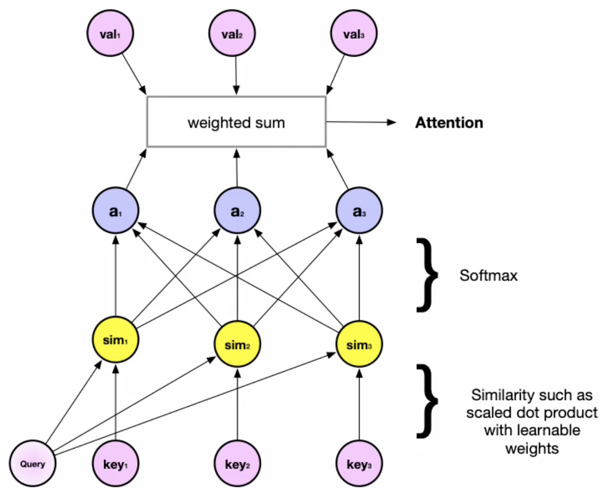

# Generative Models

Generatoren der Sprache.

## Language Models

Eine Sprachmodel rechnet mit einer Wahrscheinlichkeitsverteilung. Jedem Wort $w_1, ..., w_m$ wird
eine W'keit zugewiesen $p(w_1, ..., w_m)$. Deshalb gilt für $w_3$, wenn $w_1$ und $w_2$ gegeben

$$p(w_3|w_1,w_2)=\frac{p(w_1,w_2,w_3)}{p(w_1,w_2)}$$

Damit kann also $w_3$ und natürlich auch die folgenden Wörter generiert werden und so ein Text
verfasst werden. Die vorherigen Worte werden verwendet um das nächste Wort vorauszusagen.

### $2^{nd}$ Markov Chain

Diese Kette kann sich nur die letzten beiden Wörter merken. Entsprechend sind die Sätze relativ
sinnlos. Es gibt bereits bereits bei 1000 Wörter über eine Milliarde Möglichkeiten für jeweiles
dreier Paare ($p(w_1,w_2,w_3)$). Das Model hat exponetionelles Wachstum.

### Text Generation with RNNs

NN können langzeit Verbindungen zwischen Wörter merken ohne exponetionelles Wachstum. Weil der
Statusraum kontinuierlich ist. Die Worte entsprechen einer nicht linearen Kombination aus Gewichten.

Funktionieren bei eher kurzen Text sehr gut. Bei langen Texten entsteht das vanishing Gradient
Problem [Vanishing Gradient Problems of RNNs][].

## Transformer Networks

State-of-the-Art Performance auf Sequentiellen Daten.

### Attention motivated from Information Retrieval

Auf Basis einer Informationssuche in einer Key-Value DB. Der Suchbegriff $q$ wird auf den Key $k$
gemappt und gibt $v$ zurück. Als Analogie:

$$attention(q,\mathbf{k},\mathbf{v})= \sum_i{sim(q,k_i)*v_i}$$

Das Query, die Key und Values sind im NN Vektoren, die Similaritäts- und Attention-Weights sind
Skalar. Der Output ist wieder ein Vektor. Mit Softmax erreichen wir Binding auf 0 und 1. Das
Dot-Produkt ist eine Projektion, wir projizieren das Query auf die Keys. Siehe auch in der
Abbildung \ref{atttransf}.

{width=50%}

### Multi-Head Attention

Es werden acht Ebenen ($h=8$) verwendet. Model entspricht dem NN gemäss Abbildung \ref{atttransf}.

{width=70%}

Vergleich zwischen Single und Multi-Head Attention.

{width=50%}

### The Transformer (2017)

Encoder-Decoder Netzwerk with embeddings aber keine Reccurent-Einheit mehr. Alle Worte werden
parallel verarbeitet. Positionencoding speichert die Position jedes Wortes.

Beispiel Translation von Englisch nach Deutsch

Siehe Grafik \ref{transformer}

Vorgehen auf Encoderseite:

1. Inputsatz Englisch wird gelesen
1. Für jedes Wort wird embedded, nummerische Repräsentation generiert
1. Wird mit Position in Satz angereichert (wichtig für parallele Verarbeitung)
1. Die Infos fliessen in Multi-Head-Attention-Netz
1. Normalisieren
1. Standard Feed Forward
1. Resultat geht in Decoder

Vorgehen Decoder:
Beim Output erhalten wir mit Hilfe von Softmax eine Wahrscheinlichkeitsverteilung für das nächste
Wort.

1. Alle vorangegangenen Worte werden als Input im Decoder verwendet.
1. Durchlaufen Multi-Head-Attention-Netz
1. Normalisierung
1. Erneut MHA mit EncoderValues
1. FeedForward
1. Normalisierung
1. Linearisierung
1. Wahrscheinlichkeitsverteilung mit Softmax

{width=30%}

#### Transformer Encoder

Besteht aus $n$ identischen Schichten mit je einem Attention- und Feed-Forward-Layer. Der erste Layer
enthält alle encodierten Worte als Input und berechnet Attention (wie relevant ist erstes Wort
gegenüber Anderen) gegenüber allen Wortpaaren. So erhalten also alle Encodings zusätzlich
Informationen von den anderen Worte. Der zweite Layer berechnet die Attention auf allen Paaren der
Wortpaare usw. (wie relevant ist Wortpaar $w_1, w_2$ gegenüber $w_1, w_2$). Der Output des Encoders
enthält ein Encoding pro Wort, welches Informationen zu allen anderen Worten enthält. Die
Normalisierung sorgt für Stabilität und dass der Trainingsprozess schneller wird.

#### Transformer Decoder

Besteht auch aus $n$ Layers, enthält aber je zwei Multi-Head-Attention und ein Feed-Forward Layer.
Im ersten MHA wir die Attention in Bezug auf bereits generierte (alle) Worte berechnet. Sie
berechnet die Relevanz zwischen den bereits generierten Wortpaare. Im zweiten wird nun die
Sequenz aus Encoder und die des Decoders kombiniert und an FeedForward weitergereicht.

## Generative Adversarial Networks

Besteht aus zwei versch. neuronalen Netzwerken. Eines generiert Daten, welche echt oder falsch sind.
Das andere prüft die Daten und prüft ob es sich um wahre oder gefälschte Daten handelt. Die Netze
werden gekoppelt, sodass sie sich beide gegenseitig trainieren. Erstes Netz möchte Falschdaten immer
besser erzeugen und das Andere möchte diese immer besser erkennen.

### Definition of GANs

* die Daten kommen aus einer unbekannten Verteilung
* das GANs möchte die Verteilung approximieren
* Die Kostenfunktionen werden als Minimax definiert $J^G = -J^D$
* Training wird gemacht bis *Nash Equilibrium* erreicht wurde

#### Nash Equilibrium

Ist ein Zustand wo ein Netz seine Kostenfunktion nicht mehr anpassen kann, ohne die Parameter des
anderen Netzes zu beeinflussen (und er die auch anpasst). Keines der Netze kann sich unilateral
verbessern.

### The Math behind GANs

Es ist sehr schwierig zu trainieren. Parameter oszillieren, sind instabil und konvergieren nie. Ist
nicht konvex, weshalb Kostenfunktion schwierig zu optimieren ist. Ein Netz kann kollabieren und dann
nur wenige Varianten von Samples generieren.

Auch kann es vorkommen, dass der Diskriminator (Polizist) zu Beginn zu erfolgreich ist, dass die
Gradienten vom Generator (Fälscher)  verschwinden und beide nichts lernen.

{width=70%}

#### Anwendung GAN

Wenn das [Nash Equilibrium][] erreicht wurde, wird Polizist weggeworfen und nur noch Fälscher für eine
Voraussage verwendet. zum Beispiel Deep Fakes. Weitere Anwendungen können sein

* Tranformationen aus Portrait zu Comicbild
* «Restautration» von verpixelten Bilder
* Rekonstruktion von Bilder worin Teile fehlen
* Einfärben von Silhouetten
* Musik
