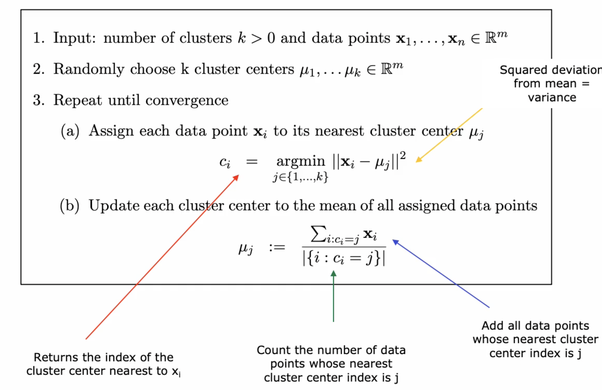
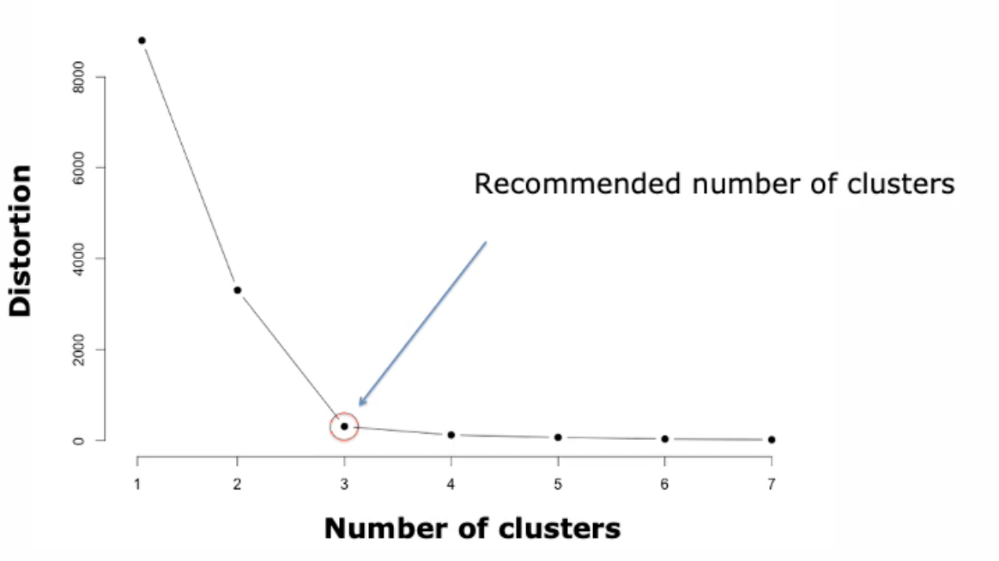
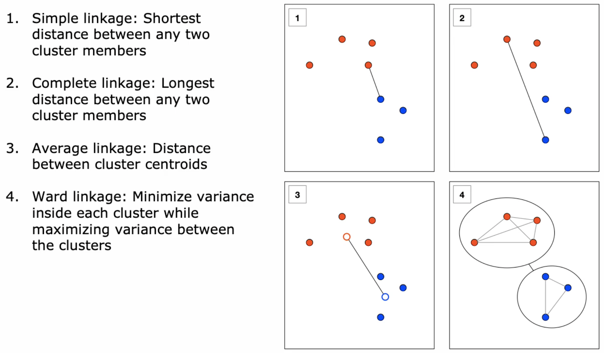
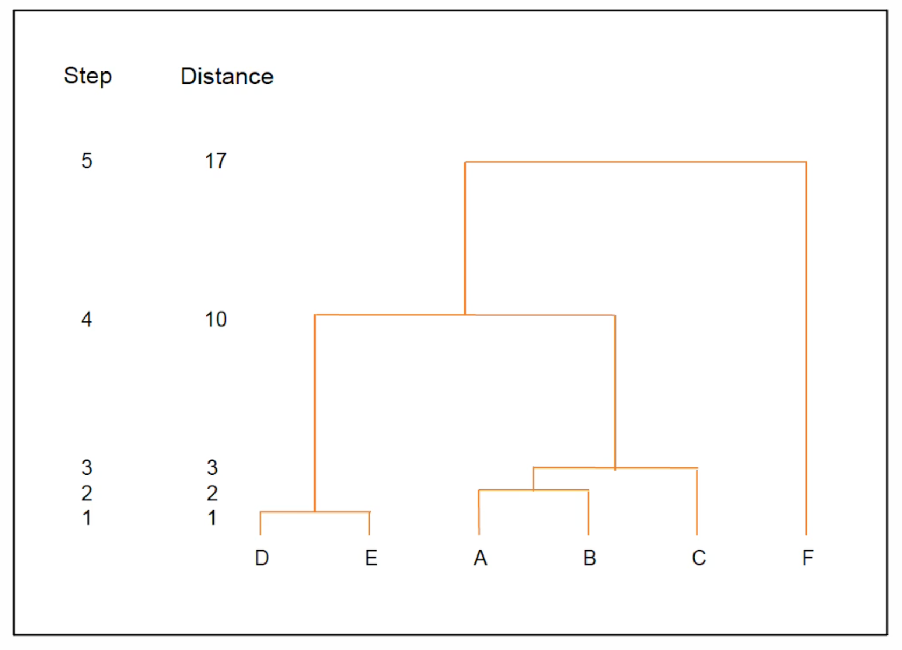

# Unsupervised Learning: Clustering

Daten ohne Labels, keine Beziehung zu der Zielvariable herstellbar, Strukturen in Daten sichtbar
machen.

## K-Means Clustering

Für einen K-Means müssen die Daten in einem Vector Space Model vorliegen. Oft eingesetzt in
Zielgruppenmarketing (Tracking) oder Auswertung in einem Contest. Skaliert gut.

**Wichtig: Datenpunkte müssen normiert sein!**

### Cluster

Bestehen aus Zuordnung der Werte in einem VSM in Gruppen (Kategorien).

### Preparation

Man wählt die Anzahl Clusters $k$, entspricht also einem Hyperparameter. Für jedes $k$ wird zufällig
eine Zahl generiert und in die Datenwolke eingefügt. Diese Punkte entsprechen den Clusterzentren.
Danach:

1. Suche für jeden Punkt den nächsten (euklidische Distanz) Cluster (Punkte werden Zentren 
   zugeordnet)
2. Zentrum wird angepasst, mit Mittelwert aus allen Punkten neu bestimmt
3. Iteriere durch 1 und 2 bis sich Lage stabilisiert (Zentren nicht mehr verschieben), bis
   konvergiert

{width=60%}

### Clustering Distortion

Damit kann Qualität gemessen werden. Die **Total Distortion** wird gemessen indem die quadrierte
Distanzen zwischen allen Punkten und dem Clusterzentrum summiert wird:
$$\sum_{i=1}^n ||x_i - \mu_{c_i}||^2$$

Mit der **Average Distortion** können Clusters über versch. Datensets verglichen werden. Die average
Distortion für jeden Datenpunkt ist:
$$\frac{1}{n}\sum_{i=1}^n ||x_i - \mu_{c_i}||^2$$

#### Convergence and Optimality

$k$-Means **approximiert** die optimale Lösung und **konvergiert immer**. Findet aber nicht zwingend
das globale, sondern nur lokale Minimum. Sklearn ruft per default k-Means 10 mal auf und 
retourniert das Clustering mit dem minimalen Distortion.

#### Choose the number of Clusters

Normalerweise wird Anzahl Clusters aus Daten erhoben (z.B. Milch Fettzellen/Verschmutzung, oder in
Marketing k=5 wo Geld für 5 Kampagnen vorhanden ist).

Die **Elbow Method** führt zum idealen $k$. Dabei wird $k$ in einem loop ausgeführt, von 1 bis
n-Datenpunkten.

{width=50%}

## Agglomerative Clustering

Hierarchisches Clustering (in Marketing beliebt).

### Algorithmus

Initial entspricht jeder Datenpunkt einem Cluster. Dann für jedes Clusterpaar die Distanz berechnen
und die zwei nächsten Clusters mergen (zusammenführen). Dies wiederholen bis Stopbedingung.

Hat drei Konfigurationsoptionen:

1. Distanzmass: kann jedes Distanz- oder Similaritätsmass einsetzen
2. Linkage: Verschmelzung der Endpunkte
3. Stopkriterium: Threshold auf Anzahl Clusters, Cluster-Dichte, usw.

### End-Points for Distance Measurement

Es gibt verschiedene Varianten (simple link = min dist., complete link = max dist., average link 
= dist. zw. cluster zentren, ward link = min. varianz innerhalb der cluster+ max varianz 
zwischen den cluster)
um die 
Endpunkte (Clusterzentren)
zu berechnen, die für die
Verschmelzung verwendet werden. Ist vom Distanzmass unabhängig.

{width=50%}

Wenn ein Cluster besonders dicht ist, sollte er nicht mit einem Cluster zusammengeführt werden,
welcher weniger dicht ist. Variante vier in Abbildung \ref{endpoint} deckt dies ab.

### Dendrogram

Zeigt die Verschmelzungen in jedem Schritt auf. Die Distanzwerte können als Stop-Entscheid mit
Elbow-Method eruiert werden.

{width=50%}

### $k$-Means $\neq$ Agglomerative Clustering

In $k$-Means kann in jedem Schritt ein Datenpunkt den Cluster "wechseln". Im agglomerativen 
Clustering
verbleibt er immer im Gleichen.

* die Anzahl Stopkriterien ist für $k$-Means nur die Anzahl $k$. Im AC können *verschiedene* verwendet
  werden.
* $k$-Means garantiert die Konvergenz nur mit der Euklidschen Distanz, AC aber mit jedem
  Distanzmass
* dafür $k$-Means gegenüber allen Datengrössen skaliert und AC nur bei kleineren Datenmengen
* $k$-Means produziert unterschiedliche Clusters je nach Initialisierung der Zentren, AC ist
  hingegen vollständig deterministisch
* $k$-Means schwierig zu interpretieren, bei AC kann mit Hilfe des [Dendrogram][] schön aufgezeigt werden
