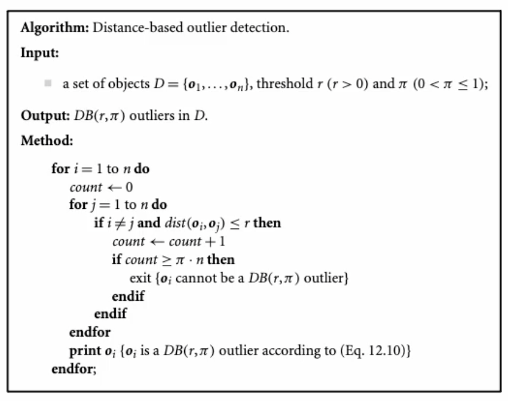
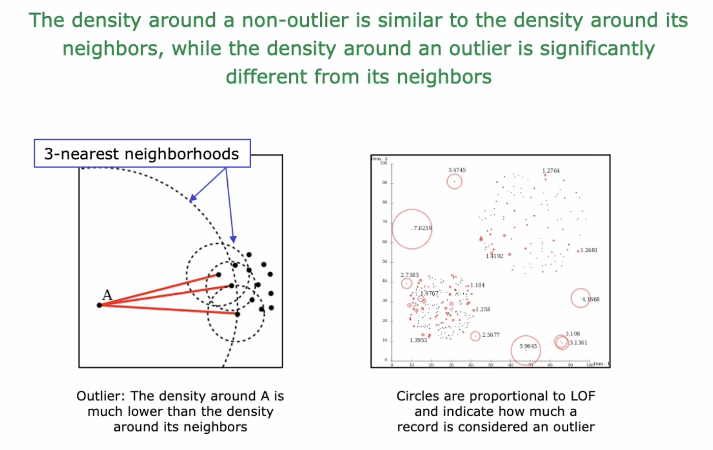
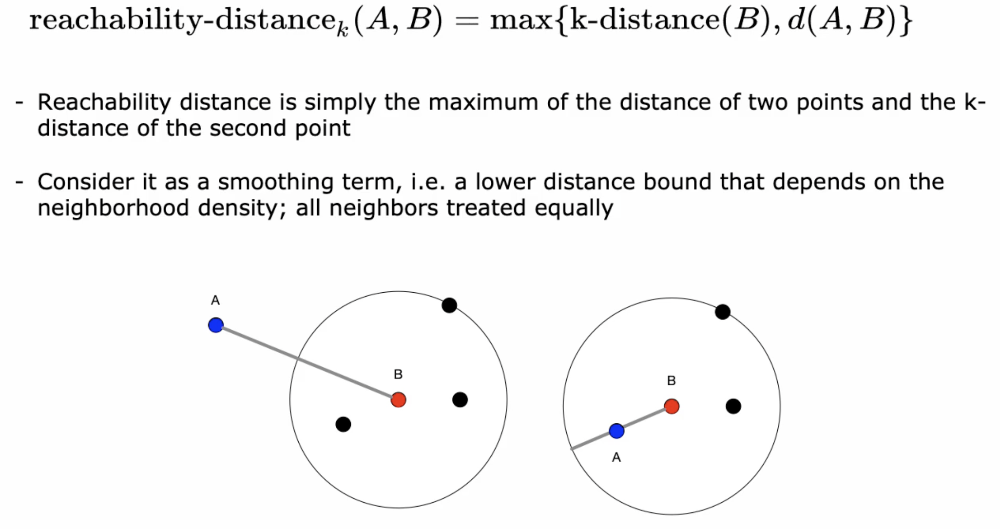
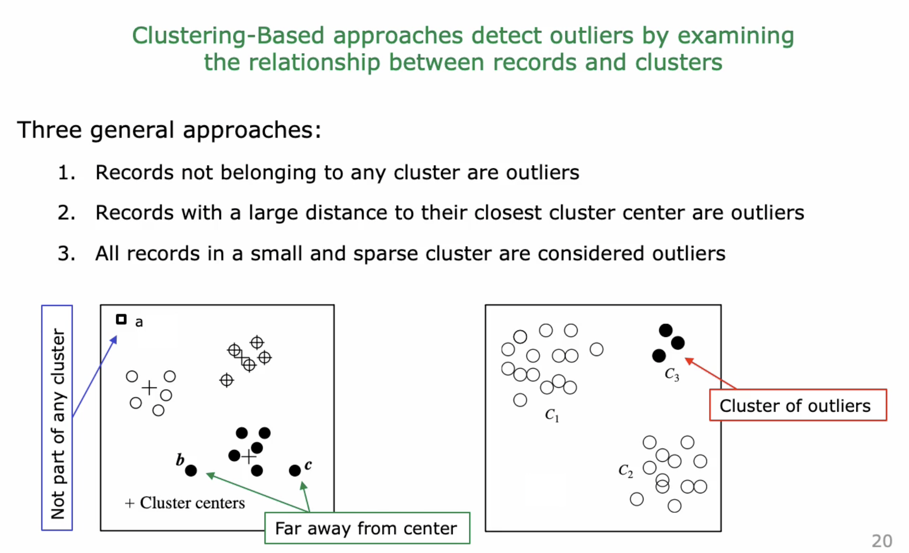

# Anomaly or Outlier Detection

In unsupervised Learning

## Types of Outliers

Welche Typen von Anomalien oder Outliers können wir erkennen. Es geht nicht nur um einzelne
Datenpunkte, sondern auch um Anomaliegruppen.

Beispiele von Outliers

* Analyse TCP traffic zum erkeennen von gehackten Computer
* Analysee MRI Bild für Kreebserkennung
* Kreditkartendaten analyse
* Trading TRansaction
* Social Media, Trends sind erst Outliers
* Outlier Investigation in der DQA
* Outlier entfernen vor dem supervised Learning

### Drei Typen von Outliers

* Globale Outlieres: unterscheidene sich markant vom Rest des Datensets (zb. Pattern von
  Kreditkarteen Transaktion)
* Contextbedingte Outliers: unterscheiden sich im Kontext (zb. Temperatur 25° im Dezember, Mai wäre
  aber normal)
* Kollektiven Outliers: Punktwolken die als Gruppe anomalie ist (zb. Bestellung, wenn eine
  Bestellung Liefereverzögerung hat ist keine, aber wenn 100 eine haben).

## Outlier Detection with ML

Mit Supervised Learning ist Outlier sehr schwierig, weil diese auch sehr rar sind. Daten wären auch
sehr unausgewogen (disbalanced). Weshalb mit Unsupervised Learning gearbeitet wird.

### Statistical Methods

Mit Hilfe der Standardabweichung weiss man wo die Daten (99.7% davon) liegen sollten. Ist nun ein
Datenpunkt nicht innerhalb der Standardabweichung ist es ein Outlier.

### Proximity-Based Methods

Es gibt Distanz- oder Dichte-basierte Methoden. Mit Distanzbasierten Methoden können nur globale
Outliers identifieziert werden.

{width=50%}

{width=50%}

#### Local Outlier Factor (LOF)

Die Zahl sagt aus ob ein Datenpunkt ein Outlier ist oder nicht. $LOF(x) \approx 1$ ist kein Outlier,
wenn deutlich grösser ist es ein Outlier. Kleiner 1 ist es im Densiy-Case ein *inlier*

#### $k$-Distance

Die Distanz (Radius) welche k-Nachbarn einschliesst.

{width=50%}

#### Reachability Distance

Lokale Erreichbarkeit ist nicht symmetrisch! Dem Punkt 1 kann der Punkt 2 innerhalb der $k$-Distanz sein, Punkt 1 muss aber nicht in $k$-Distanz von Punkt 2 liegen.

{width=70%}

### Clustering-Based Methods

Wichtig mit Datensatz ohne Outlier starten, weil Clustering sehr anfällig auf Outliers ist.

{width=70%}

## Outlier Detection with mutlivariate Gaussians