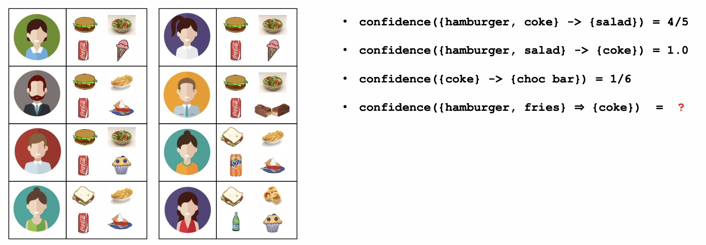
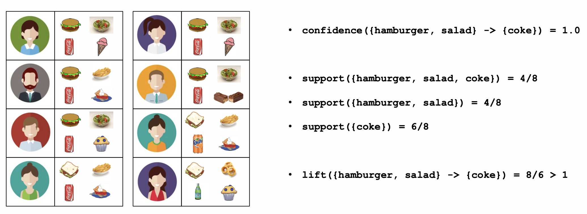

# Association Rules for Market Basket Analysis

Transaktionsdaten sind Daten, wann welcher Kunde, was gekauft hat. Dazu erwarten wir
Transaktionsdaten in Binärer Form.

{width=50%}

## Association Rules

Associationsregel implizieren X so, dass Y ist. Dies wird dann auf ein beliebiges Set angewendet.

### Support of a Set of Items

Support ist ein Teil einer Transaktion, welche ein spezifisches Set an Items beinhaltet. Misst wie
oft Items zusammen gekauft werden und somit auch die Relevanz fürs Business, wir möchten keine
Regeln die selten zutreffen. $$support({i_1,...,i_n})=\frac{\#purchases of
\{i_1,...,i_n\}}{\#transactions}$$

{width=60%}

### Support of an Association Rule

Weil wir Regeln benötigen, müssen wir den Support leicht anpassen - Berechnung wie oben.

{width=60%}

#### Interpretation of Support

Messen wie oft ein Set in den Daten auftaucht. Regeln mit kleinem Support sind aus wirtschaftlichen
Gründen weniger intressant. Werte von guten Verbindung zwischen Regeln und Support sind hoch:
Support = Interestingness

### Confidence of an Association Rule

Vertrauensmass wie gut die Regel ist. $confidence(X\rightarrow Y) = \frac{X \cup Y}{support(X)}$

{width=60%}

### Interpretation of Confidence

Entspricht auch einer bedingten Wahrscheinlichkeit $p(Y|X)$

Confidence ist ein Gütemass einer Regel. Support misst wie *interessant* und Confidence wie *gut*
eine Regel ist. Confidence = Trustworthiness $\rightarrow$ wie oft die Voraussage zutrifft

## Apriori Algorithm

Generiert Regeln, die ein gewisses Mass an Support und Confidence erreichen. Wird in zwei Schritten,
erst die *Frequent Item-Set Generation* siehe \ref{apriori1}, dann die *Rule Generation* siehe
\ref{apriori2}, durchgeführt.

{width=60%}

Der Diamant wird traversiert und da wo der Support nicht erreicht wird, abgeschnitten. Ist ein
Item-Set rar, sind auch alle Sub-Sets rar.

{width=60%}

Als Argument nimmt der Algorithmus den minimum Support und Confidence entgegen. Je grösser diese
Werte, umso schneller ist Apriori (öfteres Pruning).

{width=60%}

## Reflection

Wir haben Regeln, die den Support und deren Güte bewertet. Wird ein Produkt sehr oft gekauft (
Bananen) und ein anderes (Anchovy Paste) sehr wenig, kann die Banane trotzdem überwiegen und den
Score des Produktpaares erhöhen. Um dies zu Korrigieren gibt es einen *Lift*.

### Lift of an Association Rule

Misst ob die Regel zufällig ist, oder doch Kontinuität hat.

Definiert durch $$lift(X\rightarrow Y) = \frac{support(X \cup Y}{support(X)*support(Y)} = \frac{X
\cup Y}{support(X)*support(Y)}$$

{width=60%}

Der Lift kann höher als 1 sein und ist statistisch unabhängig.

### Interpretation of Lift

Lift ist nach oben offen. Man sollte die Verteilung ansehen und Daten nach Lift sortieren. Je nach
Streuung müssen Regelstärke angepasst und interpretiert werden. Man kann auch Elbow-Method anwenden.

* Lift = 1, ist statistisch unabhängig
* Lift < 1, sollte nicht passieren, Regel andersrum wäre besser
* Lift > 1, je grösser umso besser, je stärker deren Verbindung

Lift = Association Strength

### A Note on Business

Wenn zwei Produkte oft miteinander gekauft werden, könnten folgende Überlegungen gemacht werden.

* X und Y näher oder weiter auseinander ins Regal legen
* X und Y zusammen verkaufen
* X und Y mit einem dritten schlecht laufenden Artikel verkaufen
* Rabatt nur auf einem der Produkte geben (nicht auf beide)
* Einen der Preise erhöhen (oder senken)
* einen der Artikel bewerben (nicht beide gleichzeitig)

### Limitations of Apriori and Alternatives

Apriori ist langsam für grosse Daten. Frequent Pattern-Growth (FP-Growth) sollte verwendet werden.

## API Check

Keine Implementation in scikit learn, dafür auf [mlextend](http://rasbt.github.io/mlxtend/)
