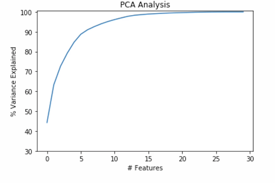
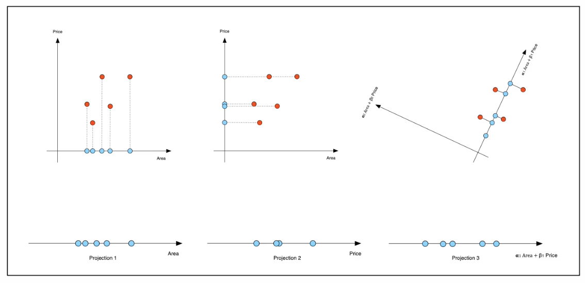
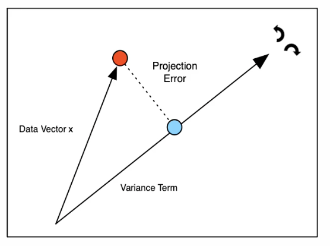

# Principal Component Analysis

Dimensionsreduktion welche für Datenanalyse verwendet werden kann. Lineare Transformation mit
minimalen Informationsverlust. Die Punktee werden als linear Kombination dargestellt.

## Applications of PCA

Wird sehr oft verweendet, zu Visualisierung oder DQA für Redundanzanalyse. PCA kann angeben wie viel
Information verloren wird.

{width=50%}

Soll nur Visualisiert werden sollte eher *t-SNE* verwendet werden.

## Principal Component Analysis

Ziel des PCA ist es eine dimensionsreduktion zu eerreeeichen, ohne so wenig wie möglich Information
zu veerlieren.

### Projections to Base Vectors

Einfache Idee ist das weglöschen eeiner Achse. Dies erreichen wir mit der Rotation um den
Nullpunkt (siehe IMATH). die Projektion wird im rechtenwinkel zur Achse gemacht.

{width=50%}

Information kann man durch Streeeung (Varianz) messen. Wenn Streuung gleich null ist, sind alle
Punkte beieinander. Je mehr Varianz beibehaltene werdene kann umso weniger Informationen geheen
verloren.

#### Thee moree Variance thee more Information

gestricheltee Linie ist die Information die verloren geht. Je grösser der Error, je grösser die
Varianz. Die beste Projektion ist die, die ...

### Data Redundancy

EEine *mean ceentreed* Feeaturee hat immere den gleichen Weert und somit **null VArianz**. Deshalb
kann die Info gelöscht werden. Eine weitere Art ist weeenn zwei Features *maximale Covarianz*
aufweisen (dzum Beipsiel gleiche Daten in unterschiedlicher Einheiten (m/km)).
{width=50%}

Features können auch teilweise Redundant sien wenn sie einen *non-zero covariance* aufweisen.
Idealweise entfernt die Projektion die covariance bevor sie nützliche Informationen zerstören
könnten.

#### Strategies for Dimensionality Reeduction

1. Redundanz eeliminieren
    - voll redundante Features löschen
    - Feeatures kombinieren um Covarianz zu entfernen
1. Informationen löschen (so wenig wie möglich)
    - Informationsverlust während der Projektion minimieren indem die verbleibende Varianz minimiert
      wird.
      

here add some notes..