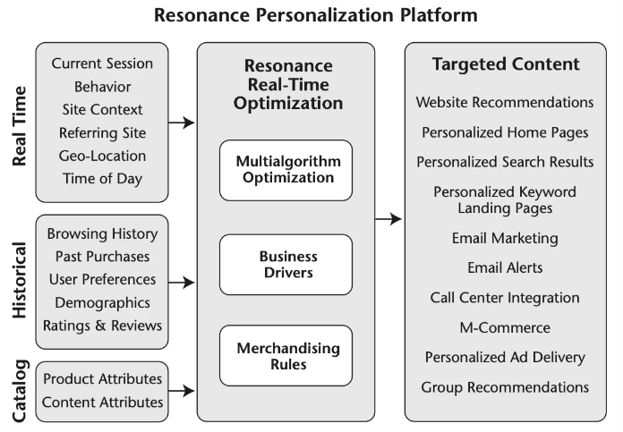
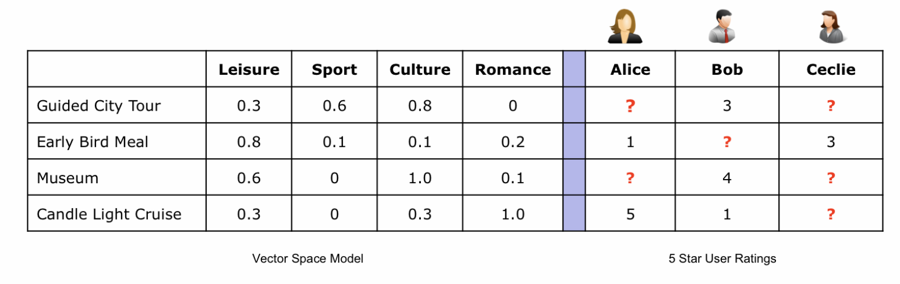
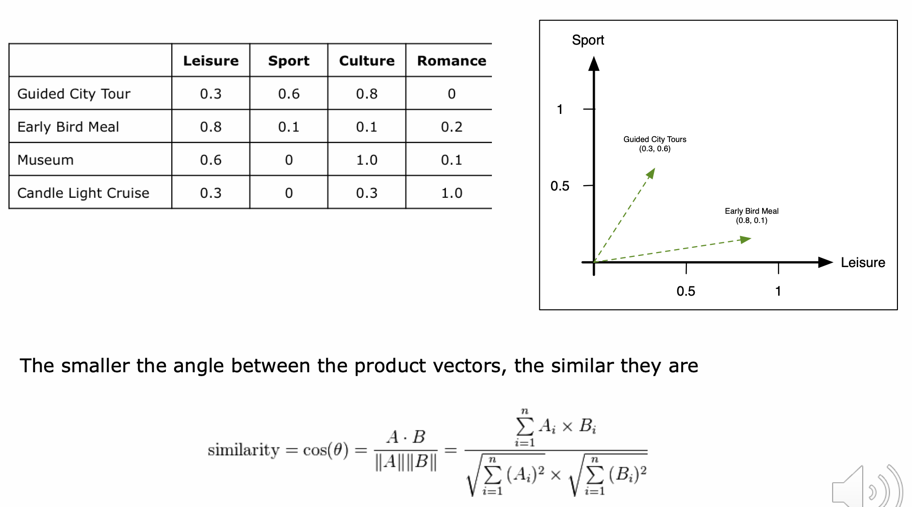
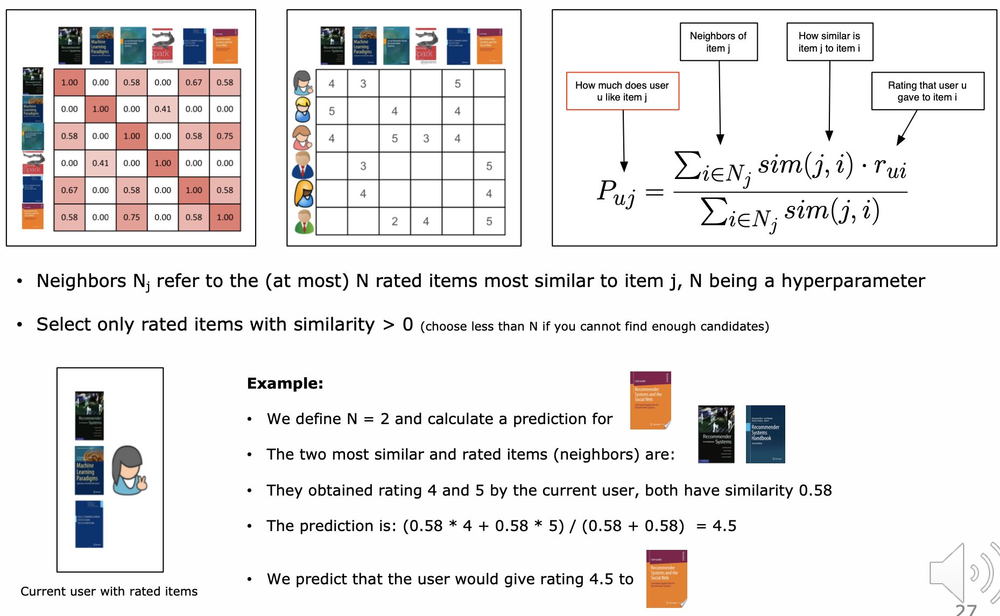
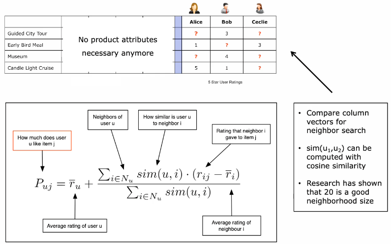
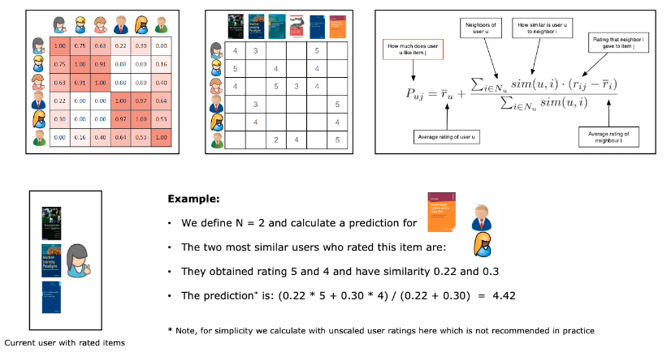
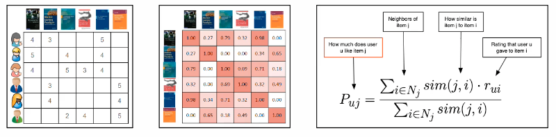

# Recommender Systems

Empfiehlt auf Basis von Nutzerverhalten Produkte.

## Definition, Applications and a short History of Recommender Systems

Anwendung sehr oft im Online-Shopping.

### $1^{st}$ Wave

Motivation war dem Benutzer Information Overload Problem zu lösen. 1992 erstmals von Xerox
implementiert um Mailflut zu bewältigen. Wurde später auf andere Domänen (Musik, Artikel, Videos)
übertragen und 1995 durch Firefly Music Recommendation erstmals kommerzionalisiert. Oftmals 5-Star
Rating von Benutzer.

#### Lessons Learned during $1^{st}$ Wave

1. In-house Kampf zwischen It und Marketing (stärker ausgeprägt als im Marktkampf) -
   Zuständigkeitsfrage ist unklar, Marketing hat auch nicht Freude, wenn ihre Aufgabe bedrängt bzw.
   bewertet wird (Kulturfrage)
1. Kundengeschmack ändert mit der Zeit (je nach dem Schnelllebig (Filme/Musik)) - wie lange zurück
   wird berücksichtigt? Gibt es eine Gewichtung?
1. Online Shopping muss effizient sein - so wenig Interaktion nötig machen, um Recommendations zu
   generieren
1. Cold Start Problem - wie können neuen Benutzer Empfehlungen gemacht werden
1. Nicht alles online lösen - sondern in DataWarehouse auslagern

### $2^{nd}$ Wave

Durch die vermehrte Internetnutzung und durch das Teilen von Informationen auf Social Media
Plattformen, wurde es immer wichtiger gute Empfehlungn abzugeben. Dies führte zur Netflix Challenge

2006.

#### Lessons Learned during $2^{nd}$ Wave

1. Hybridization (mehrere ML-Algos nutzen) löst viele Probleme und gewinnt auch Wettbewerbe (bei
   Netflix Challenge wurden über 100 versch. verwendet und deshalb nicht eingesetzt)
1. Software as a Service (SaaS) vereinfachte Integration, bezahlt aber den Preis mit Kontrollverlust
   über die Daten
1. User Experience ist wichtiger, als Algorithmen
1. Cold Start Problem kann mit Social Web Daten teilweise gelöst werden. (zwei Ausprägungen, neues
   Produkt und neuer Kunde)
1. Integration eines CRM ist immer noch eine offene Baustelle (bei Kundenanruf kein Zugriff von
   Menschen auf die Daten)

### $3^{rd}$ Wave

- Smart und überall verfügbare Technologie (Smartphone, tablets, Watches)
- neue Kontext Informationen wie Geolocation, NFC, Bio-Information (eye tracking, gesture, skin
  tension)
- Neue Trends und Services, live shopping, Nike+ (für Workout Empfehlungen)
- Cloud und Big Data Technologie verfügbar
    - Verarbeitungs- und Speicherhaltungskosten sinken
    - neue Bearbeitungsparadigmen (map reduce)
    - neue Bibliotheken und Frameworks

{width=60%}

Die mittlere Box in Abbildung \ref{recsystems} stellt Recommender System dar. Man sollte dem System
eine *Rule-Engine* zur Verfügung stellen, damit das Marketing effizient Kampagnen starten kann (zB.
Bärlauch-Produkte unabhängig von Kaufverhalten).

Akzeptanz Marketing / Recommender System muss durch Zugriff auf das System gewährleistet sein (
Kulturfrage).

### Recommender Systems Business Model

Kommerzielle Lösungen als SaaS verfügbar, verwalten Daten und geben nur Empfehlungen zurück.
Abgerechnet wird nach Interaktion der Benutzer auf die gelieferten Recommendations. Kann günstig
sein. Motivation für eigenen Recommender sind

* Daten sollen private bleiben
* Kosten steigen je erfolgreicher eigenes Produkt
* Recommendations nicht nur im Webshop sondern überall

## Recommender Algorithms

Bei individualisierten Recommenders erhalten alle Nutzer eine unterschiedliche, bei nicht
individualisierte alle Nutzer die gleichen Empfehlungen.

### Scoring and Ranking as Recommendations

Sammlung von Sterne-Ratings, ergibt eine Empfehlung. Das System nimmt Rating, nimmt Mittelwert aller
Ratings und rundet. Anstatt Rating können auch andere Indikatoren verwendet werden.

#### Scoring lacks Context

Man muss Kontext für Empfehlungen schaffen, nicht nur beliebtestes Produkt anzeigen (Glace / Ketchup
Problem). Man sollte also nur passende Artikel angezeigt erhalten. Hybridisierung nutzen!

### Computing Associations

Bedingte Wahrscheinlichkeitsverteilung. Siehe [Association Rules for Market Basket Analysis][]
Funktioniert mit zwei Produkte gerade noch.

#### Advantages and Disadvantages of Associations

1. Einfach, schnell und billig
1. Assoziationen benötigen Kontext
1. Assoziationen können eingeschränkt werden (z.B. Zeitperiode)
1. sind nicht personalisiert. Assoziationen schauen nur in Warenkörbe und nicht in Individuen,
   machen Durchschnittsaussage. Nicht anwendbar auf persönliche Preferenzen.

Kann gut als *Cold Start* für neue Kunden verwendet werden.

### Mining User Preferences

Explizite Daten, wenn Kunde etwas bewertet oder selbst eine Intressensliste ausfüllt.

Implizite Daten (wenn Kunde Datenpreisgabe nicht bewusst ist) wie Aktionen (clicks, kaufen, page
views (auch über Zeit), Mausposition, Merkzettel/Wunschliste).

### Content-Based Recommendations

1. Erzeuge Attributkatalog
1. Sammeln von Benutzerinteraktionen/Vorlieben
1. Berechne Voraussage für fehlende Daten (?) basierend auf Similarität
1. Items mit grossem Prediction-Value empfehlen

{width=60%}

Beschreibung der Attribute werden in die Berechnung mit einbezogen.

{width=60%}

Die Similarität von Produkten muss nur einmalig berechnet/gespeichert werden, auch für neues
Produkt.

{width=80%}

#### Advantages and Disadvantages of Content-Based Recommendations

1. Gegenüber Benutzer unabhängig und transparent (Kundendaten können Kunde offengelegt werden, ohne
   alle anderen zu komprimitieren). Das Benutzerprofil wird aus eigens generierten Daten erzeugt.
   Könnte neue Erkenntnisse hervorbringen
1. Kein New Item Cold Start Problem, die Similarität (Benutzerunabhängig) kann aus den bisherigen
   Produkten berechnet werden (nicht Ratings abhängig)
1. Beschränkte Content Analyse möglich, reflektieren Produktattribute wirklich Interessen der Kunden
1. Überspezialisierung - wenn man immer nur gleiche Marke auf Autoplattform ansieht, bekommt man nur
   diese Marke angezeigt
1. New User Cold Start Problem noch immer ungelöst

### User-to-User Collaborative Filtering

Digitalisierte Mund-zu-Mund Propaganda.

Es werden Profile verwendet, die sehr ähnlich sind. Es werden die Produkte präsentiert, die die
anderen Kunden gekauft haben, aber der Nutzer nicht.

Produktattribute werden sind mehr nötig und können generischer eingesetzt werden. Funktioniert aber
nur bei gleichen Produkttypen (Auto, Bücher, Kleider - bei Amazon funktioniert es nicht).

{width=60%}

Die Similarität wird über die Kunden berechnet.

{width=80%}

### Item-to-Item Collaborative Filtering

Weil Userprofile sich ständig verändern, kann man nicht auf Pre-Computation setzen. Bei den
Produktpaare ist die Similarität aber stabil und kann im voraus berechnet werden. Amazon hat dazu
die *item-to-item collaborativ filtering* eingefügt.

{width=80%}

Die Berechnung ist identisch zu den Content-Based Recommendations. Der Unterschied besteht darin, wie die Similaritätsmatrix berechnet wird. 
Die Content-Based Reco zieht die Item Attribute mit in die Berechnung ein. Bei der Item zu Item
collab filtering sind nur die User Ratings in die Rechnung involviert.

#### Advantages and Disadvantages of Collaborative Filtering Recommendations

1. Cross-Kategorie Recommendations - Produktkategorien können unterschiedlich sein
1. Viele Leute müssen mitmachen - wenn die Matrix zu spärlich ist, können keine Nachbarn gefunden
   werden
1. New User aka. Cold Start Problem - das System muss erst die Vorlieben aus den Rating berechnen
1. New Item aka. Cold Start Problem - viele User müssen das neue Item erst bewerten, bevor sie
   empfohlen werden können
1. Grey Shep Problem - Benutzer mit unüblichen Vorlieben erhalten keine guten Vorschläge

### Matrix Factorization Techniques

Eine spärlich besetzte Matrix wird mit einer Faktorisierung in zwei Matrizen tranformiert. Dabei
wird sie um Dimension $k$ *latent space* erweitert. Beide Matrizen werden so dichter. Die
Faktorisierung muss die bestmögliche Approximierung der bestehenden Ratings ergeben. Bei der
Prediction muss dann nur ein Skalarprodukt (eines Eintrags) berechnet werden.

### Hybrid Recommender Systems

Um die Vor- und Nachteile auszumerzen verwendet man oft viele verschiedene Algorithmen. Diese werden
aber nicht kombiniert, sondern an verschiedenen Orten / Anforderungen unterschiedliche Recommenders
eingesetzt.

1. Weighted Approach - Bewertet ein Item aus gewichteten Summen aus verschiedenen Engines
1. Mixed Approach - Resultate aus verschiedenen Recommenders werden angezeigt
1. Cascade Approach - Ein Recommender verfeinert die Ergebnisse eines Anderen
1. Switching Approach - unterschiedliche Methoden an unterschiedlichen Orten (Startseite,
   Produktdetailansicht)

### Evaluation - Precision@k (P@k)

$k$ ist die Anzahl Anzeigeplätze. Normalerweise soll das Lernelement sich nicht in den Testdaten
befinden. Bei der Evaluation eines Recommenders aber schon. Man lässt sich $k$ Produkte anzeigen und schaut
ob ein Produkt im Lernset (des Users) enthalten war.

Anzahl richtiger Prediction / $k$ ist die Performance

Normalerweise wird aber A/B-Testing verwendet, weil insgesamt P@k kein verlässliche Aussage zulässt.
Man weiss am Ende nicht, wieso der Benutzer das Produkt nicht gekauft hat.

## API Check

`Implicit` ist eine grosse library unter MIT-License
