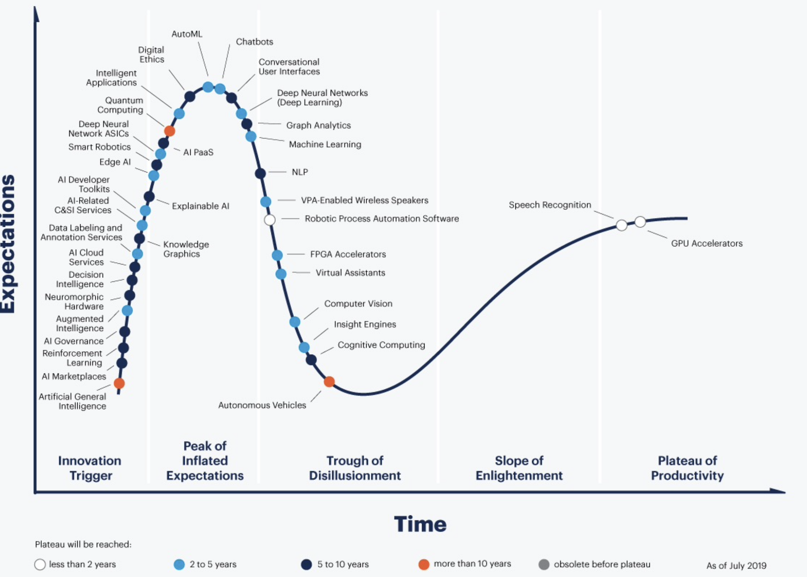
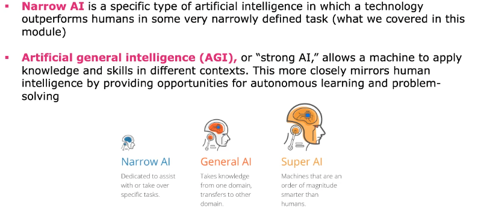

# Perspective

Blick auf ML aus höherer Flughöhe.

## Challenges in AI and Machine Learning

Die AI ist immer auf ein spezialisiertes Feld (Mikroumgebung mit harten Regeln) konzentriert. Diese
als grosses Ganzen, in einem Einzelnen zusammenzufassen, ist sehr schwierig. Weiter sind einfache
Sachen schwierig für die ML und umgekehrt (Box heben/Schach spielen).

Intelligenez ist nicht nur im Hirn, sondern auch alle anderen kognitiven Sinne tragen dazu bei. Man
lernt auch durch Experimente und Interaktionen mit der Umwelt.

### Beware of the Hype

Ungefähr 70% Prozent der AI-Projekte generierten wenig Impact auf ihr Geschäft. Sie können nicht
alles lösen und können nur spezifisch eingesetzt werden.

Das fehlen von Diversität in den Daten ist ein reales Problem. Weiter ist es bisher wenig reguliert,
wird aber zunehmen in den nächsten Jahren.

Das missbrauchen von ML kann die Demokratie untermaueren. Zum Beipsiel das publizieren von Fake
News/Videos/Bilder in Social Media Kanäle. Dies kann Wahlen negativ beinflussen und führt zu
Organisationen wie QAnon.

## Exciting Research Areas

* Explainable AI (XAI): Da wir nicht wissen wie DL-Netze entschieden haben, ist es sehr schwierig zu
  exklären oder Gründe für einen Entscheid abzugeben. Weshalb es oft ein Hindernis in sensitiven
  Gebieten (Medizin/Recht) darstellt.
* Data-Centric AI: Idee dahinter ist es nicht nur das Model/Algorithmus zu verbessern (f1-Score),
  sondern die Daten mehr in den Fokus zu stellen und da ansetzen.
* Neuro-Symbolic AI: Regelbasierte AI (if/else/then)
* Transformer Networks: Besonders im Bereich NLP wo der Fokus auf einer Aufmerksamkeit beruht (
  merken wo was war), hob NLP auf ein neues Level
* Custom Silicon for AI+ML: GPUs sind nicht optimiert für AI workload, sie wurde nur von der AI
  Community adoptiert (wegen Matrix Operationen). Eigene Hardware wird dafür entwickelt werden.
* Artificial Creativity: Kunst kreiert durch AI

{width=80%}

## Longer Term Outlook

Die *Artificial General Intelligence (AGI)* bedeutet, dass sie schwierige menschliche Aufgaben
erledigen kann (Kaffee machen, Fussball spielen).

{width=80%}

### Superintelligence

Existiert, weil wir ja existieren. Es kann also passieren, dass nochmals etwas ähnliches passieren
könnte.

### The Singularity

Punkt in 2029 wo die Intelligenz von Maschinen die der Menschen erreicht. Aber wie geht es dann
weiter?

### Brain-Machine Interfaces

Neurallinks womit Geräte durch Gedanken gesteuert werden können.

### IA: Intelligence Augmentation

Menschen und AI performen zusammen viel besser als alleine. Das Paradigma verschiebt sich von AI zu
IA.
